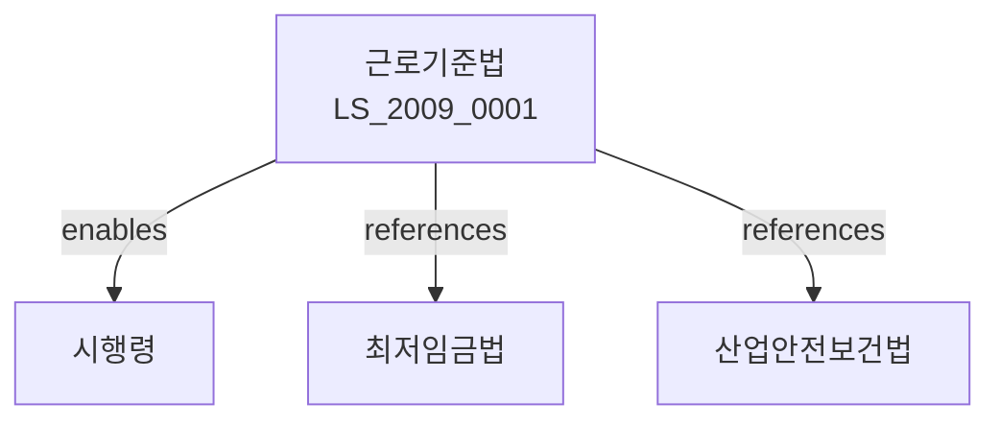

# 근로기준법

> [법률 제20114호, 2024. 1. 9., 일부개정]

---

---

## 제1장 총칙
### 제1조 (목적)
이 법은 헌법 제32조에 따라 근로조건의 기준을 정하고 근로자의 기본적 생활을 보장ㆍ향상을 도모함으로써 근로자의 생존권을 보장하고 국민경제의 균형있는 발전에 이바지함을 목적으로 한다。

### 제2조 (정의)
이 법에서 사용하는 용어의 뜻은 다음과 같다。

1. "근로자"란 직업의 종류를 불문하고 현재의 사업 또는 사업에 종사하는 자로서 임금을 목적으로 근로를 제공하는 자를 말한다.
2. "사용자"란 사업주 또는 사업경영자를 말한다.
3. "임금"이란 사용자가 근로자에게 근로의 대가로 지급하는 것을 말한다。
4. "근로계약"이란 근로자와 사용자 사이의 계약을 말한다。

---

## 제2장 근로계약
### 第5条(근로계약의 당사자)
근로계약의 당사자는 근로자와 사용자이다.
### 第6条(근로계약의 형식)
근로계약은 서면으로 작성하여야 한다.
### 第7条(근로계약의 내용)
근로계약에는 다음 각 호의 사항을 기재하여야 한다.

1. 근로조건
2. 임금
3. 근로시간
4. 휴가
### 第8条(근로계약의 위반)
근로계약을 위반한 자는 손해를 배상하여야 한다.

---

## 제3장 임금
### 第15条(임금지급의 원칙)
임금은 통화로 직접 근로자에게 전액 지급하여야 한다.
### 第16条(최저임금)
임금은 최저임금 이상이어야 한다.
### 第17条(임금지급기간)
임금은 매월 1회 이상 기일을 정하여 지급하여야 한다.
### 第18条(비상시 임금)
연장근로에 대하여는 통상임금의 100분의 50 이상을 가산하여 지급하여야 한다.

---

## 제4장 근로시간
### 第25条(근로시간)
1주간의 근로시간은 휴게시간을 제외하고 40시간을 초과할 수 없다.
### 第26条(연장근로의 제한)
근로시간을 연장하려면 근로자의 동의와 당국의 인가를 받아야 한다.
### 第27条(야간근로)
야간근로는 원칙적으로 금지된다.
### 第28条(휴게시간)
근로시간 4시간마다 30분 이상의 휴게시간을 주어야 한다.

---

## 제5장 휴가
### 第35条(주휴)
매주 1회 이상의 유급주휴를 주어야 한다.
### 第36条(연차유급휴가)
1년간 개근한 근로자에게는 10일의 연차유급휴가를 주어야 한다.
### 第37条(생리휴가)
여성근로자에게는 월 1일의 유급생리휴가를 주어야 한다.
### 第38条(산전후휴가)
임신 중인 여성근로자에게는 산전후통하여 90일의 유급휴가를 주어야 한다.

---

## 제6장 여성과 소년
### 第45条(여성의 야간근로 제한)
여성의 야간근로와 연장근로는 원칙적으로 금지된다.
### 第46条(산전후근로 제한)
산전후휴가기간 중에는 근로를 시킬 수 없다.
### 第47条(소년의 연장근로 제한)
18세 미만의 자에 대하여는 연장근로를 시킬 수 없다.
### 第48条(소년의 유해직업 금지)
18세 미만의 자를 유해ㆍ위험한 직업에 종사하게 할 수 없다.

---

## 제7장 안전과 보건
### 第55条(안전보건)
사용자는 근로자의 안전과 보건을 위하여 필요한 조치를 하여야 한다.
### 第56条(안전보건교육)
사용자는 근로자에 대하여 안전보건교육을 실시하여야 한다.
### 第57条(산업재해보상)
근로자가 업무상 재해를 입은 때는 사용자가 보상하여야 한다.
### 第58条(안전보건관리자)
일정규모 이상의 사업장에는 안전보건관리자를 두어야 한다.

---

## 제8장 감독
### 第65条(감독)
고용노동부장관은 근로기준의 이행을 감독한다.
### 第66条(보고 및 검사)
고용노동부장관은 필요한 경우 보고를 명하거나 검사할 수 있다.
### 第67条(시정명령)
고용노동부장관은 이 법을 위반한 자에 대하여 시정명령을 할 수 있다.
### 第68条(영업정지)
고용노동부장관은 중대한 위반사유가 있는 경우 영업정지를 명할 수 있다.

---

## 제9장 벌칙
### 第75条(벌칙)
다음 각 호의 어느 하나에 해당하는 자는 5년 이하의 징역 또는 1억원 이하의 벌금에 처한다.

1. 근로기준을 위반한 자
2. 임금을 착취한 자
3. 근로자를 부당하게 해고한 자
### 第76条(과태료)
다음 각 호의 어느 하나에 해당하는 자에게는 2천만원 이하의 과태료를 부과한다。

1. 정당한 사유 없이 보고를 하지 아니한 자
2. 근로계약을 서면으로 작성하지 아니한 자

---

## 관계 그래프

**상위 법령**
- [[헌법]] 제32조, 제34조 (근로3권)
- [[민법]]

**관련 법령**
- [[최저임금법]]
- [[산업안전보건법]]
- [[근로자참여법]]
- [[고용보험법]]
- [[산업재해보상보험법]]

**하위 법령**
- [[근로기준법 시행령]]
