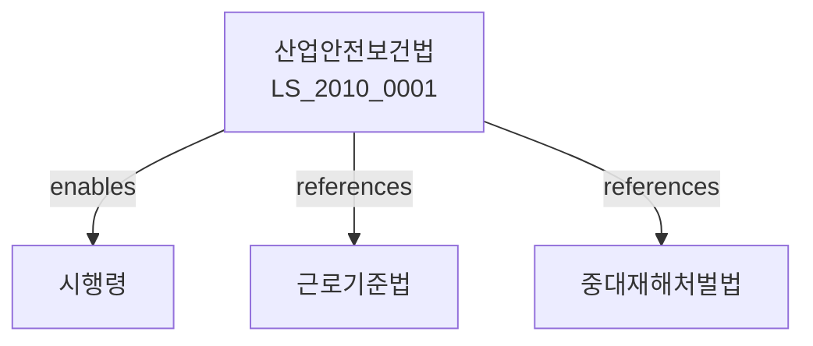

# 산업안전보건법

> [법률 제20115호, 2024. 1. 9., 일부개정]

---

---

## 제1장 총칙
### 제1조 (목적)
이 법은 산업안전과 보건을 유지하고 증진함으로써 근로자의 생명을 보호하고 쾌적한 작업환경을 조성함을 목적으로 한다。

### 제2조 (정의)
이 법에서 사용하는 용어의 뜻은 다음과 같다。

1. "안전보건"이란 근로자의 생명과 건강을 보호하고 유지하는 것을 말한다.
2. "유해요인"이란 근로자의 생명과 건강에 해를 끼치는 요인을 말한다.
3. "산업재해"이란 업무수행과 관련하여 발생한 근로자의 부상ㆍ질병 또는 사망을 말한다.
4. "작업환경"이란 근로자가 근로하는 장소의 물리적ㆍ화학적ㆍ생물학적 환경을 말한다.
5. "안전보건관리자"란 안전보건에 관한 업무를 담당하는 자를 말한다。

---

## 제2장 안전보건관리체계
### 第5条(안전보건관리체계)
사업주는 안전보건관리체계를 구축하여야 한다.
### 第6条(안전보건관리자)
일정규모 이상의 사업장은 안전보건관리자를 두어야 한다.
### 第7条(안전보건위원회)
상시근로자 100인 이상의 사업장은 안전보건위원회를 구성하여야 한다.
### 第8条(안전보건담당자)
유해ㆍ위험작업을 수행하는 사업장은 안전보건담당자를 두어야 한다.

---

## 제3장 위험성평가
### 第15条(위험성평가)
새로운 설비ㆍ공정 또는 물질을 도입할 때 위험성평가를 실시하여야 한다.
### 第16条(위험성평가의 내용)
위험성평가에는 다음 각 호의 사항이 포함되어야 한다。

1. 유해요인의 확인
2. 위험도의 평가
3. 위험감소대책의 수립
### 第17条(위험성평가의 방법)
위험성평가는 과학적ㆍ객관적 자료를 기초로 실시하여야 한다.
### 第18条(위험성평가 결과의 활용)
위험성평가 결과를 근로자에게 알려야 한다.

---

## 제4장 작업환경의 개선
### 第25条(작업환경의 개선)
사업주는 작업환경을 지속적으로 개선하여야 한다.
### 第26条(유해요인의 제거)
유해요인을 제거하거나 대체하여야 한다.
### 第27条(공학적 대책)
공학적 대책을 우선적으로 적용하여야 한다.
### 第28条(관리적 대책)
공학적 대책이 어려운 경우 관리적 대책을 적용한다.

---

## 제5장 근로자의 건강관리
### 第35条(건강진단)
사업주는 근로자에 대하여 정기적으로 건강진단을 실시하여야 한다.
### 第36条(건강진단의 종류)
건강진단은 일반건강진단과 특수건강진단으로 구분한다.
### 第37条(작업환경측정)
유해물질을 취급하는 사업장은 작업환경측정을 실시하여야 한다.
### 第38条(건강관리)
건강에 이상이 발견된 근로자에 대하여 적절한 조치를 하여야 한다.

---

## 제6장 안전보건교육
### 第45条(안전보건교육)
사업주는 근로자에 대하여 정기적으로 안전보건교육을 실시하여야 한다.
### 第46条(교육내용)
안전보건교육에는 다음 각 호의 사항이 포함되어야 한다。

1. 작업안전
2. 작업보건
3. 재해예방
4. 응급조치
### 第47条(교육방법)
안전보건교육은 실습과 이론을 병행하여 실시한다.
### 第48条(교육시간)
안전보건교육시간은 대통령령으로 정한다.

---

## 제7장 재해예방
### 第55条(재해예방계획)
사업주는 재해예방계획을 수립하여야 한다.
### 第56条(비상대응계획)
비상사태에 대비하여 비상대응계획을 수립하여야 한다.
### 第57条(응급조치)
재해발생 시 신속한 응급조치를 하여야 한다.
### 第58条(재해조사)
재해발생 시 원인을 조사하여야 한다.

---

## 제8장 감독
### 第65条(감독)
고용노동부장관은 산업안전보건을 감독한다.
### 第66条(보고 및 검사)
고용노동부장관은 필요한 경우 보고를 명하거나 검사할 수 있다.
### 第67条(시정명령)
고용노동부장관은 이 법을 위반한 자에 대하여 시정명령을 할 수 있다.
### 第68条(영업정지)
고용노동부장관은 중대한 위반사유가 있는 경우 영업정지를 명할 수 있다.

---

## 제9장 벌칙
### 第75条(벌칙)
다음 각 호의 어느 하나에 해당하는 자는 5년 이하의 징역 또는 5천만원 이하의 벌금에 처한다。

1. 안전장치를 하지 아니한 자
2. 재해를 은폐한 자
3. 건강진단을 하지 아니한 자
### 第76条(과태료)
다음 각 호의 어느 하나에 해당하는 자에게는 1천만원 이하의 과태료를 부과한다。

1. 정당한 사유 없이 보고를 하지 아니한 자
2. 보호구를 지급하지 아니한 자

---

## 관계 그래프

**상위 법령**
- [[헌법]] 제34조 (생존권)
- [[근로기준법]]

**관련 법령**
- [[근로기준법]]
- [[중대재해처벌법]]
- [[산업재해보상보험법]]
- [[건설기본법]]

**하위 법령**
- [[산업안전보건법 시행령]]
