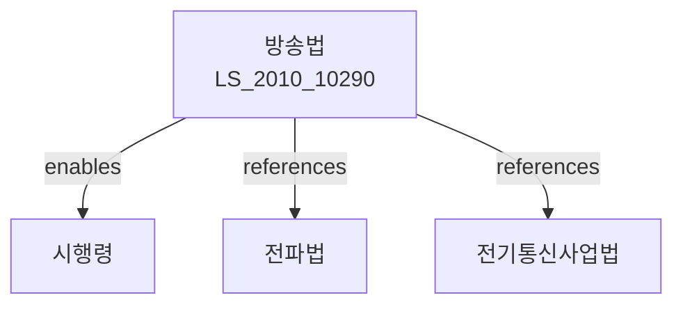

# 방송법

> [법률 제20079호, 2024. 1. 9., 일부개정]

---

---

## 제1장 총칙

### 제1조 (목적)

이 법은 방송의 공공성을 높이고 방송의 자유와 독립을 보장하며, 방송 발전을 통하여 공익에 이바지하고 민주주의의 발전과 국민문화의 향상에 기여함을 목적으로 한다。

### 제2조 (정의)

이 법에서 사용하는 용어의 뜻은 다음과 같다。

1. "방송"이란 공중이 수신할 목적으로 무선 또는 유선통신에 의하여 음성, 음향, 영상 등을 공중에게 송신하는 것을 말한다.
2. "방송사업자"란 방송을 행하는 자로서 이 법에 따라 허가 또는 등록을 받은 자를 말한다.
3. "지상파방송"이란 무선국으로부터 송신하는 전파에 의하여 방송을 수신하는 방송을 말한다.
4. "종합유선방송"이란 유선으로 방송을 송신하는 방송을 말한다.
5. "위성방송"이란 인공위성을 이용하여 방송을 송신하는 방송을 말한다。

---

## 제2장 방송의 자유와 독립

### 제4조 (방송의 자유)

① 누구든지 방송의 자유를 침해할 수 없다。

② 방송은 민주주의의 원칙에 따라 공정하고 자유로워야 한다。

### 제5조 (방송의 독립)

① 방송은 어떠한 외부의 압력이나 간섭으로부터 독립하여야 한다。

② 국가, 지방자치단체 또는 정당은 방송의 내용에 관하여 어떠한 간섭도 하여서는 아니 된다。

### 제6조 (편성의 자유)

방송사업자는 방송프로그램의 편성에 관한 자유를 가진다。

---

## 제3장 방송사업

### 第10条 (방송사업의 허가)

① 지상파방송을 하려는 자는 과학기술정보통신부장관의 허가를 받아야 한다。

② 방송사업 허가의 기준 및 절차 등에 관하여 필요한 사항은 대통령령으로 정한다。

### 第11条 (방송사업의 등록)

① 종합유선방송, 위성방송 등을 하려는 자는 과학기술정보통신부장관에게 등록하여야 한다.

② 등록의 기준 및 절차 등에 관하여 필요한 사항은 대통령령으로 정한다。

### 第12条 (방송국의 시설기준)

방송사업자는 방송국의 시설을 대통령령으로 정하는 기준에 적합하게 유지하여야 한다。

---

## 제4장 방송프로그램

### 第20条 (방송프로그램의 기준)

① 방송사업자는 방송프로그램이 다음 각 호의 기준에 적합하도록 하여야 한다。

1. 공공의 안전과 질서를 유지할 것
2. 국민의 정서를 해치지 아니할 것
3. 청소년에게 유해하지 아니할 것
4. 공정하고 객관적일 것

### 第21条 (등급분류)

① 방송사업자는 방송프로그램에 대하여 등급을 분류하여야 한다.

② 등급분류의 기준 및 방법 등에 관하여 필요한 사항은 대통령령으로 정한다。

### 第22条 (청소년보호)

방송사업자는 청소년에게 유해한 방송프로그램이 청소년에게 시청되지 아니하도록 필요한 조치를 하여야 한다.

---

## 제5장 방송광고

### 第30条 (광고방송)

① 방송사업자는 광고방송을 할 수 있다.

② 광고방송의 시간, 횟수 및 방법 등에 관하여 필요한 사항은 대통령령으로 정한다。

### 第31条 (광고의 식별)

방송사업자는 광고방송임을 명확히 식별할 수 있도록 하여야 한다。

---

## 제6장 방송통신심의위원회

### 第40条 (설치)

방송프로그램에 대한 심의 및 시청자의 권익보호를 위하여 방송통신심의위원회를 둔다。

### 第41条 (기능)

방송통신심의위원회는 다음 각 호의 사항을 심의한다。

1. 방송프로그램의 등급분류
2. 방송프로그램에 대한 시청자의 불만처리
3. 방송의 공공성 제고에 관한 사항

---

## 제7장 벌칙

### 第90条 (벌칙)

다음 각 호의 어느 하나에 해당하는 자는 3년 이하의 징역 또는 3천만원 이하의 벌금에 처한다。

1. 제10조에 따른 허가 없이 방송을 한 자
2. 허위 기타 부정한 방법으로 허가를 받은 자

### 第91条 (과태료)

다음 각 호의 어느 하나에 해당하는 자에게는 2천만원 이하의 과태료를 부과한다。

1. 제20조에 따른 방송프로그램 기준을 위반한 자
2. 제30조에 따른 광고방송 규정을 위반한 자

---

## 관계 그래프

**상위 법령**
- [[헌법]] 제21조 (언론ㆍ출판의 자유)
- [[방송문화진흥회법]]

**관련 법령**
- [[전파법]]
- [[전기통신사업법]]
- [[인터넷멀티미디어방송사업법]]
- [[저작권법]]

**하위 법령**
- [[방송법 시행령]]
