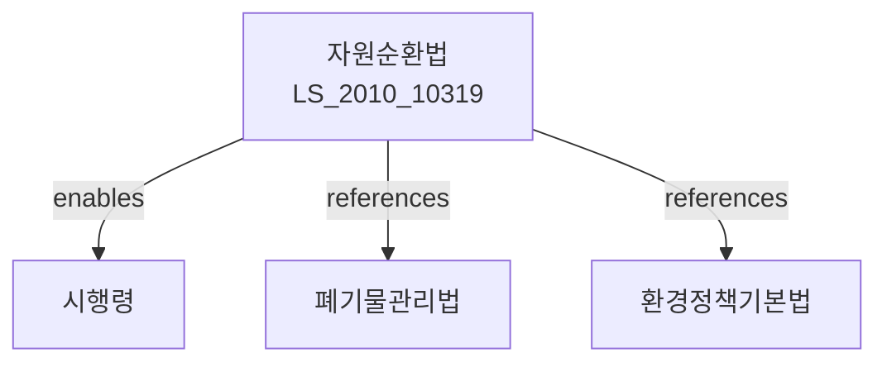

# 자원의 절약과 재활용촉진에 관한 법률

> [법률 제20094호, 2024. 1. 9., 일부개정]

---

---

## 제1장 총칙

### 제1조 (목적)

이 법은 자원의 절약과 재활용을 촉진하여 자원의 효율적인 이용을 도모하고 환경오염을 줄임으로써 지속가능한 발전에 이바지함을 목적으로 한다.

### 제2조 (정의)

이 법에서 사용하는 용어의 뜻은 다음과 같다.

1. "재활용"이란 폐기물을 다시 사용하거나 자원으로 회수하여 이용하는 것을 말한다。
2. "재활용제품"이란 재활용에 의하여 생산된 제품을 말한다。
3. "재사용"이란 폐기물을 원래의 용도 또는 다른 용도로 다시 사용하는 것을 말한다。
4. "순환자원"이란 재활용이 가능한 자원을 말한다。

---

## 제2장 자원절약 및 재활용 기본계획

### 第5条 (기본계획의 수립)

① 환경부장관은 5년마다 자원절약 및 재활용 기본계획을 수립하여야 한다。

② 기본계획에는 다음 각 호의 사항이 포함되어야 한다。

1. 자원절약 및 재활용 현황 및 전망
2. 자원절약 및 재활용 목표
3. 재활용산업 육성 방안
4. 순환자원의 수집 및 이용에 관한 사항
5. 그 밖에 자원절약 및 재활용에 필요한 사항

### 第6条 (시행계획의 수립)

① 시장ㆍ군수 또는 구청장은 기본계획에 따라 관할 구역의 시행계획을 수립하여야 한다。

② 시행계획에는 지역 특성에 맞는 자원절약 및 재활용 방안이 포함되어야 한다。

---

## 제3장 자원절약

### 第10条 (자원절약의무)

누구든지 자원의 낭비를 막고 자원을 아껴 쓰도록 노력하여야 한다。

### 第11条 (일회용품의 사용 억제)

① 국가 및 지방자치단체는 일회용품의 사용을 억제하기 위하여 필요한 조치를 하여야 한다。

② 사업자는 일회용품의 사용을 줄이고 재사용이 가능한 용기 등을 사용하도록 노력하여야 한다。

### 第12条 (제품의 내구성 향상)

제조업자는 제품의 내구성을 향상시켜 수명을 연장하도록 노력하여야 한다。

---

## 제4장 재활용 촉진

### 第20条 (분리배출)

① 폐기물을 배출하는 자는 재활용이 가능한 폐기물을 분리하여 배출하여야 한다。

② 분리배출의 방법 및 기준 등에 관하여 필요한 사항은 환경부령으로 정한다。

### 第21条 (재활용품의 우선 구매)

① 국가 및 지방자치단체는 재활용품을 우선적으로 구매하여야 한다。

② 재활용품 우선 구매의 비율 및 방법 등에 관하여 필요한 사항은 대통령령으로 정한다。

### 第22条 (재활용산업의 육성)

국가는 재활용산업을 육성하기 위하여 다음 각 호의 지원을 할 수 있다。

1. 재활용기술 개발 지원
2. 재활용시설 설치 지원
3. 재활용기업에 대한 자금 지원
4. 그 밖에 재활용산업 육성에 필요한 지원

---

## 제5장 순환자원의 관리

### 第30条 (순환자원의 수집)

순환자원을 수집하려는 자는 관할 시장ㆍ군수 또는 구청장에게 신고하여야 한다。

### 第31条 (순환자원의 보관)

순환자원을 보관하는 경우 환경오염이 발생하지 아니하도록 하여야 한다。

### 第32条 (순환자원의 이용)

순환자원을 이용하는 자는 대통령령으로 정하는 기준에 따라 이용하여야 한다。

---

## 제6장 보칙

### 第40条 (폐기물부담금)

환경부장관은 폐기물의 배출을 억제하고 재활용을 촉진하기 위하여 폐기물부담금을 부과할 수 있다。

### 第41条 (재활용부담금)

환경부장관은 재활용의무대상 제품을 제조하는 자에 대하여 재활용부담금을 부과할 수 있다。

---

## 제7장 벌칙

### 第50条 (벌칙)

다음 각 호의 어느 하나에 해당하는 자는 2년 이하의 징역 또는 2천만원 이하의 벌금에 처한다。

1. 제30조에 따른 신고 없이 순환자원을 수집한 자
2. 순환자원의 수집 과정에서 환경오염을 유발한 자

### 第51条 (과태료)

다음 각 호의 어느 하나에 해당하는 자에게는 1천만원 이하의 과태료를 부과한다。

1. 분리배출 의무를 위반한 자
2. 정당한 사유 없이 보고를 하지 아니한 자

---

## 관계 그래프

**상위 법령**
- [[헌법]] 제35조 (환경권)
- [[환경정책기본법]]

**관련 법령**
- [[폐기물관리법]]
- [[대기환경보전법]]
- [[기후위기 대응을 위한 탄소중립ㆍ녹색성장 기본법]]
- [[지속가능공조법]]

**하위 법령**
- [[자원순환법 시행령]]
