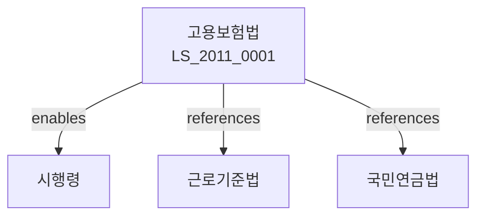

# 고용보험법

> [법률 제20116호, 2024. 1. 9., 일부개정]

---

---

## 제1장 총칙
### 제1조 (목적)
이 법은 고용보험을 실시하여 실업의 예방, 고용의 촉진 및 근로자의 직업생활의 안정을 도모함으로써 경제사회발전에 이바지함을 목적으로 한다。

### 제2조 (정의)
이 법에서 사용하는 용어의 뜻은 다음과 같다。

1. "고용보험"이란 실업에 대비하여 보험급여를 제공하는 제도를 말한다.
2. "피보험자"란 고용보험에 가입된 근로자를 말한다.
3. "사업주"란 근로자를 고용하는 자를 말한다.
4. "실업"이란 근로자가 고용관계를 상실한 상태를 말한다.

---

## 제2장 보험가입자
### 第5条(적용범위)
고용보험은 모든 사업에 적용한다.
### 第6条(피보험자)
근로자는 고용보험의 피보험자가 된다.
### 第7条(적용제외)
다음 각 호의 사업은 적용하지 아니한다。

1. 5인 미만의 사업
2. 농업ㆍ임업ㆍ어업
3. 가사서비스업
### 第8条(보험료의 납부)
사업주는 보험료를 납부하여야 한다.

---

## 제3장 보험급여
### 第15条(구직급여)
실업한 피보험자에게 구직급여를 지급한다.
### 第16条(취직촉진수당)
구직급여를 받는 자가 취직한 경우 취직촉진수당을 지급한다.
### 第17条(상병급여)
질병으로 인하여 취업할 수 없는 경우 상병급여를 지급한다.
### 第18条(육아휴직급여)
육아휴직한 경우 육아휴직급여를 지급한다.

---

## 제4장 고용안정사업
### 第25条(고용안정사업)
정부는 고용안정사업을 실시한다.
### 第26条(고용유지지원)
경기변동에 따른 고용유지를 지원한다.
### 第27条(직업훈련)
직업훈련을 실시한다.
### 第28条(취업알선)
취업알선사업을 실시한다.

---

## 제5장 직업능력개발사업
### 第35条(직업능력개발사업)
피보험자의 직업능력개발을 지원한다.
### 第36条(직업훈련비용)
직업훈련에 소요되는 비용을 지원한다.
### 第37条(자격증 취득지원)
자격증 취득에 소요되는 비용을 지원한다.
### 第38条(직업능력개발훈련)
직업능력개발훈련을 실시한다.

---

## 제6장 고용보험기금
### 第45条(고용보험기금)
고용보험기금을 설치한다.
### 第46条(기금의 재원)
기금은 보험료 및 국고보조금으로 충당한다.
### 第47条(기금의 관리)
고용노동부장관은 기금을 관리한다.
### 第48条(기금의 운용)
기금은 안전하고 수익성 있게 운용하여야 한다.

---

## 제7장 감독
### 第55条(감독)
고용노동부장관은 고용보험을 감독한다.
### 第56条(보고 및 검사)
고용노동부장관은 필요한 경우 보고를 명하거나 검사할 수 있다.
### 第57条(시정명령)
고용노동부장관은 이 법을 위반한 자에 대하여 시정명령을 할 수 있다.
### 第58条(과태료)
다음 각 호의 어느 하나에 해당하는 자에게는 과태료를 부과한다。

1. 정당한 사유 없이 보고를 하지 아니한 자
2. 허위로 보험급여를 받은 자
---

## 제8장 벌칙
### 第65条(벌칙)
다음 각 호의 어느 하나에 해당하는 자는 3년 이하의 징역 또는 3천만원 이하의 벌금에 처한다。

1. 허위로 보험급여를 받은 자
2. 보험료를 착취한 자
3. 기금을 횡령한 자
### 第66条(과태료)
다음 각 호의 어느 하나에 해당하는 자에게는 1천만원 이하의 과태료를 부과한다。

1. 정당한 사유 없이 보고를 하지 아니한 자
2. 자료를 제출하지 아니한 자

---

## 관계 그래프

**상위 법령**
- [[헌법]] 제32조, 제34조 (근로3권, 생존권)
- [[사회보장기본법]]

**관련 법령**
- [[근로기준법]]
- [[국민연금법]]
- [[산업재해보상보험법]]
- [[최저임금법]]
- [[직업훈련법]]

**하위 법령**
- [[고용보험법 시행령]]
