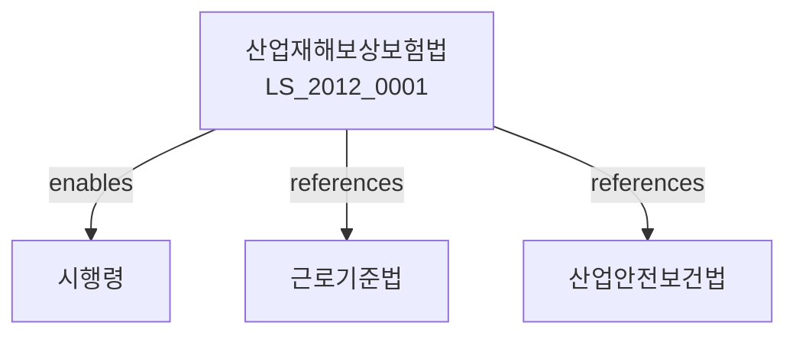

# 산업재해보상보험법

> [법률 제20117호, 2024. 1. 9., 일부개정]

---

---

## 제1장 총칙
### 제1조 (목적)
이 법은 업무상 재해를 입은 근로자를 신속하고 공정하게 보상함으로써 근로자의 생활안정과 복지증진에 이바지함을 목적으로 한다。

### 제2조 (정의)
이 법에서 사용하는 용어의 뜻은 다음과 같다。

1. "업무상 재해"란 근로자가 업무수행과 관련하여 발생한 부상ㆍ질병 또는 사망을 말한다.
2. "요양자"란 업무상 재해로 인하여 요양하는 자를 말한다.
3. "수급권자"란 요양급여 또는 유족급여를 받을 권리가 있는 자를 말한다.
4. "평균임금"이란 요양개시 전 3월간의 임금총액을 총일수로 나눈 금액을 말한다.

---

## 제2장 보험가입자
### 第5条(적용범위)
산업재해보상보험은 모든 사업에 적용한다.
### 第6条(특례가입)
건설공사 등 특정사업은 특례가입한다.
### 第7条(보험료)
사업주는 보험료를 납부하여야 한다.
### 第8条(보험료율)
보험료율은 대통령령으로 정한다.

---

## 제3장 보험급여
### 第15条(요양급여)
업무상 부상ㆍ질병으로 요양하는 자에게 요양급여를 지급한다.
### 第16条(상병보상연금)
요양 후 폐질상에 빠진 자에게 상병보상연금을 지급한다.
### 第17条(장해보상연금)
장해가 남은 자에게 장해보상연금을 지급한다.
### 第18条(유족급여)
사망한 자의 유족에게 유족급여를 지급한다.

---

## 제4장 장해급여
### 第25条(장해급여)
업무상 재해로 장해가 남은 자에게 장해급여를 지급한다.
### 第26条(장해등급)
장해는 그 정도에 따라 제1급부터 제14급까지로 구분한다.
### 第27条(장해보상연금)
제1급부터 제7급까지의 장해에 대하여는 장해보상연금을 지급한다.
### 第28条(장해보상일시금)
제8급부터 제14급까지의 장해에 대하여는 장해보상일시금을 지급한다.

---

## 제5장 유족급여
### 第35条(유족급여의 종류)
유족급여는 다음 각 호와 같다.

1. 유족보상연금
2. 유족특별급여
3. 장의비
### 第36条(유족보상연금)
유족보상연금은 사망한 자의 배우자 등에게 지급한다.
### 第37条(유족특별급여)
유족특별급여는 사망한 자의 자녀에게 지급한다.
### 第38条(장의비)
장의비는 사망한 자의 장례에 소요되는 비용을 지급한다.

---

## 제6장 보험급여의 지급절차
### 第45条(급여청구)
보험급여를 받으려면 급여청구를 하여야 한다.
### 第46条(심사)
공단은 급여청구를 심사하여 지급여부를 결정한다.
### 第47条(급여지급)
급여는 매월 지급한다.
### 第48条(이의신청)
급여결정에 이의가 있는 자는 이의를 신청할 수 있다.

---

## 제7장 산업재해보상보험기금
### 第55条(산업재해보상보험기금)
산업재해보상보험기금을 설치한다.
### 第56条(기금의 재원)
기금은 보험료 및 국고보조금으로 충당한다.
### 第57条(기금의 관리)
고용노동부장관은 기금을 관리한다.
### 第58条(기금의 운용)
기금은 안전하고 수익성 있게 운용하여야 한다.

---

## 제8장 감독
### 第65条(감독)
고용노동부장관은 산업재해보상보험을 감독한다。
### 第66条(보고 및 검사)
고용노동부장관은 필요한 경우 보고를 명하거나 검사할 수 있다.
### 第67条(시정명령)
고용노동부장관은 이 법을 위반한 자에 대하여 시정명령을 할 수 있다.
### 第68条(과태료)
다음 각 호의 어느 하나에 해당하는 자에게는 과태료를 부과한다。

1. 정당한 사유 없이 보고를 하지 아니한 자
2. 허위로 급여청구를 한 자

---

## 제9장 벌칙
### 第75条(벌칙)
다음 각 호의 어느 하나에 해당하는 자는 3년 이하의 징역 또는 3천만원 이하의 벌금에 처한다。

1. 허위로 급여를 받은 자
2. 보험료를 착취한 자
3. 기금을 횡령한 자
### 第76条(과태료)
다음 각 호의 어느 하나에 해당하는 자에게는 1천만원 이하의 과태료를 부과한다。

1. 정당한 사유 없이 보고를 하지 아니한 자
2. 자료를 제출하지 아니한 자

---

## 관계 그래프

**상위 법령**
- [[헌법]] 제34조 (생존권)
- [[근로기준법]]

**관련 법령**
- [[산업안전보건법]]
- [[근로기준법]]
- [[고용보험법]]
- [[중대재해처벌법]]

**하위 법령**
- [[산업재해보상보험법 시행령]]
