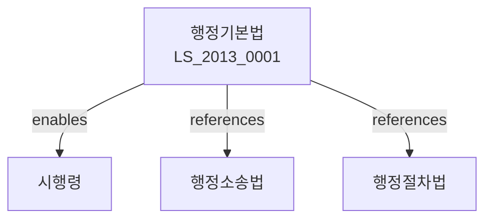

# 행정기본법

> [법률 제20118호, 2024. 1. 9., 일부개정]

---

---

## 제1장 총칙
### 제1조 (목적)
이 법은 행정에 관한 기본적인 사항을 정함으로써 행정의 민주적 운영과 국민의 권익 보호를 도모함을 목적으로 한다。

### 제2조 (정의)
이 법에서 사용하는 용어의 뜻은 다음과 같다。

1. "행정"이란 국가 또는 지방자치단체가 공익을 위하여 수행하는 활동을 말한다。
2. "행정청"이란 행정권한의 행사를 담당하는 국가기관을 말한다。
3. "행정작용"이란 행정청이 행하는 권력적ㆍ비권력적 활동을 말한다。
4. "행정관계자"란 행정에 관계되는 공무원 및 국민을 말한다。

---

## 제2장 행정의 기본원칙
### 第5条(법치행정의 원칙)
행정은 법률에 따라 행하여져야 한다。
### 第6条(비례의 원칙)
행정작용은 목적에 비례하여야 한다。
### 第7条(평등의 원칙)
행정은 국민을 평등하게 대우하여야 한다。
### 第8条(신뢰보호의 원칙)
행정청은 국민의 정당한 신뢰를 보호하여야 한다。

---

## 제3장 행정기관
### 第15条(행정기관의 조직)
행정기관은 법령에 따라 조직된다。
### 第16条(권한의 위임)
상급행정기관은 하급기관에 권한을 위임할 수 있다。
### 第17条(권한의 대리)
권한자가 부득이한 사유로 직무를 수행할 수 없는 때에는 대리인이 직무를 수행한다。
### 第18条(관할)
행정기관의 사무범위는 법령으로 정한다。

---

## 제4장 행정작용
### 第25条(행정입법)
행정청은 법률의 위임에 따라 명령을 제정할 수 있다。
### 第26条(행정처분)
행정청은 법령에 따라 국민의 권리의무에 관한 처분을 할 수 있다。
### 第27条(행정계획)
행정청은 행정목적을 달성하기 위하여 계획을 수립할 수 있다。
### 第28条(행정지도)
행정청은 국민에게 권고ㆍ조언 등의 지도를 할 수 있다。

---

## 제5장 행정절차
### 第35条(처분의 절차)
행정처분은 미리 당사자에게 기회를 주어야 한다。
### 第36条(청문)
당사자의 권익에 중대한 영향을 미치는 처분은 청문을 거쳐야 한다。
### 第37条(공청회)
행정계획 수립 시 필요한 경우 공청회를 개최한다。
### 第38条(사전통지)
처분 전에 당사자에게 처분의 내용과 이유를 통지하여야 한다。

---

## 제6장 행정정보
### 第45条(행정정보의 공개)
국민은 행정정보를 요청할 수 있다。
### 第46条(정보공개의 예외)
다음 각 호의 정보는 공개하지 아니한다。

1. 국가안보에 관한 정보
2. 개인의 프라이버시에 관한 정보
3. 영업비밀에 관한 정보
### 第47条(정보공개의 청구)
정보공개를 청구하려면 서면으로 신청하여야 한다。
### 第48条(정보공개의 결정)
행정청은 청구를 받은 날부터 10일 이내에 결정하여야 한다。

---

## 제7장 행정구제
### 第55条(행정심판)
행정처분에 불복하는 자는 행정심판을 청구할 수 있다。
### 第56条(행정소송)
행정처분에 불복하는 자는 행정소송을 제기할 수 있다。
### 第57条(손해배상)
위법한 행정작용으로 손해를 입은 자는 배상을 청구할 수 있다。
### 第58条(손실보상)
적법한 행정작용으로 손실을 입은 자는 보상을 청구할 수 있다。

---

## 제8장 감독
### 第65条(감독)
상급행정기관은 하급행정기관을 감독한다。
### 第66条(시정명령)
상급행정기관은 위법한 처분에 대하여 시정을 명할 수 있다。
### 第67条(취소ㆍ정지)
상급행정기관은 위법한 처분을 취소하거나 효력을 정지할 수 있다。
### 第68条(직권취소)
행정청은 위법한 처분을 직권으로 취소할 수 있다。

---

## 제9장 벌칙
### 第75条(벌칙)
다음 각 호의 어느 하나에 해당하는 자는 2년 이하의 징역 또는 2천만원 이하의 벌금에 처한다。

1. 허위로 정보공개를 청구한 자
2. 행정절차를 방해한 자
### 第76条(과태료)
다음 각 호의 어느 하나에 해당하는 자에게는 1천만원 이하의 과태료를 부과한다。

1. 정당한 사유 없이 자료 제출을 거부한 자
2. 정보공개 청구에 응하지 아니한 자

---

## 관계 그래프

**상위 법령**
- [[헌법]] 제1조, 제2조 (국가형성, 국민주권)
- [[정부조직법]]

**관련 법령**
- [[행정소송법]]
- [[행정절차법]]
- [[행정심판법]]
- [[정보공개법]]

**하위 법령**
- [[행정기본법 시행령]]
