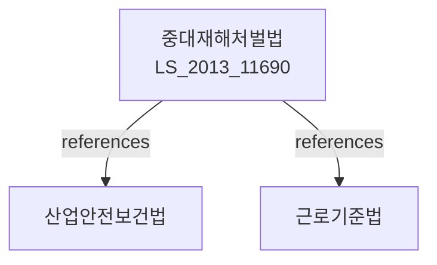

# 중대재해 등에서의 근로자 사망사건 등과 관련된 처벌 등에 관한 법률

> [법률 제20093호, 2024. 1. 9., 일부개정]

---

---

## 제1조 (목적)

이 법은 중대재해 등에서의 근로자 사망사건 등과 관련하여 사업주나 경영책임자에 대한 처벌 규정을 마련함으로써 사업장의 안전보건 확보를 위한 경영책임자의 책임을 강화하고, 나아가 근로자의 생명과 안전을 보호함을 목적으로 한다.

### 제2조 (정의)

이 법에서 사용하는 용어의 뜻은 다음과 같다。

1. "중대재해"란 「산업안전보건법」 제2조 제1호에 따른 산업재해 중 사망자가 발생하거나 동일한 원인으로 3개월 이상 치료가 필요한 부상자가 2명 이상 발생한 재해를 말한다。
2. "경영책임자"란 사업의 경영사항에 대하여 사업주를 대신하여 의사결정을 하고, 해당 사업의 경영을 총괄하는 직위에 있는 자로서 대통령령으로 정하는 자를 말한다。
3. "안전보건관리체계"란 산업재해 예방을 위하여 사업장 내에 구축하는 안전보건 관리 조직 및 절차를 말한다。

---

## 제3조 (경영책임자의 안전보건 의무)

① 경영책임자는 근로자의 생명과 안전을 확보하기 위하여 다음 각 호의 의무를 성실히 이행하여야 한다.

1. 안전보건관리체계의 구축 및 운영
2. 안전보건 관련 인력, 예산 및 시설의 확보
3. 유해ㆍ위험요인의 파악 및 개선
4. 근로자의 안전보건의견 반영

② 제1항에 따른 안전보건관리체계의 구축 및 운영에 관한 기준 등에 관하여 필요한 사항은 대통령령으로 정한다。

### 제4조 (안전보건 관련 조치 의무 위반에 따른 처벌)

경영책임자가 제3조에 따른 의무를 위반하여 중대재해를 발생시킨 경우에는 다음 각 호의 구분에 따라 처벌한다。

1. 사망사건이 발생한 경우: 1년 이상의 징역 또는 10억원 이하의 벌금
2. 다중사망사건(2명 이상 사망)이 발생한 경우: 3년 이상의 징역 또는 30억원 이하의 벌금

### 제5조 (법인에 대한 양벌규정)

법인의 대표자나 법인이나 개인의 대리인, 사용인 그 밖의 종업원이 그 법인 또는 개인의 업무에 관하여 제4조의 위반행위를 한 때에는 행위자를 벌하는 외에 그 법인 또는 개인에게도 각 해당 조의 벌금형을 과한다。다만, 법인 또는 개인이 그 위반행위를 방지하기 위하여 해당 업무에 관하여 상당한 주의 및 감독을 게을리하지 아니한 경우에는 그러하지 아니하다。

---

## 제6조 (사업주의 안전보건 의무)

사업주는 경영책임자가 제3조에 따른 의무를 성실히 이행할 수 있도록 필요한 권한과 자원을 부여하여야 한다。

### 제7조 (안전보건관리체계의 인증)

① 고용노동부장관은 사업장의 안전보건관리체계가 대통령령으로 정하는 기준에 적합한 경우 이를 인증할 수 있다。

② 제1항에 따른 인증의 절차 및 방법 등에 관하여 필요한 사항은 고용노동부령으로 정한다。

### 제8조 (안전보건 전담조직)

① 상시 근로자 50명 이상을 고용하는 사업장의 사업주는 안전보건 전담조직을 설치ㆍ운영하여야 한다.

② 안전보건 전담조직의 구성 및 운영 등에 관하여 필요한 사항은 대통령령으로 정한다。

---

## 제9조 (근로자 및 근로자대표의 참여)

① 사업주는 안전보건관리체계의 구축 및 운영에 근로자 및 근로자대표가 참여할 수 있도록 하여야 한다.

② 근로자 및 근로자대표는 안전보건 관련 사항에 대하여 사업주에게 의견을 제시할 수 있다。

---

## 제10조 (배상책임)

이 법에 따른 처벌은 「근로기준법」, 「산업재해보상보험법」 및 민법 등 다른 법률에 따른 손해배상책임에 영향을 미치지 아니한다。

---

## 제11조 (적용범위)

이 법은 상시 근로자 5명 이상을 고용하는 사업 또는 사업장에 적용한다。다만, 다음 각 호의 어느 하나에 해당하는 사업 또는 사업장은 제4조의 적용에서 제외한다.

1. 상시 근로자 50명 미만을 고용하는 사업 또는 사업장(2024년 1월 27일까지)
2. 국가 및 지방자치단체의 기관

---

## 제12조 (조사 및 수사)

① 고용노동부장관은 중대재해가 발생한 경우 그 원인을 조사하여야 한다。

② 수사기관은 제4조의 위반행위에 대하여 수사할 수 있다。

---

## 제13조 (관계 법령과의 관계)

이 법은 「산업안전보건법」 및 다른 법률에 우하여 적용한다。

---

## 관계 그래프

**상위 법령**
- [[헌법]] 제32조 (근로의 권리)
- [[산업안전보건법]]

**관련 법령**
- [[근로기준법]]
- [[산업재해보상보험법]]
- [[민법]] 제750조 (불법행위)
- [[형법]]

**하위 법령**
- [[중대재해처벌법 시행령]]
