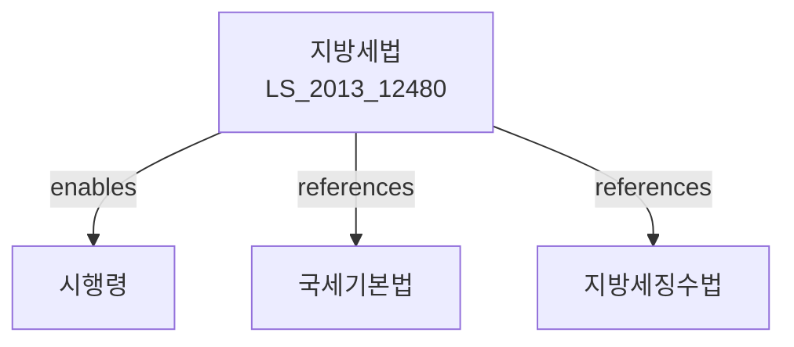

# 지방세법

> [법률 제20110호, 2024. 1. 9., 일부개정]

---

---

## 제1장 총칙

### 제1조 (목적)

이 법은 지방세의 부과ㆍ징수 및 그에 필요한 사항을 정함으로써 지방재정을 확보하고 지방자치를 건전하게 발전시킴을 목적으로 한다。

### 제2조 (정의)

이 법에서 사용하는 용어의 뜻은 다음과 같다。

1. "지방세"란 지방자치단체가 부과ㆍ징수하는 조세를 말한다。
2. "보통세"란 지방자치단체가 일반 재정수요에 충당하기 위하여 부과하는 지방세를 말한다。
3. "목적세"란 지방자치단체가 특정한 목적에 충당하기 위하여 부과하는 지방세를 말한다。
4. "과세물건"이란 지방세의 과세대상이 되는 물건 또는 행위를 말한다。

---

## 제2장 취득세

### 第10条 (취득세의 과세대상)

취득세는 부동산, 차량, 선박 등의 취득에 대하여 부과한다。

### 第11条 (취득의 시기)

취득의 시기는 다음 각 호와 같다。

1. 매매: 잔금지급일
2. 증여: 증여받은 날
3. 교환: 계약일
4. 경매: 대금납부일

### 第12条 (취득세의 세율)

취득세의 세율은 취득가액의 100분의 4로 한다。

### 第13条 (취득세의 신고와 납부)

취득자는 취득일부터 60일 이내에 취득세를 신고하고 납부하여야 한다。

---

## 제3장 재산세

### 第30条 (재산세의 과세대상)

재산세는 건축물, 선박, 항공기 등에 대하여 부과한다。

### 第31条 (재산세의 납기)

재산세는 매년 7월 16일부터 7월 31일까지 납부한다。

### 第32条 (재산세의 세율)

재산세의 세율은 과세표준에 따라 대통령령으로 정한다。

---

## 제4장 자동차세

### 第45条 (자동차세의 과세대상)

자동차세는 자동차에 대하여 부과한다。

### 第46条 (자동차세의 납기)

자동차세는 다음 각 호의 기간에 납부한다。

1. 제1기분: 6월 16일부터 6월 30일까지
2. 제2기분: 12월 16일부터 12월 31일까지

### 第47条 (자동차세의 세율)

자동차세의 세율은 배기량에 따라 대통령령으로 정한다。

---

## 第5章 주민세

### 第60条 (주민세의 종류)

주민세는 다음 각 호와 같다。

1. 주민세 균등할
2. 주민세 소득할

### 第61条 (주민세 균등할)

주민세 균등할은 개인 및 법인에게 부과한다。

### 第62条 (주민세 소득할)

주민세 소득할은 소득세ㆍ법인세ㆍ농업소득세 납세의무자에게 부과한다。

---

## 第6章 지방소비세

### 第70条 (지방소비세의 과세대상)

지방소비세는 부가가치세의 납세의무자에게 부과한다。

### 第71条 (지방소비세의 세율)

지방소비세의 세율은 부가가치세액의 100분의 5로 한다。

---

## 第7장 지방교육세

### 第80条 (지방교육세의 목적)

지방교육세는 지방교육재정을 확보하기 위하여 부과한다。

### 第81条 (지방교육세의 세율)

지방교육세의 세율은 대통령령으로 정한다。

---

## 第8章 벌칙

### 第150条 (벌칙)

다음 각 호의 어느 하나에 해당하는 자는 3년 이하의 징역 또는 지방세액의 5배과 타당하는 금액 이하의 벌금에 처한다。

1. 허위로 지방세를 신고한 자
2. 지방세를 포탈한 자

### 第151条 (가산세)

지방세의 신고ㆍ납부를 지연한 자에게는 가산세를 부과한다。

---

## 관계 그래프

**상위 법령**
- [[헌법]] 제38조 (납세의 의무)
- [[국세기본법]]

**관련 법령**
- [[지방세징수법]]
- [[지방세외수입금징수법]]
- [[소득세법]]
- [[법인세법]]
- [[부가가치세법]]

**하위 법령**
- [[지방세법 시행령]]
