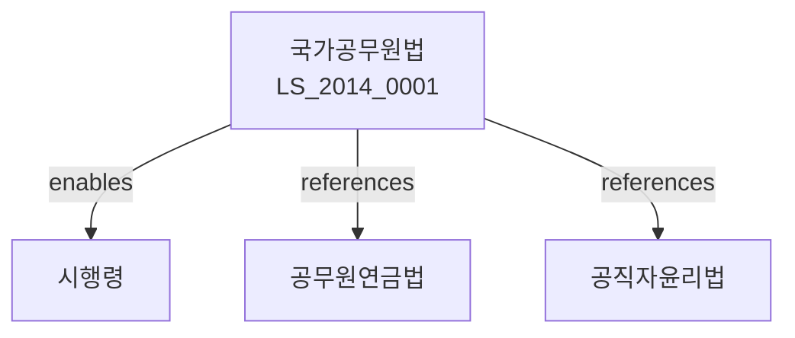

# 국가공무원법

> [법률 제20119호, 2024. 1. 9., 일부개정]

---

---

## 제1장 총칙
### 제1조 (목적)
이 법은 국가공무원의 직무를 정하고 그 인사행정에 관한 기본사항을 규정함으로써 국가행정의 민주적ㆍ능률적인 운영과 공무원의 능력발전을 도모함을 목적으로 한다。

### 제2조 (정의)
이 법에서 사용하는 용어의 뜻은 다음과 같다。

1. "공무원"이란 국가공무원으로 임명된 자를 말한다。
2. "경력직공무원"이란 실수요직으로서 평생공무원으로 근무할 자를 말한다。
3. "별정직공무원"이란 특수한 경력ㆍ자격 등이 필요한 직위에 근무할 자를 말한다。
4. "정무직공무원"이란 국가의 중요정책을 결정하거나 수행하는 직위에 근무할 자를 말한다。

---

## 제2장 공무원의 직무
### 第5条(공무원의 의무)
공무원은 국민전체에 대한 봉사자로서 양심에 따라 성실히 직무를 수행하여야 한다。
### 第6条(성실의무)
공무원은 직무를 성실히 수행하여야 한다。
### 第7条(복종의무)
공무원은 상사의 직무상 명령에 복종하여야 한다。
### 第8条(비밀엄수의무)
공무원은 직무상 알게 된 비밀을 누설하여서는 아니 된다。

---

## 제3장 임용
### 第15条(임용의 원칙)
공무원의 임용은 시험ㆍ자격증 또는 성적 등에 의하여 공개경쟁의 방법으로 행한다。
### 第16条(임용결격사유)
다음 각 호의 어느 하나에 해당하는 자는 공무원으로 임용될 수 없다。

1. 금치산자
2. 파산선고를 받은 자
3. 금고 이상의 형을 선고받은 자
4. 공무원으로 임용될 수 없는 자
### 第17条(시험)
공무원의 임용을 위한 시험은 공개경쟁시험과 특채시험으로 구분한다。
### 第18条(임용의 효력)
공무원의 임용은 임용장 교부로써 효력이 발생한다。

---

## 제4장 보수
### 第25条(보수의 지급)
공무원에게는 보수를 지급한다。
### 第26条(보수의 구성)
보수는 봉급ㆍ수당 및 기타 급여로 구성한다。
### 第27条(봉급)
봉급은 직급 및 호봉에 따라 지급한다。
### 第28条(수당)
수당은 직무의 특수성 등에 따라 지급한다。

---

## 제5장 교육훈련
### 第35条(교육훈련의 실시)
국가는 공무원의 직무능력 향상을 위하여 교육훈련을 실시한다。
### 第36条(교육훈련의 종류)
교육훈련은 다음 각 호와 같다。

1. 기본교육
2. 전문교육
3. 직무교육
4. 특별교육
### 第37条(교육훈련의 내용)
교육훈련의 내용은 직무수행에 필요한 지식과 기술로 한다。
### 第38条(교육훈련의 기관)
교육훈련은 행정안전부와 소속 교육훈련기관이 실시한다。

---

## 제6장 신분보장
### 第45条(신분보장)
공무원은 법령에 정한 사유에 의하지 아니하고는 그 의사에 반하여 휴직ㆍ직위해제ㆍ면직 또는 해임되지 아니한다。
### 第46条(징계)
공무원이 직무상 의무를 위반한 때에는 징계처분을 할 수 있다。
### 第47条(징계의 종류)
징계처분은 다음 각 호와 같다。

1. 견책
2. 감봉
3. 정직
4. 강임
5. 해임
### 第48条(징계절차)
징계처분은 징계위원회의 의결을 거쳐야 한다。

---

## 제7장 복무
### 第55条(복무의 기본원칙)
공무원은 국민전체의 봉사자로서 공익을 우선하여야 한다。
### 第56条(정치활동의 제한)
공무원은 정치활동을 할 수 없다。
### 第57条(영리업무의 제한)
공무원은 영리를 목적으로 하는 업무에 종사할 수 없다。
### 第58条(증여의 제한)
공무원은 직무와 관련하여 증여를 받을 수 없다。

---

## 제8장 권익보장
### 第65条(소청)
공무원은 인사처분에 불복하는 때에는 소청을 제기할 수 있다。
### 第66条(소청심사위원회)
소청을 심사하기 위하여 소청심사위원회를 둔다。
### 第67条(심사절차)
소청심사위원회는 서면심사를 원칙으로 한다。
### 第68条(결정)
소청심사위원회는 인용ㆍ각하 또는 기각의 결정을 한다。

---

## 제9장 벌칙
### 第75条(벌칙)
다음 각 호의 어느 하나에 해당하는 자는 3년 이하의 징역 또는 3천만원 이하의 벌금에 처한다。

1. 공무원의 신분을 사칭한 자
2. 공무원의 직무를 방해한 자
3. 시험에 부정한 방법으로 합격한 자
### 第76条(과태료)
다음 각 호의 어느 하나에 해당하는 자에게는 2천만원 이하의 과태료를 부과한다。

1. 정당한 사유 없이 보고를 하지 아니한 자
2. 교육훈련을 받지 아니한 자

---

## 관계 그래프

**상위 법령**
- [[헌법]] 제7조 (공무원의 지위)
- [[정부조직법]]

**관련 법령**
- [[공무원연금법]]
- [[공직자윤리법]]
- [[지방공무원법]]
- [[공무원징계령]]

**하위 법령**
- [[국가공무원법 시행령]]
