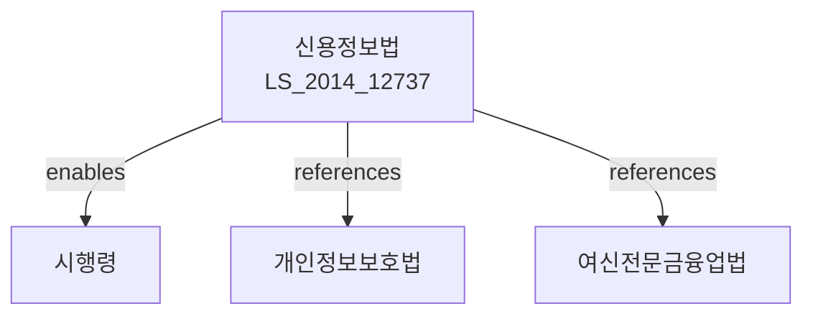

# 신용정보의 이용 및 보호에 관한 법률

> [법률 제20081호, 2024. 1. 9., 일부개정]

---

---

## 제1장 총칙

### 제1조 (목적)

이 법은 신용정보의 효율적인 이용과 관리를 위하여 신용정보의 수집ㆍ처리 및 이용에 관한 사항을 정함으로써 신용질서의 확립과 정보주체의 권익보호에 이바지함을 목적으로 한다。

### 제2조 (정의)

이 법에서 사용하는 용어의 뜻은 다음과 같다。

1. "신용정보"란 금융거래 등 상거래에서 상대방의 신용을 판단하기 위한 정보로서 다음 각 목의 정보를 말한다。
   가. 신용거래정보: 대출, 보증, 신용카드 등 신용거래의 내용 및 실적
   나. 신용판단정보: 연체, 대지급, 부도 등 신용상태를 판단할 수 있는 정보
   다. 신용능력정보: 소득, 재산, 채무 등 신용능력에 관한 정보
   라. 신용조회정보: 신용정보의 조회에 관한 정보
2. "정보주체"란 신용정보에 의하여 식별되는 자를 말한다.
3. "신용정보업"이란 신용정보를 수집ㆍ처리하여 제공하는 업무를 말한다.
4. "신용정보집중기관"이란 신용정보를 수집ㆍ관리하는 기관을 말한다.

---

## 제2장 신용정보의 수집 및 이용

### 第4条 (신용정보의 수집)

① 신용정보업자 또는 신용정보집중기관은 정당한 사유 없이 정보주체의 동의를 받지 아니하고 신용정보를 수집하여서는 아니 된다.

② 다음 각 호의 어느 하나에 해당하는 경우에는 제1항에도 불구하고 동의 없이 신용정보를 수집할 수 있다.

1. 다른 법률에 따라 수집하는 경우
2. 공공기관이 직무 수행을 위하여 필요한 경우

### 第5条 (신용정보의 이용)

① 신용정보는 수집 목적 범위 내에서 이용하여야 한다.

② 신용정보업자는 정당한 사유 없이 정보주체의 동의를 받지 아니하고 수집한 신용정보를 제3자에게 제공하여서는 아니 된다。

### 第6条 (신용정보의 보호)

신용정보업자 및 신용정보집중기관은 신용정보의 누출, 오용 또는 남용을 방지하기 위하여 필요한 조치를 하여야 한다。

---

## 제3장 정보주체의 권리

### 第10条 (자신의 신용정보 열람 청구)

① 정보주체는 신용정보집중기관에 대하여 자신의 신용정보의 열람을 청구할 수 있다.

② 신용정보집중기관은 제1항에 따른 청구를 받은 날부터 5영업일 이내에 열람하게 하여야 한다。

### 第11条 (신용정보의 정정 청구)

① 정보주체는 자신의 신용정보가 사실과 다른 경우 그 정정을 청구할 수 있다.

② 신용정보집중기관은 제1항에 따른 청구를 받은 경우 지체 없이 조사하여 그 결과를 정보주체에게 통지하여야 한다。

### 第12条 (이의신청)

정보주체는 신용정보의 열람 또는 정정 청구에 대한 결과에 이의가 있는 경우 이의신청을 할 수 있다。

---

## 제4장 신용정보업자

### 第20条 (등록)

① 신용정보업을 영위하려는 자는 금융위원회에 등록하여야 한다.

② 등록의 요건 및 절차 등에 관하여 필요한 사항은 대통령령으로 정한다。

### 第21条 (결격사유)

다음 각 호의 어느 하나에 해당하는 자는 신용정보업의 등록을 할 수 없다.

1. 금치산자 또는 한정치산자
2. 파산자로서 복권되지 아니한 자
3. 이 법을 위반하여 징역형을 선고받은 후 3년이 지나지 아니한 자

---

## 제5장 신용조회

### 第30条 (신용조회)

① 금융기관 등은 다음 각 호의 목적으로 신용정보를 조회할 수 있다。

1. 여신의 승인 및 관리
2. 보증의 승인 및 관리
3. 그 밖에 대통령령으로 정하는 목적

② 제1항에 따른 신용조회 결과는 조회 목적 외의 용도로 이용할 수 없다.

---

## 제6장 벌칙

### 第40条 (벌칙)

다음 각 호의 어느 하나에 해당하는 자는 5년 이하의 징역 또는 5천만원 이하의 벌금에 처한다.

1. 부정한 방법으로 신용정보를 수집한 자
2. 신용정보를 목적 외 용도로 이용하거나 제3자에게 제공한 자

### 第41条 (과태료)

다음 각 호의 어느 하나에 해당하는 자에게는 3천만원 이하의 과태료를 부과한다.

1. 제20조에 따른 등록 없이 신용정보업을 영위한 자
2. 정보주체의 열람 청구를 거부한 자

---

## 관계 그래프

**상위 법령**
- [[개인정보보호법]]
- [[금융실명거래및비밀보장에관한법률]]

**관련 법령**
- [[여신전문금융업법]]
- [[신용협동조합법]]
- [[대부업법]]
- [[은행법]]

**하위 법령**
- [[신용정보법 시행령]]
