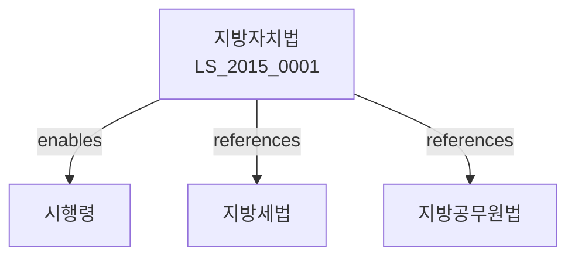

# 지방자치법

> [법률 제20120호, 2024. 1. 9., 일부개정]

---

---

## 제1장 총칙
### 제1조 (목적)
이 법은 지방자치단체의 종류ㆍ조직 및 운영 등에 관한 사항을 정함으로써 지방자치제도를 확립하고 국민의 민주적 자치능력을 배양함을 목적으로 한다。

### 제2조 (정의)
이 법에서 사용하는 용어의 뜻은 다음과 같다。

1. "지방자치단체"란 지방자치를 실시하기 위하여 설치된 단체를 말한다。
2. "지방의회"란 지방자치단체의 의결기관을 말한다。
3. "지방자치단체장"이란 지방자치단체의 집행기관을 말한다。
4. "주민"이란 지방자치단체의 관할구역 안에 주소를 둔 자를 말한다。

---

## 제2장 지방자치단체
### 第5条(지방자치단체의 종류)
지방자치단체는 다음 각 호와 같다。

1. 특별시
2. 광역시
3. 도
4. 시
5. 군
6. 구
### 第6条(지방자치단체의 법인격)
지방자치단체는 법인격을 가진다。
### 第7条(관할구역)
지방자치단체의 관할구역은 법률로 정한다。
### 第8条(사무의 범위)
지방자치단체는 관할구역 안의 자치사무와 법령에 위임된 사무를 처리한다。

---

## 제3장 주민
### 第15条(주민의 권리)
주민은 다음 각 호의 권리를 가진다。

1. 선거권
2. 주민투표권
3. 주민소환권
4. 주민감사청구권
### 第16条(주민의 의무)
주민은 지방자치단체의 조례가 정하는 바에 따라 의무를 진다。
### 第17条(주민투표)
지방자치단체의 중요정책은 주민투표에 부칠 수 있다。
### 第18条(주민소환)
주민은 지방자치단체장 등을 소환할 수 있다。

---

## 제4장 지방의회
### 第25条(지방의회의 구성)
지방의회는 주민이 선출한 의원으로 구성한다。
### 第26条(의원의 수)
지방의회 의원의 정수는 법령으로 정한다。
### 第27条(의원의 임기)
지방의회 의원의 임기는 4년으로 한다。
### 第28条(의회의 권한)
지방의회는 다음 각 호의 권한을 가진다。

1. 의결권
2. 행정사무감사권
3. 청원수리권
4. 자치법규 제정권

---

## 제5장 지방자치단체장
### 第35条(지방자치단체장의 선거)
지방자치단체장은 주민이 선출한다。
### 第36条(지방자치단체장의 임기)
지방자치단체장의 임기는 4년으로 한다。
### 第37条(지방자치단체장의 직무)
지방자치단체장은 지방자치단체를 대표하고 사무를 총괄한다。
### 第38条(부단체장)
지방자치단체에는 부단체장을 둘 수 있다。

---

## 제6장 사무
### 第45条(자치사무)
지방자치단체는 자치사무를 자주적으로 처리한다。
### 第46条(단체위임사무)
국가 또는 상급지방자치단체는 지방자치단체에 사무를 위임할 수 있다。
### 第47条(기관위임사무)
국가는 지방자치단체장에게 기관위임사무를 위임할 수 있다。
### 第48条(사무의 조정)
지방자치단체 간 사무에 관한 분쟁은 중앙조정기관이 조정한다。

---

## 제7장 재정
### 第55条(재정의 기본원칙)
지방자치단체는 자주재정을 확보하여야 한다。
### 第56条(지방세)
지방자치단체는 지방세를 부과ㆍ징수할 수 있다。
### 第57条(지방교부세)
국가는 지방자치단체에 지방교부세를 교부한다。
### 第58条(지방양여금)
국가는 특정목적을 위하여 지방양여금을 교부할 수 있다。

---

## 제8장 지방자치단체 간 협력
### 第65条(협력의 원칙)
지방자치단체는 상호 협력하여야 한다。
### 第66条(지방자치단체 조합)
지방자치단체는 공동으로 사무를 처리하기 위하여 조합을 설립할 수 있다。
### 第67条(협의회)
지방자치단체는 협력을 위하여 협의회를 구성할 수 있다。
### 第68条(상호 협력사항)
지방자치단체는 다음 각 호의 사항에 대하여 상호 협력한다。

1. 광역계획 수립
2. 환경보전
3. 교통ㆍ물류
4. 문화ㆍ관광

---

## 제9장 감독
### 第75条(감독)
중앙행정기관은 지방자치단체를 감독한다。
### 第76条(시정명령)
중앙행정기관은 위법한 처분에 대하여 시정을 명할 수 있다。
### 第77条(대집행)
지방자치단체가 법령에 따른 의무를 이행하지 아니한 때에는 대집행할 수 있다。
### 第78条(조례의 감독)
지방자치단체의 조례는 법령에 위반되지 아니하여야 한다。

---

## 제10장 벌칙
### 第85条(벌칙)
다음 각 호의 어느 하나에 해당하는 자는 2년 이하의 징역 또는 2천만원 이하의 벌금에 처한다。

1. 주민투표를 방해한 자
2. 의회의 회의를 방해한 자
3. 지방자치단체장의 직무를 방해한 자
### 第86条(과태료)
다음 각 호의 어느 하나에 해당하는 자에게는 1천만원 이하의 과태료를 부과한다。

1. 정당한 사유 없이 자료 제출을 거부한 자
2. 감사를 방해한 자

---

## 관계 그래프

**상위 법령**
- [[헌법]] 제117조, 제118조 (지방자치)
- [[행정기본법]]

**관련 법령**
- [[지방세법]]
- [[지방공무원법]]
- [[지방재정법]]
- [[지방교부세법]]

**하위 법령**
- [[지방자치법 시행령]]
