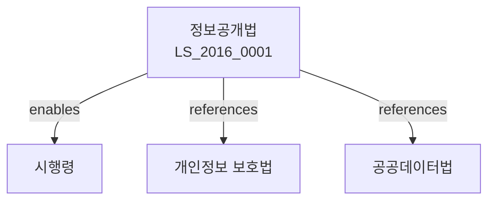

# 공공기관의 정보공개에 관한 법률

> [법률 제20121호, 2024. 1. 9., 일부개정]

---

---

## 제1장 총칙
### 제1조 (목적)
이 법은 국민의 알권리를 보장하고 공공기관의 정보공개 의무를 명확히 함으로써 국정운영의 투명성을 확보하고 국민의 국정참여를 제고함을 목적으로 한다。

### 제2조 (정의)
이 법에서 사용하는 용어의 뜻은 다음과 같다。

1. "정보"란 공공기관이 직무상 작성 또는 취득하여 관리하고 있는 문서ㆍ도면ㆍ사진 등을 말한다。
2. "공공기관"이란 국가기관ㆍ지방자치단체 등을 말한다。
3. "정보공개청구"란 공공기관에게 정보의 공개를 요구하는 행위를 말한다。
4. "공개"란 정보를 열람하게 하거나 그 사본을 교부하는 것을 말한다。

---

## 제2장 정보공개청구
### 第5条(청구권자)
모든 국민은 정보공개를 청구할 수 있다。
### 第6条(청구의 방법)
정보공개를 청구하려면 서면으로 신청하여야 한다。
### 第7条(청구의 내용)
청구서에는 다음 각 호의 사항을 기재하여야 한다。

1. 청구인의 성명 및 주소
2. 청구하는 정보의 내용
3. 공개의 방법
### 第8条(접수)
공공기관은 청구를 접수한 때에는 접수증을 교부하여야 한다。

---

## 제3장 공개 및 비공개
### 第15条(공개의 원칙)
공공기관은 정보공개청구가 있는 때에는 공개하여야 한다。
### 第16条(비공개 대상)
다음 각 호의 정보는 공개하지 아니한다。

1. 국가안보ㆍ국방에 관한 정보
2. 외교관계에 관한 정보
3. 형사사건의 수사ㆍ공소에 관한 정보
4. 개인의 프라이버시에 관한 정보
5. 영업비밀에 관한 정보
### 第17条(부분공개)
정보의 일부가 비공개 대상인 경우에는 나머지 부분을 공개할 수 있다。
### 第18条(공개의 청구)
공공기관은 청구를 받은 날부터 10일 이내에 공개여부를 결정하여야 한다。

---

## 제4장 공개의 방법
### 第25条(공개의 방법)
정보공개는 다음 각 호의 방법으로 한다。

1. 열람
2. 사본 교부
3. 우편송부
### 第26条(공개의 장소)
정보공개는 공공기관의 장소에서 행한다。
### 第27条(공개의 시기)
공공기관은 공개결정을 한 날부터 10일 이내에 공개하여야 한다。
### 第28条(수수료)
정보공개에 소요되는 비용은 청구인이 부담한다。

---

## 제5장 불복구제
### 第35条(이의신청)
공개여부의 결정에 불복하는 자는 이의신청을 할 수 있다。
### 第36条(행정심판)
공개여부의 결정에 불복하는 자는 행정심판을 청구할 수 있다。
### 第37条(행정소송)
공개여부의 결정에 불복하는 자는 행정소송을 제기할 수 있다。
### 第38条(정보공개위원회)
정보공개에 관한 분쟁을 조정하기 위하여 정보공개위원회를 둔다。

---

## 제6장 정보목록의 비치
### 第45条(정보목록)
공공기관은 정보목록을 작성ㆍ비치하여야 한다。
### 第46条(목록의 공개)
정보목록은 누구든지 열람할 수 있다。
### 第47条(전산정보)
공공기관은 전산정보를 구축하여야 한다。
### 第48条(정보공개처리대장)
공공기관은 정보공개처리대장을 비치하여야 한다。

---

## 제7장 보칙
### 第55条(공개에 대한 협조)
공공기관은 정보공개를 위하여 상호 협조하여야 한다。
### 第56条(비밀유지의무)
공무원은 직무상 알게 된 비밀을 누설하여서는 아니 된다。
### 第57条(우편요금의 무료)
정보공개에 관한 우편요금은 무료로 한다。
### 第58条(시행규칙)
이 법의 시행에 필요한 사항은 대통령령으로 정한다。

---

## 제8장 벌칙
### 第65条(벌칙)
다음 각 호의 어느 하나에 해당하는 자는 3년 이하의 징역 또는 3천만원 이하의 벌금에 처한다。

1. 허위로 정보공개를 청구한 자
2. 공개된 정보를 부정하게 이용한 자
### 第66条(과태료)
다음 각 호의 어느 하나에 해당하는 자에게는 2천만원 이하의 과태료를 부과한다。

1. 정당한 사유 없이 정보공개를 하지 아니한 자
2. 정보목록을 비치하지 아니한 자

---

## 관계 그래프

**상위 법령**
- [[헌법]] 제21조 (알권리)
- [[행정기본법]]

**관련 법령**
- [[개인정보 보호법]]
- [[공공데이터법]]
- [[행정소송법]]
- [[행정심판법]]

**하위 법령**
- [[정보공개법 시행령]]
