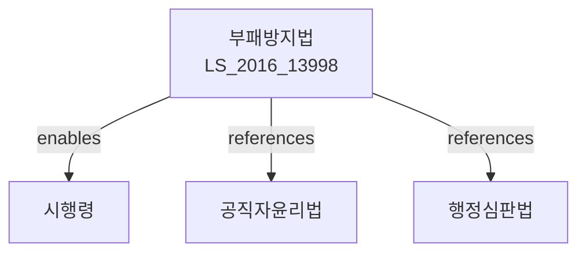

# 부패방지 및 국민권익위원회의 설치와 운영에 관한 법률

> [법률 제20111호, 2024. 1. 9., 일부개정]

---

---

## 제1장 총칙

### 제1조 (목적)

이 법은 부패의 방지와 국민의 권익을 침해받지 아니할 권리의 보장에 관한 사항을 정함으로써 청렴한 공직사회와 건전한 사회기풍을 확립함을 목적으로 한다。

### 제2조 (정의)

이 법에서 사용하는 용어의 뜻은 다음과 같다。

1. "부패"란 공무원이 직무와 관련하여 그 지위 또는 권한을 남용하거나 법령을 위반하여 자기 또는 제3자의 이익을 도모하는 행위를 말한다。
2. "공무원"이란 국가공무원법 및 지방공무원법의 적용을 받는 공무원과 그 밖에 법령에 따라 공무로 종사하는 자를 말한다。
3. "공공기관"이란 국가기관, 지방자치단체 등을 말한다。
4. "부패방지시책"이란 부패를 예방하고 억제하기 위한 정책을 말한다。

---

## 제2장 부패방지 시책

### 第5条 (부패방지 기본계획)

① 국민권익위원회는 5년마다 부패방지 기본계획을 수립하여야 한다。

② 기본계획에는 다음 각 호의 사항이 포함되어야 한다。

1. 부패실태의 분석 및 전망
2. 부패방지의 목표 및 방향
3. 공무원의 윤리의식 제고에 관한 사항
4. 부패신고의 보호 및 보상에 관한 사항
5. 그 밖에 부패방지에 필요한 사항

### 第6条 (공공기관의 의무)

공공기관의 장은 소속 공무원에 대하여 부패방지 교육을 실시하고 부패방지를 위한 제도를 마련하여야 한다。

### 第7条 (공무원의 의무)

공무원은 직무를 수행함에 있어 부패행위를 하여서는 아니 된다。

### 第8条 (공익신고의 보호)

공익을 위하여 부패행위를 신고한 자는 그 신고로 인하여 불이익을 받지 아니한다。

---

## 제3장 국민권익위원회

### 第15条 (설치)

국민의 권익을 보호하고 부패를 방지하기 위하여 국민권익위원회를 둔다。

### 第16条 (기능)

국민권익위원회는 다음 각 호의 사무를 관장한다。

1. 부패방지 시책의 수립 및 추진
2. 부패신고의 접수 및 처리
3. 공익신고자의 보호 및 보상
4. 국민의 권익침해에 대한 구제
5. 행정제도의 개선에 관한 권고
6. 그 밖에 법령으로 정하는 사무

### 第17条 (조직)

① 국민권익위원회는 위원장을 포함한 15인 이내의 위원으로 구성한다。

② 위원의 자격ㆍ임명 등에 관하여 필요한 사항은 대통령령으로 정한다。

---

## 제4장 부패신고의 처리

### 第30条 (부패신고)

누구든지 부패행위를 알게 된 때에는 국민권익위원회에 신고할 수 있다。

### 第31条 (신고의 방법)

부패신고는 서면, 전화, 전자우편 등으로 할 수 있다。

### 第32条 (신고의 처리)

국민권익위원회는 부패신고를 접수한 경우 지체 없이 조사하여야 한다。

### 第33条 (신고자의 보호)

국민권익위원회는 부패신고자에 대하여 다음 각 호의 보호조치를 할 수 있다。

1. 신분공개의 금지
2. 불이익조치의 금지
3. 인적사항의 변경
4. 그 밖에 대통령령으로 정하는 보호조치

### 第34条 (신고자의 보상)

부패신고로 인하여 국가 또는 지방자치단체의 재정에 기여한 경우 신고자에게 보상금을 지급할 수 있다。

---

## 제5장 벌칙

### 第60条 (벌칙)

다음 각 호의 어느 하나에 해당하는 자는 3년 이하의 징역 또는 3천만원 이하의 벌금에 처한다。

1. 부패신고자에게 불이익을 준 자
2. 부패신고자의 신분을 공개한 자

### 第61条 (과태료)

다음 각 호의 어느 하나에 해당하는 자에게는 2천만원 이하의 과태료를 부과한다。

1. 정당한 사유 없이 조사를 거부한 자
2. 정당한 사유 없이 자료를 제출하지 아니한 자

---

## 관계 그래프

**상위 법령**
- [[헌법]] 제27조 (공무원의 책임)
- [[공직자윤리법]]

**관련 법령**
- [[행정심판법]]
- [[행정소송법]]
- [[국가공무원법]]
- [[공공기관의 정보공개에 관한 법률]]

**하위 법령**
- [[부패방지법 시행령]]
