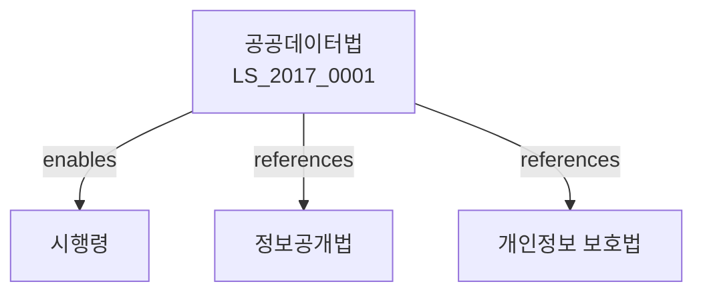

# 공공데이터의 제공 및 이용 활성화에 관한 법률

> [법률 제20122호, 2024. 1. 9., 일부개정]

---

---

## 제1장 총칙
### 제1조 (목적)
이 법은 공공데이터의 제공 및 이용 활성화에 필요한 사항을 정함으로써 국민의 편의를 증진하고 새로운 가치를 창출하는 데 이바지함을 목적으로 한다。

### 제2조 (정의)
이 법에서 사용하는 용어의 뜻은 다음과 같다。

1. "공공데이터"란 공공기관이 생성 또는 취득하여 관리하는 데이터를 말한다。
2. "개방형 공공데이터"란 누구나 이용할 수 있는 공공데이터를 말한다。
3. "공공데이터 제공"란 공공데이터를 이용자에게 제공하는 것을 말한다。
4. "이용자"란 공공데이터를 이용하는 자를 말한다。

---

## 제2장 공공데이터의 제공
### 第5条(공공데이터의 제공 원칙)
공공기관은 공공데이터를 원활하게 제공하기 위하여 노력하여야 한다。
### 第6条(공공데이터의 목록)
공공기관은 공공데이터 목록을 작성하여 공개하여야 한다。
### 第7条(공공데이터 제공계획)
공공기관은 공공데이터 제공계획을 수립하여야 한다。
### 第8条(공공데이터의 제공 방법)
공공데이터는 다음 각 호의 방법으로 제공한다。

1. 온라인 제공
2. 매체 제공
3. 열람

---

## 제3장 공공데이터의 관리
### 第15条(공공데이터의 표준화)
공공기관은 공공데이터를 표준화하여야 한다。
### 第16条(공공데이터의 품질관리)
공공기관은 공공데이터의 품질을 관리하여야 한다。
### 第17条(메타데이터)
공공기관은 공공데이터의 메타데이터를 구축하여야 한다。
### 第18条(공공데이터 통합관제)
공공데이터의 효율적 관리를 위하여 통합관제체계를 구축한다。

---

## 제4장 공공데이터의 이용
### 第25条(이용의 원칙)
공공데이터는 누구나 자유롭게 이용할 수 있다。
### 第26条(이용의 방법)
공공데이터는 다음 각 호의 방법으로 이용할 수 있다。

1. 다운로드
2. API(Application Programming Interface)
3. 맞춤형 제공
### 第27条(이용의 제한)
다음 각 호의 공공데이터는 이용을 제한할 수 있다。

1. 비공개 대상 정보
2. 제3자의 권리가 포함된 데이터
3. 기술적 제약이 있는 데이터
### 第28条(이용료)
공공데이터의 이용료는 무료를 원칙으로 한다。

---

## 제5장 공공데이터의 활용
### 第35条(활용의 촉진)
국가는 공공데이터의 활용을 촉진하여야 한다。
### 第36条(민관협력)
국가는 민관협력을 통하여 공공데이터의 활용을 도모한다。
### 第37条(창업지원)
국가는 공공데이터를 활용한 창업을 지원한다。
### 第38条(교육)
국가는 공공데이터의 활용능력을 높이기 위한 교육을 실시한다。

---

## 제6장 공공데이터포털
### 第45条(공공데이터포털)
공공데이터의 제공 및 이용을 위하여 공공데이터포털을 운영한다。
### 第46条(포털의 기능)
공공데이터포털은 다음 각 호의 기능을 수행한다。

1. 공공데이터 제공
2. 이용자 지원
3. 통계 제공
4. 민원 처리
### 第47条(포털의 운영)
공공데이터포털은 행정안전부가 운영한다。
### 第48条(포털의 이용)
공공데이터포털의 이용은 무료로 한다。

---

## 제7장 벌칙
### 第55条(벌칙)
다음 각 호의 어느 하나에 해당하는 자는 2년 이하의 징역 또는 2천만원 이하의 벌금에 처한다。

1. 공공데이터를 부정하게 이용한 자
2. 공공데이터를 무단으로 변경한 자
### 第56条(과태료)
다음 각 호의 어느 하나에 해당하는 자에게는 1천만원 이하의 과태료를 부과한다。

1. 정당한 사유 없이 공공데이터를 제공하지 아니한 자
2. 공공데이터 목록을 공개하지 아니한 자

---

## 관계 그래프

**상위 법령**
- [[헌법]] 제21조 (알권리)
- [[행정기본법]]

**관련 법령**
- [[정보공개법]]
- [[개인정보 보호법]]
- [[전자정부법]]
- [[정보통신망법]]

**하위 법령**
- [[공공데이터법 시행령]]
