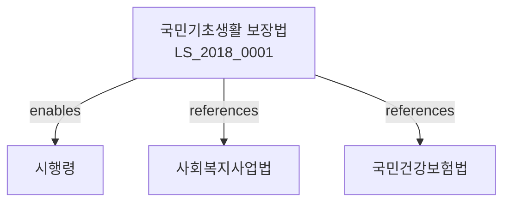

# 국민기초생활 보장법

> [법률 제20123호, 2024. 1. 9., 일부개정]

---

---

## 제1장 총칙
### 제1조 (목적)
이 법은 생활이 어려운 사람에게 필요한 급여를 행하여 이들의 최저생활을 보장하고 자활을 조성함으로써 국민의 생존권 보장과 사회복지 증진에 이바지함을 목적으로 한다。

### 제2조 (정의)
이 법에서 사용하는 용어의 뜻은 다음과 같다。

1. "수급자"란 이 법에 따른 급여를 받는 자를 말한다。
2. "부양의무자"란 수급자를 부양할 의무가 있는 자를 말한다。
3. "급여"란 생계급여ㆍ의료급여ㆍ주거급여ㆍ교육급여 등을 말한다。
4. "소득인정액"이란 소득액에 재산의 소득환산액을 합한 금액을 말한다。

---

## 제2장 급여의 종류
### 第5条(생계급여)
생계급여는 수급자의 생계유지에 필요한 급여를 말한다。
### 第6条(의료급여)
의료급여는 수급자의 질병ㆍ부상 등에 대한 의료를 제공하는 급여를 말한다。
### 第7条(주거급여)
주거급여는 수급자의 주거안정에 필요한 급여를 말한다。
### 第8条(교육급여)
교육급여는 수급자의 교육에 필요한 급여를 말한다。

---

## 제3장 수급자
### 第15条(수급자의 요건)
수급자는 소득인정액이 최저생계비 이하인 자로 한다。
### 第16条(수급자의 선정)
수급자는 신청에 따라 시장ㆍ군수ㆍ구청장이 선정한다。
### 第17条(부양의무자의 범위)
부양의무자는 수급자의 1촌의 직계혈족 및 그 배우자로 한다。
### 第18条(부양능력의 판정)
부양능력은 소득ㆍ재산 등을 고려하여 판정한다。

---

## 제4장 급여의 실시
### 第25条(생계급여의 실시)
생계급여는 현금으로 지급한다。
### 第26条(의료급여의 실시)
의료급여는 의료기관에서 제공한다。
### 第27条(주거급여의 실시)
주거급여는 현금 또는 현물로 지급한다。
### 第28条(교육급여의 실시)
교육급여는 교육기관에 직접 지급할 수 있다。

---

## 제5장 자활사업
### 第35条(자활사업의 목적)
자활사업은 수급자의 자립자활을 지원하기 위한 사업을 말한다。
### 第36条(자활사업의 종류)
자활사업은 다음 각 호와 같다。

1. 자활근로사업
2. 자활후견기관 운영
3. 직업훈련
4. 창업지원
### 第37条(자활후견기관)
자활후견기관은 수급자의 자활을 지원하는 기관을 말한다。
### 第38条(자활급여)
자활급여는 자활사업 참여자에게 지급한다。

---

## 제6장 시설급여
### 第45条(시설급여의 대상)
시설급여는 가정에서 생활하기 어려운 수급자에게 제공한다。
### 第46条(생활시설)
생활시설은 수급자를 입소시켜 보호하는 시설을 말한다。
### 第47条(이용시설)
이용시설은 수급자에게 주간보호 등을 제공하는 시설을 말한다。
### 第48条(시설의 설치)
시설은 국가 또는 지방자치단체가 설치하거나 법인이 설치할 수 있다。

---

## 제7장 비용
### 第55条(비용의 부담)
급여에 소요되는 비용은 국가와 지방자치단체가 부담한다。
### 第56条(비용의 부담비율)
국가와 지방자치단체의 부담비율은 대통령령으로 정한다。
### 第57条(비용의 반환)
부정한 방법으로 급여를 받은 자에게는 급여비용을 반환하게 할 수 있다。
### 第58条(비용의 징수)
제3자의 책임으로 인한 사유에 대하여는 비용을 징수할 수 있다。

---

## 제8장 감독
### 第65条(감독)
보건복지부장관은 기초생활보장사업을 감독한다。
### 第66条(보고 및 검사)
보건복지부장관은 필요한 경우 보고를 명하거나 검사할 수 있다。
### 第67条(시정명령)
위법한 사항에 대하여는 시정을 명할 수 있다。
### 第68条(청문)
수급자 선정 등에 이의가 있는 자는 청문을 청구할 수 있다。

---

## 제9장 벌칙
### 第75条(벌칙)
다음 각 호의 어느 하나에 해당하는 자는 3년 이하의 징역 또는 3천만원 이하의 벌금에 처한다。

1. 허위로 급여를 받은 자
2. 부정한 방법으로 급여를 받게 한 자
### 第76条(과태료)
다음 각 호의 어느 하나에 해당하는 자에게는 1천만원 이하의 과태료를 부과한다。

1. 정당한 사유 없이 보고를 하지 아니한 자
2. 검사를 거부한 자

---

## 관계 그래프

**상위 법령**
- [[헌법]] 제34조 (생존권)
- [[사회보장기본법]]

**관련 법령**
- [[사회복지사업법]]
- [[국민건강보험법]]
- [[장애인복지법]]
- [[노인복지법]]

**하위 법령**
- [[국민기초생활 보장법 시행령]]
