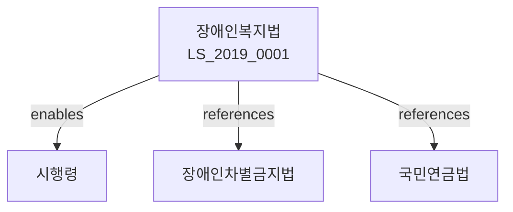

# 장애인복지법

> [법률 제20124호, 2024. 1. 9., 일부개정]

---

---

## 제1장 총칙
### 제1조 (목적)
이 법은 장애인의 인간다운 삶과 권익보장 및 사회참여 증진을 위하여 장애인복지에 관한 사항을 정함을 목적으로 한다。

### 제2조 (정의)
이 법에서 사용하는 용어의 뜻은 다음과 같다。

1. "장애인"이란 신체적ㆍ정신적 손상으로 인하여 일상생활에 상당한 제약을 받는 자를 말한다。
2. "장애인복지시설"이란 장애인을 위한 시설을 말한다。
3. "장애인복지사업"이란 장애인의 복지를 증진하기 위한 사업을 말한다。
4. "장애인단체"란 장애인의 권익을 옹호하기 위한 단체를 말한다。

---

## 제2장 장애인의 권리
### 第5条(평등권)
장애인은 정치ㆍ경제ㆍ사회ㆍ문화 생활의 모든 영역에서 차별받지 아니한다。
### 第6条(기회균등)
장애인은 교육ㆍ고용 등 모든 분야에서 동등한 기회를 가진다。
### 第7条(자기결정권)
장애인은 자신의 일에 관하여 스스로 결정할 권리를 가진다。
### 第8条(정보접근권)
장애인은 정보에 접근할 수 있는 권리를 가진다。

---

## 제3장 장애의 등록
### 第15条(장애의 등록)
장애인은 시장ㆍ군수ㆍ구청장에게 등록할 수 있다。
### 第16条(장애등급)
장애등급은 장애의 정도에 따라 1급부터 6급까지로 구분한다。
### 第17条(장애진단)
장애진단은 전문의사가 행한다。
### 第18条(장애인증명서)
등록된 장애인에게는 장애인증명서를 교부한다。

---

## 제4장 복지서비스
### 第25条(재가복지)
재가복지는 가정에서 생활하는 장애인에게 제공하는 서비스를 말한다。
### 第26条(시설복지)
시설복지는 시설에 입소한 장애인에게 제공하는 서비스를 말한다。
### 第27条(직업재활)
직업재활은 장애인의 직업능력을 개발하는 서비스를 말한다。
### 第28条(교육지원)
교육지원은 장애인의 교육을 위한 지원을 말한다。

---

## 제5장 장애인복지시설
### 第35条(장애인복지시설의 종류)
장애인복지시설은 다음 각 호와 같다。

1. 생활시설
2. 지역사회재활시설
3. 직업재활시설
4. 의료재활시설
### 第36条(시설의 설치)
장애인복지시설은 국가ㆍ지방자치단체 또는 법인이 설치할 수 있다。
### 第37条(시설의 운영)
시설은 장애인의 인권을 존중하여 운영하여야 한다。
### 第38条(시설의 퇴소)
장애인은 언제든지 시설에서 퇴소할 수 있다。

---

## 제6장 장애인고용
### 第45条(장애인고용의무)
사업주는 일정비율 이상의 장애인을 고용하여야 한다。
### 第46条(의무고용률)
장애인 의무고용률은 100분의 3.1로 한다。
### 第47条(고용장려금)
장애인을 고용하는 사업주에게는 장려금을 지급할 수 있다。
### 第48条(부담금)
의무고용률을 달성하지 못한 사업주는 부담금을 납부하여야 한다。

---

## 제7장 편의시설
### 第55条(편의시설의 설치)
공공시설 등에는 장애인을 위한 편의시설을 설치하여야 한다。
### 第56条(편의시설의 종류)
편의시설은 다음 각 호와 같다。

1. 출입구 경사로
2. 장애인 전용 주차구역
3. 장애인용 화장실
4. 점자ㆍ음성유도시설
### 第57条(편의시설의 기준)
편의시설의 설치기준은 보건복지부령으로 정한다。
### 第58条(편의시설의 유지)
편의시설은 항상 이용 가능한 상태로 유지하여야 한다。

---

## 제8장 비용
### 第65条(비용의 부담)
장애인복지사업에 소요되는 비용은 국가와 지방자치단체가 부담한다。
### 第66条(비용의 보조)
국가는 장애인복지시설에 보조금을 지급할 수 있다。
### 第67条(수수료)
장애인복지서비스의 일부에 대하여는 수수료를 부과할 수 있다。
### 第68条(비용의 반환)
부정한 방법으로 급여를 받은 자에게는 비용을 반환하게 할 수 있다。

---

## 제9장 벌칙
### 第75条(벌칙)
다음 각 호의 어느 하나에 해당하는 자는 3년 이하의 징역 또는 3천만원 이하의 벌금에 처한다。

1. 장애인을 학대한 자
2. 장애인의 권리를 침해한 자
### 第76条(과태료)
다음 각 호의 어느 하나에 해당하는 자에게는 1천만원 이하의 과태료를 부과한다。

1. 편의시설을 설치하지 아니한 자
2. 편의시설을 유지하지 아니한 자

---

## 관계 그래프

**상위 법령**
- [[헌법]] 제34조 (생존권)
- [[사회보장기본법]]

**관련 법령**
- [[장애인차별금지법]]
- [[국민연금법]]
- [[국민기초생활 보장법]]
- [[고용보험법]]

**하위 법령**
- [[장애인복지법 시행령]]
