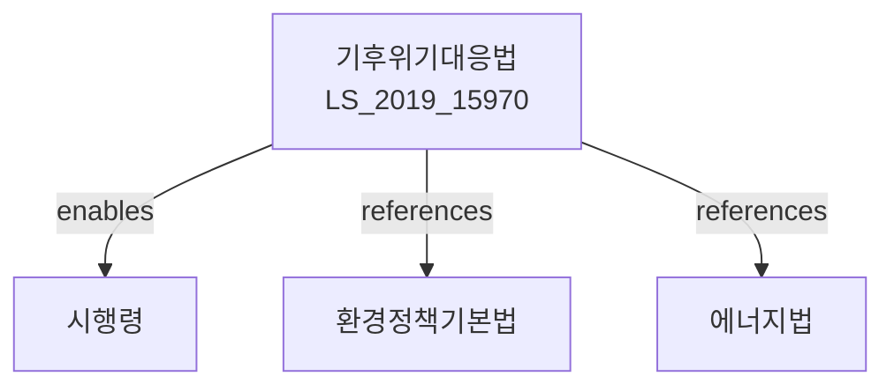

# 기후위기대응을 위한 탄소중립·녹색성장 기본법

> [법률 제20100호, 2024. 1. 9., 일부개정]

---

---

## 제1장 총칙

### 제1조 (목적)

이 법은 기후위기에 효과적으로 대응하기 위하여 탄소중립과 녹색성장을 추진하고, 이를 통하여 지속가능한 발전을 도모함으로써 현재와 장래 세대의 건강하고 쾌적한 환경에서 생활할 권리를 보장하고 인류공동체의 번영에 이바지함을 목적으로 한다.

### 제2조 (정의)

이 법에서 사용하는 용어의 뜻은 다음과 같다.

1. "기후위기"란 기후변화로 인하여 사람의 생명ㆍ재산과 생태계에 심각한 위해가 발생하거나 발생할 우려가 있는 상황을 말한다.
2. "탄소중립"란 온실가스의 배출량과 흡수량을 균형시키는 것을 말한다.
3. "녹색성장"란 온실가스 배출을 줄이고 기후변화에 적응하면서도 경제성장과 환경보전을 동시에 달성하는 지속가능한 성장을 말한다.
4. "온실가스"란 대기 중에 존재하여 지구표면에서 방사되는 열을 흡수ㆍ재방사하는 기체로서 대통령령으로 정하는 것을 말한다.
5. "기후위기적응"란 기후변화의 영향에 대비하여 자연 및 사회체계의 저항력을 높이는 것을 말한다.

### 제3조 (탄소중립 달성 목표)

국가는 2050년까지 탄소중립을 달성하는 것을 목표로 한다.

---

## 제2장 국가 등의 책임

### 제4조 (국가의 책무)

국가는 기후위기에 효과적으로 대응하고 탄소중립과 녹색성장을 달성하기 위하여 다음 각 호의 책무를 다하여야 한다.

1. 탄소중립ㆍ녹색성장 관련 중장기 정책의 수립 및 시행
2. 온실가스 감축 목표의 설정 및 이행
3. 기후위기적응 대책의 수립 및 시행
4. 녹색기술 및 산업의 육성
5. 국민의 인식 제고 및 참여 확대

### 제5조 (지방자치단체의 책무)

지방자치단체는 당해 지역의 특성을 고려한 탄소중립ㆍ녹색성장 계획을 수립하고 이를 성실히 이행하여야 한다.

### 제6조 (사업자의 책무)

사업자는 온실가스 배출을 줄이고 녹색경영을 실천하며, 탄소중립 달성에 협조하여야 한다.

### 제7조 (국민의 책무)

국민은 일상생활에서 온실가스 배출을 줄이고 녹색소비를 실천하도록 노력하여야 한다.

---

## 제3장 탄소중립·녹색성장 추진체계

### 제10조 (국가탄소중립·녹색성장위원회)

① 탄소중립ㆍ녹색성장에 관한 주요 정책을 심의하기 위하여 대통령 소속하에 국가탄소중립ㆍ녹색성장위원회(이하 "위원회"라 한다)를 둔다.

② 위원회는 다음 각 호의 사항을 심의한다.

1. 국가탄소중립ㆍ녹색성장 기본계획에 관한 사항
2. 온실가스 감축목표 및 이행계획에 관한 사항
3. 기후위기적응 대책에 관한 사항
4. 그 밖에 탄소중립ㆍ녹색성장과 관련하여 대통령이 부의하는 사항

### 제11조 (기본계획의 수립)

① 정부는 5년마다 국가탄소중립ㆍ녹색성장 기본계획(이하 "기본계획"이라 한다)을 수립하여야 한다.

② 기본계획에는 다음 각 호의 사항이 포함되어야 한다.

1. 탄소중립 달성을 위한 기본방향 및 목표
2. 부문별 온실가스 감축목표 및 이행방안
3. 기후위기적응 대책
4. 녹색기술 개발 및 보급
5. 그 밖에 탄소중립ㆍ녹색성장에 필요한 사항

---

## 제4장 온실가스 감축

### 제20조 (국가 온실가스 감축목표)

① 정부는 제3조에 따른 탄소중립 달성을 위하여 국가 온실가스 감축목표를 설정하여야 한다.

② 국가 온실가스 감축목표에는 연도별 감축목표가 포함되어야 한다.

### 제21조 (부문별 감축목표)

정부는 국가 온실가스 감축목표를 달성하기 위하여 에너지, 산업, 수송, 건축, 농축수산, 폐기물 등 부문별 감축목표를 설정하고 이를 이행하여야 한다.

### 제22조 (온실가스 배출허가제)

① 대통령령으로 정하는 규모 이상의 온실가스 배출사업장은 환경부장관의 배출허가를 받아야 한다.

② 배출허가의 기준 및 절차 등에 관하여 필요한 사항은 대통령령으로 정한다.

### 제23조 (온실가스 배출권거래제)

① 온실가스 배출을 효율적으로 관리하기 위하여 온실가스 배출권거래제를 실시한다.

② 온실가스 배출권의 배분, 거래 및 관리 등에 관하여 필요한 사항은 따로 법률로 정한다.

---

## 제5장 기후위기 적응

### 제30조 (기후위기영향평가)

① 정부는 기후변화가 국민생활과 경제에 미치는 영향을 정기적으로 평가하여야 한다.

② 기후위기영향평가의 항목, 방법 및 절차 등에 관하여 필요한 사항은 대통령령으로 정한다.

### 제31조 (국가기후위기적응대책)

① 정부는 기후위기영향평가 결과를 바탕으로 국가기후위기적응대책을 수립하여야 한다.

② 국가기후위기적응대책에는 다음 각 호의 사항이 포함되어야 한다.

1. 건강ㆍ농수산ㆍ산림ㆍ해양수산 등 분야별 적응대책
2. 자연재해 대응체계 강화
3. 기후위기 취약계층 보호
4. 그 밖에 기후위기적응에 필요한 사항

---

## 제6장 녹색성장 기반 조성

### 제40조 (녹색기술 개발 및 보급)

① 국가는 녹색기술의 개발과 보급을 촉진하기 위하여 다음 각 호의 조치를 취하여야 한다.

1. 녹색기술 연구개발 지원
2. 녹색기술 표준화 및 인증
3. 녹색제품 구매 촉진
4. 그 밖에 녹색기술 확산에 필요한 조치

### 제41조 (녹색금융 활성화)

국가와 금융기관은 탄소중립ㆍ녹색성장에 필요한 자금을 원활하게 공급하기 위하여 녹색금융을 활성화하여야 한다.

### 제42조 (녹색일자리 창출)

국가는 탄소중립ㆍ녹색성장 과정에서 일자리 창출을 위하여 노력하여야 한다.

---

## 제7장 벌칙

### 第70条 (벌칙)

다음 각 호의 어느 하나에 해당하는 자는 3년 이하의 징역 또는 3천만원 이하의 벌금에 처한다。

1. 제22조 제1항에 따른 배출허가를 받지 아니하고 온실가스를 배출한 자
2. 허위 기타 부정한 방법으로 배출허가를 받은 자

### 第71条 (과태료)

다음 각 호의 어느 하나에 해당하는 자에게는 1천만원 이하의 과태료를 부과한다。

1. 정당한 사유 없이 온실가스 배출량 보고를 하지 아니한 자
2. 온실가스 배출량을 허위로 보고한 자

---

## 관계 그래프

**상위 법령**
- [[헌법]] 제35조 (환경권)
- [[환경정책기본법]]

**관련 법령**
- [[대기환경보전법]]
- [[에너지법]]
- [[신재생에너지법]]
- [[전기사업법]]
- [[자동차관리법]]

**하위 법령**
- [[기후위기대응을 위한 탄소중립·녹색성장 기본법 시행령]]
