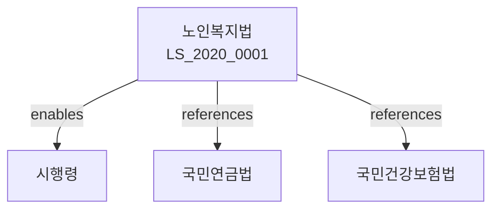

# 노인복지법

> [법률 제20125호, 2024. 1. 9., 일부개정]

---

---

## 제1장 총칙
### 제1조 (목적)
이 법은 노인의 복지를 증진하고 노인이 인간다운 삶을 영위할 수 있도록 함을 목적으로 한다。

### 제2조 (정의)
이 법에서 사용하는 용어의 뜻은 다음과 같다。

1. "노인"이란 65세 이상의 자를 말한다。
2. "노인복지시설"이란 노인을 위한 시설을 말한다。
3. "노인복지사업"이란 노인의 복지를 증진하기 위한 사업을 말한다。
4. "요양"이란 노인의 신체적ㆍ정신적 기능 유지를 위한 보호를 말한다。

---

## 제2장 노인의 권리
### 第5条(존엄성)
노인은 인간의 존엄성을 존중받는다。
### 第6条(사회참여)
노인은 사회ㆍ경제ㆍ문화 생활에 참여할 권리를 가진다。
### 第7条(부양)
노인은 가족 및 사회로부터 부양받을 권리를 가진다。
### 第8条(보호)
노인은 학대받지 아니할 권리를 가진다。

---

## 제3장 노인복지시설
### 第15条(노인복지시설의 종류)
노인복지시설은 다음 각 호와 같다。

1. 노인요양시설
2. 노인주거시설
3. 노인여가시설
4. 재가노인복지시설
### 第16条(시설의 설치)
노인복지시설은 국가ㆍ지방자치단체 또는 법인이 설치할 수 있다。
### 第17条(시설의 운영)
시설은 노인의 인권을 존중하여 운영하여야 한다。
### 第18条(시설의 퇴소)
노인은 언제든지 시설에서 퇴소할 수 있다。

---

## 제4장 노인요양보호
### 第25条(노인요양보호)
노인요양보호는 일상생활을 영위하기 어려운 노인에게 제공한다。
### 第26条(요양급여)
요양급여는 노인요양보호를 위한 급여를 말한다。
### 第27条(요양보호사)
요양보호사는 노인요양보호를 제공하는 자를 말한다。
### 第28条(요양보호사의 자격)
요양보호사는 교육을 이수하고 자격을 취득하여야 한다。

---

## 제5장 재가노인복지
### 第35条(방문요양)
방문요양은 노인의 가정을 방문하여 요양보호를 제공하는 서비스를 말한다。
### 第36条(방문목욕)
방문목욕은 노인의 가정을 방문하여 목욕서비스를 제공하는 것을 말한다。
### 第37条(주야간보호)
주야간보호는 주간 또는 야간에 노인을 보호하는 서비스를 말한다。
### 第38条(단기보호)
단기보호는 일시적으로 노인을 보호하는 서비스를 말한다。

---

## 제6장 노인여가복지
### 第45条(노인여가복지시설)
노인여가복지시설은 노인에게 여가활동을 제공하는 시설을 말한다。
### 第46条(경로당)
경로당은 노인에게 휴식 및 여가공간을 제공하는 시설을 말한다。
### 第47条(노인대학)
노인대학은 노인에게 교육기회를 제공하는 시설을 말한다。
### 第48条(노인복지관)
노인복지관은 종합적인 노인복지서비스를 제공하는 시설을 말한다。

---

## 제7장 노인취업지원
### 第55条(노인취업알선)
국가는 노인의 취업을 알선한다。
### 第56条(노인일자리사업)
국가는 노인에게 적합한 일자리를 제공한다。
### 第57条(노인취업지원센터)
노인취업지원센터는 노인의 취업을 지원하는 기관을 말한다。
### 第58条(취업장려금)
노인을 고용하는 사업주에게는 장려금을 지급할 수 있다。

---

## 제8장 노인학대 방지
### 第65条(노인학대의 금지)
누구든지 노인을 학대하여서는 아니 된다。
### 第66条(노인학대의 신고)
노인학대를 발견한 자는 신고하여야 한다。
### 第67条(노인보호전문기관)
노인보호전문기관은 노인학대 예방 및 피해노인 보호를 담당한다。
### 第68条(긴급보호)
학대받은 노인은 긴급보호를 받을 수 있다。

---

## 제9장 벌칙
### 第75条(벌칙)
다음 각 호의 어느 하나에 해당하는 자는 5년 이하의 징역 또는 5천만원 이하의 벌금에 처한다。

1. 노인을 학대한 자
2. 노인을 유기한 자
### 第76条(과태료)
다음 각 호의 어느 하나에 해당하는 자에게는 1천만원 이하의 과태료를 부과한다。

1. 정당한 사유 없이 보고를 하지 아니한 자
2. 시설의 운영기준을 위반한 자

---

## 관계 그래프

**상위 법령**
- [[헌법]] 제34조 (생존권)
- [[사회보장기본법]]

**관련 법령**
- [[국민연금법]]
- [[국민건강보험법]]
- [[장기요양보험법]]
- [[국민기초생활 보장법]]

**하위 법령**
- [[노인복지법 시행령]]
