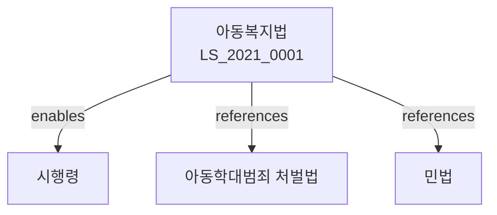

# 아동복지법

> [법률 제20126호, 2024. 1. 9., 일부개정]

---

---

## 제1장 총칙
### 제1조 (목적)
이 법은 아동이 건강하게 태어나고 안전하게 성장하도록 아동의 건강과 복지를 보장함을 목적으로 한다。

### 제2조 (정의)
이 법에서 사용하는 용어의 뜻은 다음과 같다。

1. "아동"이란 18세 미만의 자를 말한다。
2. "아동복지시설"이란 아동을 보호ㆍ육성하는 시설을 말한다。
3. "아동학대"란 아동에 대한 신체적ㆍ정신적 학대를 말한다。
4. "보호자"란 아동을 보호할 의무가 있는 자를 말한다。

---

## 제2장 아동의 권리
### 第5条(아동의 권리)
아동은 생존ㆍ보호ㆍ발달의 권리를 가진다。
### 第6条(최선의 이익)
아동에 관한 모든 활동은 아동의 최선의 이익을 고려하여야 한다。
### 第7条(의사표현의 존중)
아동의 의사는 존중되어야 한다。
### 第8条(차별금지)
아동은 어떠한 이유로도 차별받지 아니한다。

---

## 제3장 아동복지시설
### 第15条(아동복지시설의 종류)
아동복지시설은 다음 각 호와 같다。

1. 아동양육시설
2. 아동보호치료시설
3. 아동단기보호시설
4. 아동자립지원시설
### 第16条(시설의 설치)
아동복지시설은 국가ㆍ지방자치단체 또는 법인이 설치할 수 있다。
### 第17条(시설의 운영)
시설은 아동의 인권을 존중하여 운영하여야 한다。
### 第18条(시설의 종료)
아동복지시설을 종료하려면 관할관청의 승인을 받아야 한다。

---

## 제4장 아동보호
### 第25条(아동보호)
아동은 가정에서 건강하게 성장하도록 보호된다。
### 第26条(아동일시보호)
보호자가 없는 아동은 일시보호된다。
### 第27条(입양)
입양은 아동의 최선의 이익을 위하여 실시된다。
### 第28条(가정위탁보호)
가정위탁보호는 아동을 가정에서 위탁하여 보호하는 것을 말한다。

---

## 제5장 아동학대 예방
### 第35条(아동학대의 금지)
누구든지 아동을 학대하여서는 아니 된다。
### 第36条(아동학대의 신고)
아동학대를 발견한 자는 신고하여야 한다。
### 第37条(아동보호전문기관)
아동보호전문기관은 아동학대 예방 및 피해아동 보호를 담당한다。
### 第38条(긴급보호)
학대받은 아동은 긴급보호를 받을 수 있다。

---

## 제6장 아동조사
### 第45条(아동조사)
아동학대 사건에 대하여는 아동조사를 실시한다。
### 第46条(아동조사관)
아동조사관은 아동학대 사건을 조사한다。
### 第47条(아동전담경찰관)
아동전담경찰관은 아동학대 사건을 수사한다。
### 第48条(아동우선조사)
아동학대 사건은 아동의 권리를 우선하여 조사한다。

---

## 제7장 아동의 치료 및 재활
### 第55条(치료지원)
학대받은 아동에게는 치료를 지원한다。
### 第56条(심리치료)
학대받은 아동에게는 심리치료를 제공한다。
### 第57条(재활지원)
학대받은 아동에게는 재활을 지원한다。
### 第58条(가족기능 회복)
아동과 가족에게는 가족기능 회복을 지원한다。

---

## 제8장 비용
### 第65条(비용의 부담)
아동복지사업에 소요되는 비용은 국가와 지방자치단체가 부담한다。
### 第66条(비용의 보조)
국가는 아동복지시설에 보조금을 지급할 수 있다。
### 第67条(아동수당)
아동에게는 아동수당을 지급할 수 있다。
### 第68条(양육비)
부모는 아동의 양육비를 부담한다。

---

## 제9장 벌칙
### 第75条(벌칙)
다음 각 호의 어느 하나에 해당하는 자는 10년 이하의 징역 또는 1억원 이하의 벌금에 처한다。

1. 아동을 학대한 자
2. 아동을 성폭행한 자
### 第76条(과태료)
다음 각 호의 어느 하나에 해당하는 자에게는 1천만원 이하의 과태료를 부과한다。

1. 아동학대를 신고하지 아니한 자
2. 시설의 운영기준을 위반한 자

---

## 관계 그래프

**상위 법령**
- [[헌법]] 제34조 (생존권)
- [[아동권리협약]]

**관련 법령**
- [[아동학대범죄 처벌법]]
- [[민법]]
- [[가족관계등록법]]
- [[입양특례법]]

**하위 법령**
- [[아동복지법 시행령]]
