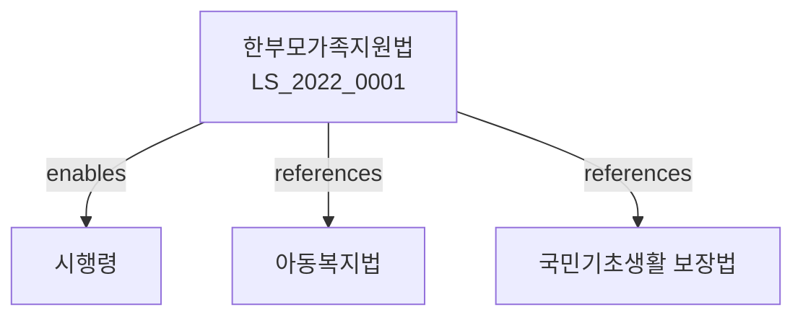

# 한부모가족지원법

> [법률 제20127호, 2024. 1. 9., 일부개정]

---

---

## 제1장 총칙
### 제1조 (목적)
이 법은 한부모가족의 생활안정과 복지증진을 도모함을 목적으로 한다。

### 제2조 (정의)
이 법에서 사용하는 용어의 뜻은 다음과 같다。

1. "한부모가족"이란 모 또는 부가 단독으로 아동을 양육하는 가족을 말한다。
2. "한부모가족보호시설"이란 한부모가족을 보호하는 시설을 말한다。
3. "한부모가족자립지원"이란 한부모가족의 자립을 지원하는 사업을 말한다。
4. "아동양육비"란 아동의 양육에 소요되는 비용을 말한다。

---

## 제2장 한부모가족의 권리
### 第5条(평등권)
한부모가족은 어떠한 이유로도 차별받지 아니한다。
### 第6条(보호)
한부모가족은 국가의 보호를 받는다。
### 第7条(자립지원)
한부모가족은 자립을 위한 지원을 받는다。
### 第8条(아동권리)
한부모가족 아동의 권리는 보장된다。

---

## 제3장 생활지원
### 第15条(생계지원)
한부모가족에게는 생계지원을 제공한다。
### 第16条(주거지원)
한부모가족에게는 주거지원을 제공한다。
### 第17条(의료지원)
한부모가족에게는 의료지원을 제공한다。
### 第18条(교육지원)
한부모가족 아동에게는 교육지원을 제공한다。

---

## 제4장 아동양육지원
### 第25条(양육비지원)
한부모가족에게는 아동양육비를 지원한다。
### 第26条(보육지원)
한부모가족 아동에게는 보육서비스를 지원한다。
### 第27条(방문보육)
한부모가족에게는 방문보육서비스를 제공한다。
### 第28条(일시보호)
한부모가족 아동에게는 일시보호를 제공한다。

---

## 제5장 자립지원
### 第35条(직업훈련)
한부모가족에게는 직업훈련을 제공한다。
### 第36条(취업알선)
한부모가족에게는 취업알선을 제공한다。
### 第37条(창업지원)
한부모가족의 창업을 지원한다。
### 第38条(자금대부)
한부모가족에게는 자금을 대부할 수 있다。

---

## 제6장 한부모가족보호시설
### 第45条(보호시설)
한부모가족보호시설은 한부모가족을 보호하는 시설을 말한다。
### 第46条(시설의 설치)
보호시설은 국가ㆍ지방자치단체 또는 법인이 설치할 수 있다。
### 第47条(시설의 운영)
시설은 입소자의 인권을 존중하여 운영하여야 한다。
### 第48条(퇴소)
입소자는 언제든지 퇴소할 수 있다。

---

## 제7장 비용
### 第55条(비용의 부담)
한부모가족지원사업에 소요되는 비용은 국가와 지방자치단체가 부담한다。
### 第56条(비용의 보조)
국가는 한부모가족보호시설에 보조금을 지급할 수 있다。
### 第57条(수수료)
서비스의 일부에 대하여는 수수료를 부과할 수 있다。
### 第58条(비용의 반환)
부정한 방법으로 지원을 받은 자에게는 비용을 반환하게 할 수 있다。

---

## 제8장 감독
### 第65条(감독)
보건복지부장관은 한부모가족지원사업을 감독한다。
### 第66条(보고 및 검사)
보건복지부장관은 필요한 경우 보고를 명하거나 검사할 수 있다。
### 第67条(시정명령)
위법한 사항에 대하여는 시정을 명할 수 있다。
### 第68条(청문)
지원결정에 이의가 있는 자는 청문을 청구할 수 있다。

---

## 제9장 벌칙
### 第75条(벌칙)
다음 각 호의 어느 하나에 해당하는 자는 2년 이하의 징역 또는 2천만원 이하의 벌금에 처한다。

1. 허위로 지원을 받은 자
2. 시설 입소자를 학대한 자
### 第76条(과태료)
다음 각 호의 어느 하나에 해당하는 자에게는 1천만원 이하의 과태료를 부과한다。

1. 정당한 사유 없이 보고를 하지 아니한 자
2. 검사를 거부한 자

---

## 관계 그래프

**상위 법령**
- [[헌법]] 제34조 (생존권)
- [[사회보장기본법]]

**관련 법령**
- [[아동복지법]]
- [[국민기초생활 보장법]]
- [[영유아보육법]]
- [[고용보험법]]

**하위 법령**
- [[한부모가족지원법 시행령]]
