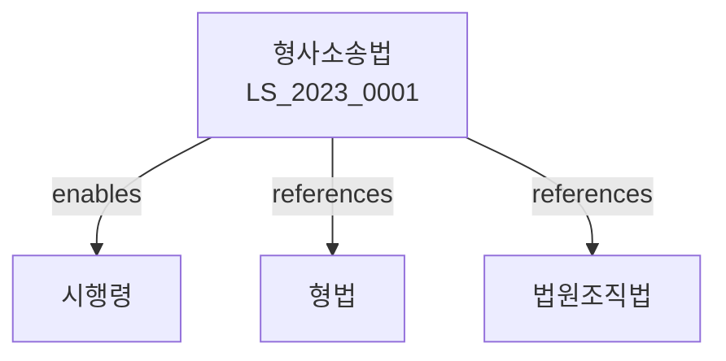

# 형사소송법

> [법률 제20128호, 2024. 1. 9., 일부개정]

---

---

## 제1편 총칙
### 제1조 (목적)
이 법은 형사사건에 관한 소송절차를 규정함으로써 형벌권의 적정한 실현을 도모함을 목적으로 한다。

### 제2조 (법원의 관할)
법원은 소재지에 의하여 관할을 정한다。

### 제3조 (토지관할)
토지관할은 범죄지 또는 피고인의 주소지ㆍ거소지에 의한다。

### 제4조 (겸직관할)
동일한 사건에 관하여 관할권이 있는 수개의 법원이 있는 때에는 최초로 수사한 법원이 심판한다。

---

## 제2편 제1심 소송절차
### 제1장 수사
#### 第5条(수사기관)
수사는 검사가 행한다。
#### 第6条(사법경찰관)
사법경찰관은 검사의 지휘를 받아 수사를 행한다。
#### 第7条(피의자신문)
피의자는 신문할 때에 진술을 거부할 수 있다。
#### 第8条(체포)
체포는 영장에 의하여 행한다。

### 제2장 공소
#### 第25条(공소제기)
공소는 검사가 제기한다。
#### 第26条(공소장)
공소를 제기할 때에는 공소장을 제출하여야 한다。
#### 第27条(공소시효)
공소는 범죄성립 후 일정기간이 경과하면 시효가 완성된다。
#### 第28条(공소취소)
공소는 제1심판결 선고 전까지 취소할 수 있다。

### 제3장 공판
#### 第45条(공판준비)
법원은 공판준비를 명할 수 있다。
#### 第46条(공판기일)
공판기일에는 피고인의 출석이 필요하다。
#### 第47条(증거조사)
법원은 증거를 조사하여야 한다。
#### 第48条(변론)
검사와 변호인은 변론을 한다。

---

## 제3편 상소
### 제1장 항소
#### 第85条(항소)
제1심판결에 불복하는 자는 항소할 수 있다。
#### 第86条(항소기간)
항소는 판결선고일부터 7일 이내에 할 수 있다。
#### 第87条(항소이유)
항소이유는 판결에 영향을 미친 법령위반이나 사실오인 등이다。
#### 第88条(항소심 절차)
항소심은 제1심 절차에 준하여 행한다。

### 제2장 상고
#### 第95条(상고)
항소심판결에 불복하는 자는 상고할 수 있다。
#### 第96条(상고이유)
상고이유는 헌법ㆍ법령위반이다。
#### 第97条(상고기간)
상고는 판결선고일부터 7일 이내에 할 수 있다。
#### 第98条(상고심 절차)
상고심은 법률심으로 한다。

### 제3장 비상상고
#### 第105条(비상상고)
확정판결에 대하여 비상상고를 할 수 있다。
#### 第106条(비상상고이유)
비상상고이유는 형사에 관한 법령의 위반이다。

---

## 제4편 재심
### 第115条(재심)
확정판결에 대하여 재심을 청구할 수 있다。
### 第116条(재심사유)
재심사유는 다음 각 호와 같다。

1. 증거의 위조
2. 증인의 허위진술
3. 판사의 직무범죄
4. 새로운 증거의 발견
### 第117条(재심청구권자)
재심은 피고인ㆍ검사 등이 청구할 수 있다。
### 第118条(재심절차)
재심절차는 제1심 절차에 준하여 행한다。

---

## 제5편 비상구제
### 第125条(비상구제)
구속된 피고인 또는 피의자는 법원에 비상구제를 신청할 수 있다。
### 第126条(비상구제의 사유)
비상구제는 구속의 위법 또는 부적당함을 이유로 한다。
### 第127条(비상구제의 절차)
비상구제신청을 받은 법원은 지체 없이 결정하여야 한다。

---

## 제6편 배상 및 보상
### 第135条(형사보상)
무죄의 판결을 받은 자는 형사보상을 청구할 수 있다。
### 第136条(보상의 범위)
보상은 구속ㆍ형 집행으로 인한 손해에 대하여 한다。
### 第137条(보상의 청구)
보상은 무죄판결 확정 후 1년 이내에 청구하여야 한다。

---

## 제7편 벌칙
### 第145条(벌칙)
다음 각 호의 어느 하나에 해당하는 자는 5년 이하의 징역 또는 1천만원 이하의 벌금에 처한다。

1. 증거를 인멸한 자
2. 증인을 매수한 자
3. 위증한 자
### 第146条(과태료)
정당한 사유 없이 출석하지 아니한 증인에게는 과태료를 부과한다。

---

## 관계 그래프

**상위 법령**
- [[헌법]] 제12조 (영장주의), 제27조 (재판청구권)
- [[법원조직법]]

**관련 법령**
- [[형법]]
- [[검찰청법]]
- [[변호사법]]
- [[소년법]]

**하위 법령**
- [[형사소송법 시행령]]
- [[형사소송규칙]]
