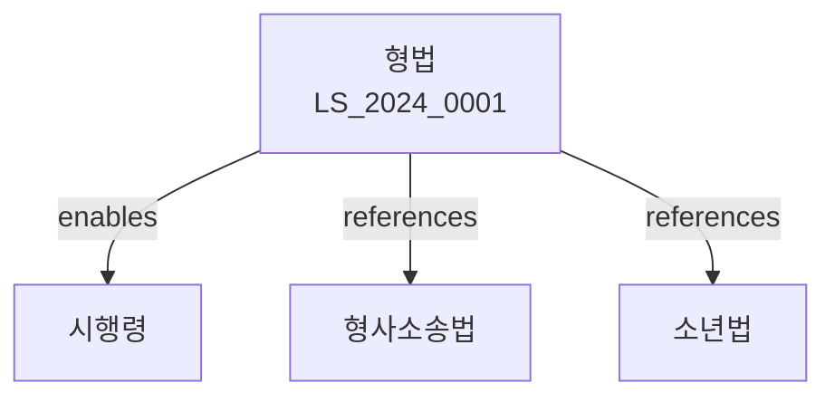

# 형법

> [법률 제20129호, 2024. 1. 9., 일부개정]

---

---

## 제1편 총칙
### 제1조 (목적)
이 법은 범죄와 형벌에 관한 기본원칙을 정함을 목적으로 한다。

### 제2조 (죄형법정주의)
범죄의 성립과 형벌은 법률로 정한다。

### 제3조 (속지주의)
대한민국 영역 안에서 범한 죄는 이 법을 적용한다。

### 제4조 (속인주의)
대한민국 국민이 외국에서 범한 죄는 이 법을 적용한다。

---

## 제2편 범죄
### 제1장 총칙
#### 第5条(책임능력)
14세 미만의 자는 형벌을 받지 아니한다。
#### 第6条(심신상실)
심신상실자는 형벌을 받지 아니한다。
#### 第7条(원인에서 자유로운 행위)
책임능력 있는 상태에서 범행의사를 가진 자는 심신상실 상태에서의 행위도 처벌된다。
#### 第8条(고의)
범죄는 고의로 행한다。

### 제2장 미수
#### 第25条(미수범)
범죄의 실행에 착수하고 미완성된 것을 미수범으로 한다。
#### 第26条(중지범)
범죄의 실행을 중지한 자는 형을 감경 또는 면제한다。
#### 第27条(불능범)
범죄의 성립 불능인 경우에도 처벌한다。

### 제3장 공범
#### 第35条(공동정범)
2인 이상이 공동하여 범죄를 실행한 자는 공동정범으로 처벌한다。
#### 第36条(교사범)
타인을 교사하여 범죄를 실행하게 한 자는 교사범으로 처벌한다。
#### 第37条(종범)
범죄를 방조한 자는 종범으로 처벌한다。
#### 第38条(공범의 처벌)
공범은 각자의 죄에 따라 처벌한다。

---

## 제3편 형벌
### 제1장 형의 종류
#### 第45条(사형)
사형은 생명을 박탈하는 형벌이다。
#### 第46条(징역)
징역은 자유를 박탈하는 형벌이다。
#### 第47条(금고)
금고는 자유를 제한하는 형벌이다。
#### 第48条(벌금)
벌금은 재산을 박탈하는 형벌이다。

### 제2장 형의 경중
#### 第55条(형의 경중)
형의 경중은 법정형의 최고도를 기준으로 한다。
#### 第56条(가중)
법정형의 가중은 최고형의 2배까지 할 수 있다。
#### 第57条(감경)
법정형의 감경은 최저형의 2분의 1까지 할 수 있다。

### 제3장 형의 집행
#### 第65条(형의 집행)
형은 판결확정일부터 집행한다。
#### 第66条(집행유예)
3년 이하의 징역ㆍ금고에 처할 경우 1년 이상 5년 이하의 기간 집행을 유예할 수 있다。
#### 第67条(선고유예)
1년 이하의 징역ㆍ금고에 처할 경우 선고를 유예할 수 있다。

---

## 제4편 각칙
### 제1장 국가의 존립과 권력에 관한 죄
#### 第85条(내란)
국토를 참절하거나 국헌을 문란하게 할 목적으로 폭동한 자는 처벌한다。
#### 第86条(외환)
외국과 통모하여 국권을 침해한 자는 처벌한다。
#### 第87条(국가기관의 권한 침해)
국가기관의 권한을 침해한 자는 처벌한다。

### 제2장 공공의 안녕과 질서에 관한 죠
#### 第95条(폭발물사용)
폭발물을 사용하여 사람의 생명ㆍ신체를 해한 자는 처벌한다。
#### 第96条(방화)
불을 놓아 타인의 재물을 소훼한 자는 처벌한다。
#### 第97条(수난)
물을 넣어 타인의 재물을 침해한 자는 처벌한다。

### 제3장 국민의 생명과 신체에 관한 죄
#### 第105条(살인)
사람을 살해한 자는 사형ㆍ무기 또는 5년 이상의 징역에 처한다。
#### 第106条(상해)
사람의 신체를 상해한 자는 7년 이하의 징역 또는 1천만원 이하의 벌금에 처한다。
#### 第107条(폭행)
사람을 폭행한 자는 2년 이하의 징역 또는 500만원 이하의 벌금에 처한다。

### 제4장 재산에 관한 죄
#### 第115条(절도)
타인의 재물을 절취한 자는 6년 이하의 징역 또는 1천만원 이하의 벌금에 처한다。
#### 第116条(강도)
폭행 또는 협박으로 타인의 재물을 강취한 자는 3년 이상의 징역에 처한다。
#### 第117条(사기)
기망으로 타인의 재물을 편취한 자는 10년 이하의 징역 또는 2천만원 이하의 벌금에 처한다。

---

## 관계 그래프

**상위 법령**
- [[헌법]] 제12조 (신체의 자유)
- [[형사소송법]]

**관련 법령**
- [[형사소송법]]
- [[소년법]]
- [[성폭력범죄 처벌법]]
- [[아동학대범죄 처벌법]]

**하위 법령**
- [[형법 시행령]]
