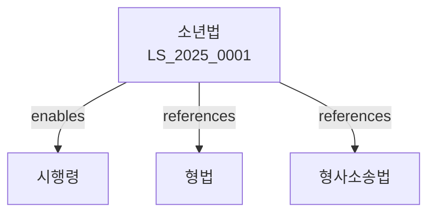

# 소년법

> [법률 제20130호, 2024. 1. 9., 일부개정]

---

---

## 제1장 총칙
### 제1조 (목적)
이 법은 비행소년의 건전한 육성을 도모하기 위하여 소년보호사건의 처리에 관한 특별사항을 정함을 목적으로 한다。

### 제2조 (정의)
이 법에서 사용하는 용어의 뜻은 다음과 같다。

1. "소년"이란 19세 미만의 자를 말한다。
2. "비행소년"이란 범죄소년ㆍ촉탁소년 및 우범소년을 말한다。
3. "범죄소년"이란 14세 이상 19세 미만의 죄를 범한 자를 말한다。
4. "촉탁소년"이란 14세 미만의 죄를 범한 자를 말한다。

---

## 제2장 비행소년
### 第5条(범죄소년)
14세 이상 19세 미만의 자로서 형벌법령에 위반된 행위를 한 자는 범죄소년으로 한다。
### 第6条(촉탁소년)
14세 미만의 자로서 형벌법령에 위반된 행위를 한 자는 촉탁소년으로 한다。
### 第7条(우범소년)
다음 각 호의 어느 하나에 해당하는 19세 미만의 자는 우범소년으로 한다。

1. 보호자의 정당한 감돹을 받지 아니하는 자
2. 가정에서 이탈한 자
3. 범죄성이 있는 자와 교제하는 자
### 第8条(소년의 연령)
소년의 연령은 행위시를 기준으로 한다。

---

## 제3장 소년보호사건
### 第15条(관할)
소년보호사건은 소년의 보통재판적 소재지 또는 현재지를 관할하는 가정법원ㆍ지방법원 소년부가 관장한다。
### 第16条(사건의 이송)
법원은 사건의 성질에 따라 사건을 이송할 수 있다。
### 第17条(수사)
소년보호사건의 수사는 검사가 행한다。
### 第18条(송치)
사법경찰관은 소년보호사건을 검사에게 송치하여야 한다。

---

## 제4장 조사 및 심리
### 第25条(조사)
법원은 소년보호사건에 관하여 조사하여야 한다。
### 第26条(조사관)
법원은 소년부조사관에게 조사를 명할 수 있다。
### 第27条(심리)
법원은 비공개로 심리를 진행한다。
### 第28条(임시조치)
법원은 필요한 경우 소년에 대하여 임시조치를 할 수 있다。

---

## 제5장 보호처분
### 第35条(보호처분의 종류)
보호처분은 다음 각 호와 같다。

1. 보호자에게 감독하게 하는 처분
2. 보호자의 감돹을 보조하게 하는 처분
3. 사회봉사명령
4. 수강명령
5. 소년원 송치처분
### 第36条(처분의 결정)
법원은 소년의 행위의 성질ㆍ동기ㆍ수단 및 결과 등을 고려하여 처분을 결정한다。
### 第37条(처분의 기간)
소년원 송치처분의 기간은 6월 이상 2년 이하로 한다。
### 第38条(처분의 집행)
보호처분은 확정 후 지체 없이 집행하여야 한다。

---

## 제6장 형의 특례
### 第45条(형의 감경)
소년에 대하여는 형을 감경한다。
### 第46条(사형ㆍ무기형의 특례)
소년에게는 사형 또는 무기징역을 선고하지 아니한다。
### 第47条(미결구속일수의 산입)
미결구속일수는 형기에 산입한다。
### 第48条(집행유예의 특례)
소년에 대하여는 집행유예의 요건을 완화한다。

---

## 제7장 전과기록의 삭제
### 第55条(전과기록의 삭제)
보호처분을 받은 소년은 처분 종료 후 2년이 경과하면 전과기록의 삭제를 신청할 수 있다。
### 第56条(삭제의 효과)
전과기록이 삭제된 자는 법률상 아무런 불이익을 받지 아니한다。
### 第57条(삭제의 절차)
전과기록의 삭제는 법원의 결정으로 한다。

---

## 제8장 벌칙
### 第65条(벌칙)
다음 각 호의 어느 하나에 해당하는 자는 2년 이하의 징역 또는 2천만원 이하의 벌금에 처한다。

1. 소년을 범죄에 교사한 자
2. 소년을 우범에 빠지게 한 자
### 第66条(과태료)
다음 각 호의 어느 하나에 해당하는 자에게는 1천만원 이하의 과태료를 부과한다。

1. 정당한 사유 없이 출석하지 아니한 자
2. 조사를 방해한 자

---

## 관계 그래프

**상위 법령**
- [[헌법]] 제12조 (신체의 자유)
- [[아동복지법]]

**관련 법령**
- [[형법]]
- [[형사소송법]]
- [[아동복지법]]
- [[아동학대범죄 처벌법]]

**하위 법령**
- [[소년법 시행령]]
