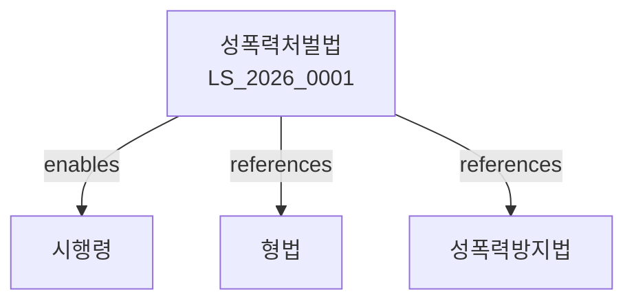

# 성폭력범죄의 처벌 등에 관한 특례법

> [법률 제20131호, 2024. 1. 9., 일부개정]

---

---

## 제1장 총칙
### 제1조 (목적)
이 법은 성폭력범죄를 예방하고 그 피해자를 보호함으로써 국민의 인권을 보장하고 건전한 사회풍토를 조성함을 목적으로 한다。

### 제2조 (정의)
이 법에서 사용하는 용어의 뜻은 다음과 같다。

1. "성폭력범죄"란 성적 행위를 강요하는 범죄를 말한다。
2. "피해자"란 성폭력범죄로 인하여 피해를 입은 자를 말한다。
3. "가해자"란 성폭력범죄를 저지른 자를 말한다。
4. "성적 행위"란 성적 목적으로 하는 행위를 말한다。

---

## 제2장 성폭력범죄의 처벌
### 第5条(강간)
폭행 또는 협박으로 13세 이상의 사람을 강간한 자는 3년 이상의 징역에 처한다。
### 第6条(강제추행)
폭행 또는 협박으로 13세 이상의 사람에게 추행을 한 자는 1년 이상 10년 이하의 징역 또는 1천500만원 이하의 벌금에 처한다。
### 第7条(준강간)
13세 미만의 사람을 강간한 자는 무기 또는 5년 이상의 징역에 처한다。
### 第8条(준강제추행)
13세 미만의 사람에게 추행을 한 자는 5년 이상의 징역 또는 3천만원 이하의 벌금에 처한다。

---

## 제3장 아동ㆍ장애인에 대한 성폭력범죄
### 第15条(아동에 대한 성폭력)
13세 미만의 사람에 대하여 성폭력범죄를 저지른 자는 죄에 정한 형의 2분의 1까지 가중한다。
### 第16条(장애인에 대한 성폭력)
장애인에 대하여 성폭력범죄를 저지른 자는 죄에 정한 형의 2분의 1까지 가중한다。
### 第17条(카메라 등 이용 촬영)
성적 목적으로 카메라 등을 이용하여 촬영한 자는 5년 이하의 징역 또는 3천만원 이하의 벌금에 처한다。
### 第18条(디지털 성범죄)
성적 목적으로 정보통신망을 이용하여 성적 행위를 한 자는 5년 이하의 징역 또는 5천만원 이하의 벌금에 처한다。

---

## 제4장 피해자 보호
### 第25条(피해자의 권리)
피해자는 신속하고 공정한 수사를 받을 권리를 가진다。
### 第26条(비밀보장)
수사기관은 피해자의 신원을 공개하여서는 아니 된다。
### 第27条(피해자 보호시설)
국가 또는 지방자치단체는 피해자 보호시설을 설치할 수 있다。
### 第28条(피해자 상담소)
피해자 상담소를 설치할 수 있다。

---

## 제5장 치료 및 재활
### 第35条(치료보호)
성폭력범죄 피해자는 치료보호를 받을 수 있다。
### 第36条(심리치료)
피해자에게는 심리치료를 제공한다。
### 第37条(가해자 치료)
성폭력범죄 가해자는 치료명령을 받을 수 있다。
### 第38条(치료기관)
성폭력범죄 치료기관을 지정할 수 있다。

---

## 제6장 신고 및 수사
### 第45条(성폭력범죄 신고)
성폭력범죄를 발견한 자는 신고할 수 있다。
### 第46条(전담수사)
성폭력범죄는 전담수사관이 수사한다。
### 第47条(피해자 진술)
피해자의 진술은 비공개로 한다。
### 第48条(증거수집)
수사기관은 과학적 수사방법으로 증거를 수집한다。

---

## 제7장 벌칙
### 第55条(벌칙)
다음 각 호의 어느 하나에 해당하는 자는 무기 또는 3년 이상의 징역에 처한다。

1. 강간치상
2. 강간치사
3. 특수강간
### 第56条(과태료)
다음 각 호의 어느 하나에 해당하는 자에게는 2천만원 이하의 과태료를 부과한다。

1. 피해자의 비밀을 누설한 자
2. 피해자를 보호하지 아니한 자

---

## 관계 그래프

**상위 법령**
- [[헌법]] 제10조 (인간의 존엄)
- [[형법]]

**관련 법령**
- [[형법]]
- [[성폭력방지 및 피해자 보호 등에 관한 법률]]
- [[아동학대범죄 처벌법]]
- [[장애인복지법]]

**하위 법령**
- [[성폭력범죄 처벌법 시행령]]
