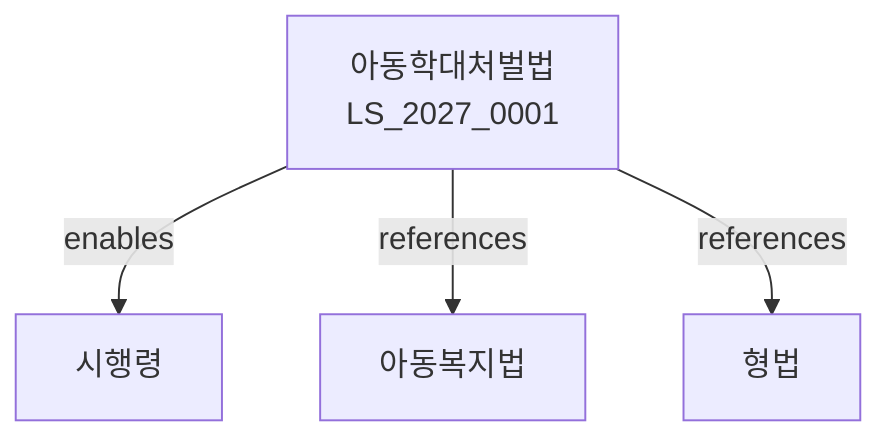

# 아동학대범죄의 처벌 등에 관한 특례법

> [법률 제20132호, 2024. 1. 9., 일부개정]

---

---

## 제1장 총칙
### 제1조 (목적)
이 법은 아동학대범죄를 예방하고 아동을 건전하게 육성하며 아동학대범죄를 처벌함을 목적으로 한다。

### 제2조 (정의)
이 법에서 사용하는 용어의 뜻은 다음과 같다。

1. "아동"이란 18세 미만의 자를 말한다。
2. "아동학대범죄"란 아동에 대한 학대행위로서 형법 등 형벌법령에 위반되는 행위를 말한다。
3. "학대행위"란 아동의 신체적ㆍ정신적 건강 및 발달에 해를 가하는 행위를 말한다。
4. "보호자"란 아동을 보호할 의무가 있는 자를 말한다。

---

## 제2장 아동학대범죄의 처벌
### 第5条(아동학대)
보호자가 아동에게 학대행위를 한 경우 죄에 정한 형의 2분의 1까지 가중한다。
### 第6条(아동상해)
아동을 상해한 자는 1년 이상의 징역 또는 500만원 이상 1천만원 이하의 벌금에 처한다。
### 第7条(아동유기)
아동을 유기한 자는 5년 이하의 징역 또는 3천만원 이하의 벌금에 처한다。
### 第8条(아동방임)
아동을 방임한 자는 3년 이하의 징역 또는 2천만원 이하의 벌금에 처한다。

---

## 제3장 아동학대의 신고
### 第15条(신고의무)
누구든지 아동학대를 발견한 때에는 수사기관 또는 아동보호전문기관에 신고하여야 한다。
### 第16条(신고자 보호)
아동학대를 신고한 자는 보호받는다。
### 第17条(신고방법)
아동학대 신고는 전화ㆍ방문ㆍ서면 등으로 할 수 있다。
### 第18条(신고처리)
신고를 접수한 기관은 지체 없이 조사하여야 한다。

---

## 제4장 아동보호
### 第25条(긴급보호)
학대받은 아동은 긴급보호를 받을 수 있다。
### 第26条(일시보호)
아동보호전문기관은 아동을 일시보호할 수 있다。
### 第27条(의료보호)
학대받은 아동에게는 의료보호를 제공한다。
### 第28条(심리치료)
학대받은 아동에게는 심리치료를 제공한다。

---

## 제5장 아동조사
### 第35条(아동조사)
아동학대 사건에 대하여는 아동조사를 실시한다。
### 第36条(아동조사관)
아동조사관은 아동학대 사건을 조사한다。
### 第37条(아동전담경찰관)
아동전담경찰관은 아동학대 사건을 수사한다。
### 第38条(아동우선조사)
아동학대 사건은 아동의 권리를 우선하여 조사한다。

---

## 제6장 가해자 교육
### 第45条(교육명령)
아동학대 가해자에게는 교육명령을 내릴 수 있다。
### 第46条(교육내용)
교육내용은 양육지원ㆍ심리상담 등으로 한다。
### 第47条(교육기관)
아동학대 예방교육기관을 지정할 수 있다。
### 第48条(교육이수)
교육명령을 받은 자는 교육을 이수하여야 한다。

---

## 제7장 벌칙
### 第55条(벌칙)
다음 각 호의 어느 하나에 해당하는 자는 무기 또는 5년 이상의 징역에 처한다。

1. 아동학대치상
2. 아동학대치사
### 第56条(과태료)
다음 각 호의 어느 하나에 해당하는 자에게는 3천만원 이하의 과태료를 부과한다。

1. 아동학대를 신고하지 아니한 자
2. 신고자에게 불이익을 준 자

---

## 관계 그래프

**상위 법령**
- [[헌법]] 제34조 (생존권)
- [[아동권리협약]]

**관련 법령**
- [[아동복지법]]
- [[형법]]
- [[소년법]]
- [[성폭력범죄 처벌법]]

**하위 법령**
- [[아동학대범죄 처벌법 시행령]]
