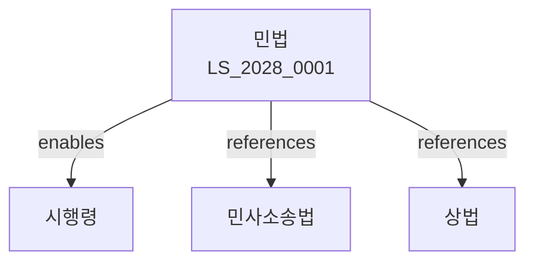

# 민법

> [법률 제20133호, 2024. 1. 9., 일부개정]

---

---

## 제1편 총칙
### 제1조 (목적)
이 법은 사법ㆍ사권 및 그 밖의 재산에 관한 법률관계를 규정함을 목적으로 한다。

### 제2조 (신의사상)
법원의 자유로운 심증에 의하여 확정된 사실은 진실로 추정한다。

### 제3조 (권리능력)
사람은 생존하는 동안 권리와 의무의 주체가 된다。

### 제4조 (행위능력)
성년에 달한 자는 행위능력을 가진다。

---

## 제2편 인
### 제1장 총칙
#### 第5条(인의 시기)
태아는 모체로부터 생존능력을 갖춘 때에 출생한 것으로 본다。
#### 第6条(사망의 시기)
사망은 호흡ㆍ맥박이 완전히 정지한 때에 이른다。
#### 第7条(동시사망)
동시에 사망한 자는 서로 상속하지 아니한다。
#### 第8条(실종선고)
부재자의 사망을 인정하는 재판이 확정된 때에 사망한 것으로 본다。

### 제2장 인의 능력
#### 第15条(행위능력)
성년자는 독자적으로 법률행위를 할 수 있다。
#### 第16条(미성년자)
미성년자는 법정대리인의 동의를 얻어 법률행위를 할 수 있다。
#### 第17条(피성년자)
피성년자는 제한능력자로서 법정대리인의 동의를 얻어 법률행위를 할 수 있다。
#### 第18条(금치산자)
금치산자는 무능력자로서 법정대리인이 대리하여 법률행위를 한다。

---

## 제3편 법인
### 第25条(법인의 성립)
법인은 법률의 규정에 따라 설립된다。
### 第26条(법인의 권리능력)
법인은 법률의 규정에 따라 권리와 의무의 주체가 된다。
### 第27条(법인의 행위능력)
법인은 이사 기타 대표자가 그 업무를 집행한다。
### 第28条(법인의 불법행위능력)
법인은 이사 기타 대표자가 그 직무에 관하여 타인에게 가한 손해를 배상할 책임이 있다。

---

## 제4편 물건
### 第35条(물건의 정의)
이 법에서 물건이라 함은 유체물과 전기 기타 관리할 수 있는 자연력을 말한다。
### 第36条(부동산)
토지 및 그 정착물은 부동산으로 한다。
### 第37条(동산)
부동산 이외의 물건은 동산으로 한다。
### 第38条(주물과 종물)
주물의 효용을 돕는 물건은 종물로 한다。

---

## 제5편 법률행위
### 第45条(법률행위의 성립)
법률행위는 당사자의 의사표시로 성립한다。
### 第46条(의사표시)
의사표시는 명시 또는 묵시로 한다。
### 第47条(비진의 의사표시)
진의 아닌 의사표시는 원칙적으로 유효하다。
### 第48条(통정허위표시)
통정허위표시는 무효로 한다。

---

## 제6편 기간
### 第55条(기간의 계산)
기간은 시ㆍ분ㆍ시에 의하여 계산한다。
### 第56条(기간의 기산)
기간은 그 기산일에 착수한다。
### 第57条(기간의 만료)
기간은 그 말일에 만료한다。
### 第58条(공휴일)
기간의 말일이 공휴일인 때에는 기간을 다음날로 연장한다。

---

## 제7편 소멸시효
### 第65条(소멸시효의 성립)
채권은 권리자가 의무자에게 10년 간 행사하지 아니하면 소멸시효가 완성된다。
### 第66条(단기소멸시효)
다음 각 호의 채권은 3년 간 행사하지 아니하면 소멸한다。

1. 이자ㆍ배당금
2. 임금
3. 공사대금
### 第67条(소멸시효의 중단)
소멸시효는 재판상의 청구ㆍ압류 등에 의하여 중단된다。
### 第68条(소멸시효의 정지)
소멸시효는 천재지변 등 불가항력 있는 사유로 인하여 시효를 완성할 수 없는 경우 정지된다。

---

## 제8편 권리의 행사
### 第75条(자력구제)
권리의 침해에 대하여 자력으로 구제할 수 있다。
### 第76条(정당방위)
급박한 부정행위에 대한 권리의 침해에 대하여 정당방위로 면책된다。
### 第77条(긴급피난)
현재의 부당한 침해를 피하기 위한 행위로 면책된다。
### 第78条(자구행위)
권리의 침해를 방지하기 위한 행위로 면책된다。

---

## 관계 그래프

**상위 법령**
- [[헌법]] 제10조 (인간의 존엄), 제23조 (재산권)

**관련 법령**
- [[민사소송법]]
- [[상법]]
- [[형법]]
- [[국가배상법]]

**하위 법령**
- [[민법 시행령]]
