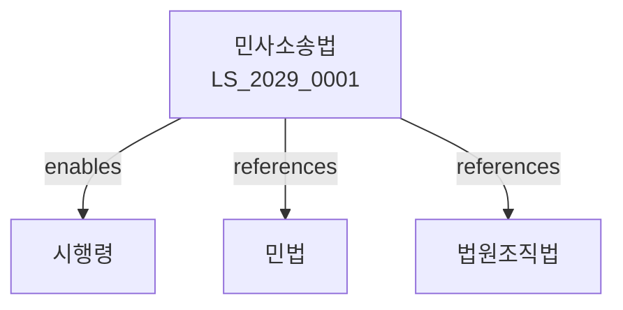

# 민사소송법

> [법률 제20134호, 2024. 1. 9., 일부개정]

---

---

## 제1편 총칙
### 제1조 (목적)
이 법은 민사사건에 관한 소송절차를 규정함을 목적으로 한다。

### 제2조 (법원의 관할)
법원은 소재지에 의하여 관할을 정한다。

### 제3조 (토지관할)
토지관할은 피고의 보통재판적 소재지에 의한다。

### 제4조 (특별재판적)
특별재판적은 법률로 정한다。

---

## 제2편 제1심 소송절차
### 제1장 소
#### 第5条(소의 제기)
소는 소장을 법원에 제출함으로써 제기한다。
#### 第6条(소장의 기재사항)
소장에는 다음 각 호의 사항을 기재하여야 한다。

1. 당사자
2. 청구의 취지
3. 청구의 원인
#### 第7条(소장의 송달)
법원은 소장을 피고에게 송달한다。
#### 第8条(변론기일의 지정)
법원은 변론기일을 지정한다。

### 제2장 변론
#### 第15条(변론의 형식)
변론은 공개한다。
#### 第16条(당사자의 출석)
당사자는 변론기일에 출석하여야 한다。
#### 第17条(증거조사)
법원은 증거를 조사한다。
#### 第18条(변론의 종결)
변론은 종결할 수 있다。

### 제3장 증거
#### 第25条(증거의 종류)
증거는 다음 각 호와 같다。

1. 증인신문
2. 감정
3. 검증
4. 서증
5. 당사자신문
#### 第26条(자유심증주의)
법원은 변론의 전체취지와 증거조사의 결과를 참작하여 자유심증으로 사실을 인정한다。
#### 第27条(증명책임)
사실의 주장자가 증명책임을 진다。
#### 第28条(증거보전)
소송물의 가치에 중대한 영향을 미칠 증거의 멸실을 방지하기 위하여 증거보전을 할 수 있다。

---

## 제3편 상소
### 제1장 항소
#### 第35条(항소)
제1심판결에 불복하는 자는 항소할 수 있다。
#### 第36条(항소기간)
항소는 판결서를 송달받은 날부터 2주 이내에 할 수 있다。
#### 第37条(항소이유)
항소이유를 기재하여야 한다。
#### 第38条(항소심 절차)
항소심은 제1심 절차에 준하여 행한다。

### 제2장 상고
#### 第45条(상고)
항소심판결에 불복하는 자는 상고할 수 있다。
#### 第46条(상고이유)
상고이유는 판결에 영향을 미친 법령위반이다。
#### 第47条(상고기간)
상고는 판결서를 송달받은 날부터 2주 이내에 할 수 있다。
#### 第48条(상고심 절차)
상고심은 법률심으로 한다。

---

## 제4편 재심
### 第55条(재심)
확정판결에 대하여 재심을 청구할 수 있다。
### 第56条(재심사유)
재심사유는 다음 각 호와 같다。

1. 법관의 직무범죄
2. 증거의 위조
3. 증인의 허위진술
4. 새로운 증거의 발견
### 第57条(재심청구기간)
재심은 재심사유를 안 날부터 30일 이내에 청구하여야 한다。
### 第58条(재심절차)
재심절차는 제1심 절차에 준하여 행한다。

---

## 제5편 독촉절차
### 第65条(독촉절차)
채권자는 채무자에게 지급명령을 발할 것을 법원에 신청할 수 있다。
### 第66条(지급명령)
지급명령은 채무자에게 청구금액의 지급을 명한다。
### 第67条(이의신청)
채무자는 지급명령에 대하여 이의신청을 할 수 있다。
### 第68条(이의신청의 효과)
이의신청이 있는 때에는 소송으로 이행된다。

---

## 제6편 조정절차
### 第75条(조정)
법원은 분쟁을 조정할 수 있다。
### 第76条(조정위원)
법원은 조정위원에게 조정을 하게 할 수 있다。
### 第77条(조정의 효력)
조정은 재판상 화해와 동일한 효력이 있다。
### 第78条(불조정결정)
조정이 성립되지 아니한 때에는 불조정결정을 한다。

---

## 제7편 비용
### 第85条(소송비용)
소송비용은 패소자가 부담한다。
### 第86条(비용액의 확정)
비용액은 법원이 확정한다。
### 第87条(비용의 면제)
법원은 비용의 면제를 명할 수 있다。
### 第88条(비용의 배상)
승소자는 비용의 배상을 청구할 수 있다。

---

## 관계 그래프

**상위 법령**
- [[헌법]] 제27조 (재판청구권)
- [[법원조직법]]

**관련 법령**
- [[민법]]
- [[형사소송법]]
- [[행정소송법]]
- [[가사소송법]]

**하위 법령**
- [[민사소송법 시행령]]
- [[민사소송규칙]]
