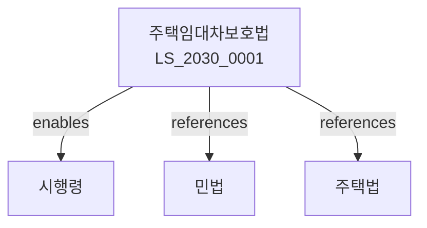

# 주택임대차보호법

> [법률 제20135호, 2024. 1. 9., 일부개정]

---

---

## 제1장 총칙
### 제1조 (목적)
이 법은 주택의 임대차에 관하여 민법에 대한 특례를 규정함으로써 국민의 주거생활의 안정을 도모함을 목적으로 한다。

### 제2조 (정의)
이 법에서 사용하는 용어의 뜻은 다음과 같다。

1. "주택"이란 주거용 건물 또는 주거용으로 사용할 수 있는 건물을 말한다。
2. "임대차"란 당사자의 일방이 상대방에게 목적물을 사용ㆍ수익하게 할 것을 약정하고 상대방은 이에 대하여 차임을 지급할 것을 약정함으로써 성립하는 계약을 말한다。
3. "임차인"이란 주택을 임차한 자를 말한다。
4. "임대인"이란 주택을 임대한 자를 말한다。

---

## 제2장 대항력
### 第5条(대항력의 요건)
임차인이 주택의 인도와 전입신고를 마친 때에는 그 다음 날부터 제3자에 대하여 대항력을 가진다。
### 第6条(대항력의 효과)
대항력을 갖춘 임차인은 임대인이 바뀌더라도 새로운 소유자에 대하여 임대차의 존속을 주장할 수 있다。
### 第7条(임대차의 승계)
주택의 양수인은 임대인의 지위를 승계한다。
### 第8条(대항력의 소멸)
임차인이 주택을 명도한 때에는 대항력이 소멸한다。

---

## 제3장 우선변제권
### 第15条(우선변제권의 요건)
다음 각 호의 요건을 갖춘 임차인은 우선변제권을 가진다。

1. 주택의 인도
2. 전입신고
3. 확정일자
### 第16条(우선변제권의 효과)
우선변제권을 가진 임차인은 경매 또는 공매절차에서 후순위 권리자에 우선하여 변제를 받는다。
### 第17条(우선변제권의 순위)
우선변제권의 순위는 전입신고 및 확정일자의 순서에 따른다。
### 第18条(소액임차인의 보호)
소액임차인은 일정금액까지 최우선 변제를 받는다。

---

## 제4장 임대차기간
### 第25条(최단기간)
임대차는 그 기간을 정하지 아니한 때에는 2년으로 본다。
### 第26条(기간의 연장)
임차인은 임대차기간의 만료 전 6월부터 1월까지 사이에 임대인에게 갱신거절 또는 조건변경의 통지를 하지 아니하면 임대차는 같은 조건으로 다시 2년간 존속한다。
### 第27条(계약갱신청구권)
임차인은 임대차기간이 만료하기 전 6월부터 1월까지 사이에 임대인에게 계약갱신을 청구할 수 있다。
### 第28条(거절사유)
임대인은 다음 각 호의 사유가 있는 경우에만 갱신을 거절할 수 있다。

1. 임차인이 임차료를 연체한 경우
2. 임차인이 주택을 무단전대한 경우

---

## 제5장 임대료
### 第35条(차임의 증감청구)
임대인은 약정한 차임이 부족한 때에는 증액을 청구할 수 있다。
### 第36条(증액의 제한)
차임의 증액은 연 5%를 초과하지 못한다。
### 第37条(보증금의 반환)
임대차가 종료된 때에는 임대인은 지체 없이 보증금을 반환하여야 한다。
### 第38条(보증금 반환청구 소송)
보증금 반환청구 소송은 임차주택 소재지 관할법원에 제기한다。

---

## 제6장 보호범위
### 第45条(사무실 겸용주택)
주택의 일부가 사무실로 사용되는 경우에도 이 법을 적용한다。
### 第46条(상가주택)
주택과 상가가 결합된 건물의 주택 부분에 대하여는 이 법을 적용한다。
### 第47条(다가구주택)
다가구주택의 각 가구에 대하여는 독립하여 이 법을 적용한다。
### 第48条(주택의 범위)
주택의 범위는 국토교통부령으로 정한다。

---

## 제7장 벌칙
### 第55条(과태료)
다음 각 호의 어느 하나에 해당하는 자에게는 1천만원 이하의 과태료를 부과한다。

1. 거짓으로 전입신고를 한 자
2. 보증금 반환을 거부한 자

---

## 관계 그래프

**상위 법령**
- [[헌법]] 제35조 (주거생활 보장)
- [[민법]]

**관련 법령**
- [[민법]]
- [[주택법]]
- [[주택도시보증공사법]]
- [[부동산거래신고법]]

**하위 법령**
- [[주택임대차보호법 시행령]]
