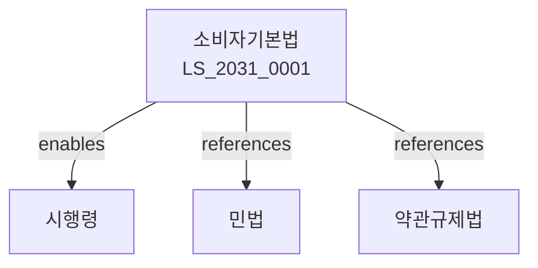

# 소비자기본법

> [법률 제20136호, 2024. 1. 9., 일부개정]

---

---

## 제1장 총칙
### 제1조 (목적)
이 법은 소비자의 권익을 보호하고 증진하기 위하여 소비자정책의 기본사항을 정함을 목적으로 한다。

### 제2조 (정의)
이 법에서 사용하는 용어의 뜻은 다음과 같다。

1. "소비자"란 물품 또는 용역을 사용 또는 이용하는 자를 말한다。
2. "사업자"란 물품 또는 용역을 제공하는 자를 말한다。
3. "소비자단체"란 소비자의 권익을 옹호하기 위한 단체를 말한다。
4. "소비자정책"이란 소비자의 권익을 보호하기 위한 정책을 말한다。

---

## 제2장 소비자의 권리
### 第5条(소비자의 권리)
소비자는 다음 각 호의 권리를 가진다。

1. 물품 또는 용역을 선택할 권리
2. 물품 또는 용역에 관한 정보를 제공받을 권리
3. 물품 또는 용역으로 인한 피해를 보상받을 권리
4. 소비자교육을 받을 권리
5. 소비자단체를 조직할 권리
### 第6条(알 권리)
소비자는 물품 또는 용역에 관한 정보를 알 권리를 가진다。
### 第7条(선택할 권리)
소비자는 물품 또는 용역을 자유로이 선택할 권리를 가진다。
### 第8条(의견을 반영받을 권리)
소비자는 정책수립에 있어 의견을 반영받을 권리를 가진다。

---

## 제3장 소비자정책
### 第15条(소비자정책의 수립)
정부는 소비자의 권익을 보호하기 위하여 소비자정책을 수립하여야 한다。
### 第16条(소비자정책심의위원회)
소비자정책을 심의하기 위하여 소비자정책심의위원회를 둔다。
### 第17条(소비자의 날)
매년 5월의 셋째 주 화요일을 소비자의 날로 한다。
### 第18条(소비자보호종합계획)
정부는 매년 소비자보호종합계획을 수립하여야 한다。

---

## 제4장 소비자단체
### 第25条(소비자단체의 설립)
소비자는 소비자단체를 설립할 수 있다。
### 第26条(소비자단체의 역할)
소비자단체는 다음 각 호의 역할을 한다。

1. 소비자 상담 및 정보제공
2. 소비자 피해구제
3. 소비자교육
4. 사업자와의 협력
### 第27条(소비자단체의 지원)
국가는 소비자단체를 지원할 수 있다。
### 第28条(소비자단체의 의무)
소비자단체는 공익을 위하여 활동하여야 한다。

---

## 제5장 소비자피해구제
### 第35条(피해구제)
소비자는 물품 또는 용역으로 인한 피해에 대하여 보상을 받을 수 있다。
### 第36条(피해보상기준)
사업자는 피해보상기준에 따라 보상하여야 한다。
### 第37条(분쟁조정)
소비자와 사업자 사이의 분쟁은 소비자분쟁조정위원회에서 조정한다。
### 第38条(조정의 효력)
조정은 당사자가 수락한 때에는 재판상 화해와 동일한 효력이 있다。

---

## 제6장 소비자교육
### 第45条(소비자교육의 실시)
국가는 소비자교육을 실시하여야 한다。
### 第46条(교육내용)
소비자교육에는 다음 각 호의 사항이 포함되어야 한다。

1. 물품 또는 용역의 선택방법
2. 소비자의 권리와 의무
3. 피해구제 방법
4. 기타 소비자생활에 필요한 사항
### 第47条(교육기관)
소비자교육은 소비자단체 등이 실시할 수 있다。
### 第48条(교육지원)
국가는 소비자교육에 소요되는 비용을 지원할 수 있다。

---

## 제7장 벌칙
### 第55条(과태료)
다음 각 호의 어느 하나에 해당하는 자에게는 1천만원 이하의 과태료를 부과한다。

1. 거짓으로 정보를 제공한 자
2. 피해보상을 거부한 자

---

## 관계 그래프

**상위 법령**
- [[헌법]] 제35조 (소비자보호)
- [[민법]]

**관련 법령**
- [[민법]]
- [[약관규제법]]
- [[전자상거래법]]
- [[할부거래법]]

**하위 법령**
- [[소비자기본법 시행령]]
