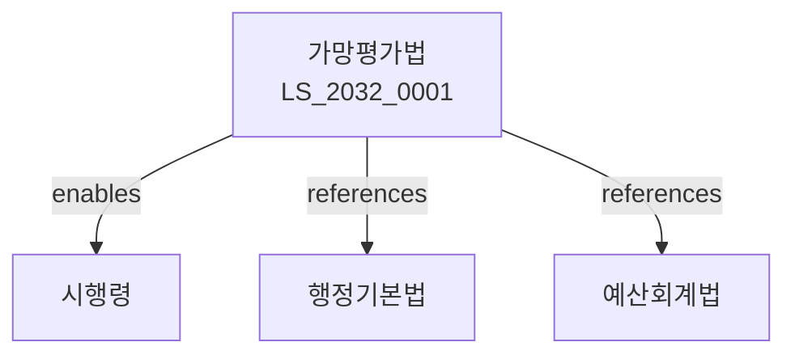

# 가망평가법

> [법률 제20137호, 2024. 1. 9., 일부개정]

---

---

## 제1장 총칙
### 제1조 (목적)
이 법은 정부의 정책ㆍ사업의 가망평가에 관한 사항을 정함으로써 재정의 효율성을 제고함을 목적으로 한다。

### 제2조 (정의)
이 법에서 사용하는 용어의 뜻은 다음과 같다。

1. "가망평가"란 정부의 정책ㆍ사업의 비용과 편익을 분석하는 것을 말한다。
2. "가망분석"이란 정책ㆍ사업의 경제적 타당성을 분석하는 것을 말한다。
3. "평가기관"이란 가망평가를 실시하는 기관을 말한다。
4. "피평가기관"이란 가망평가를 받는 기관을 말한다。

---

## 제2장 가망평가의 대상
### 第5条(평가대상)
다음 각 호의 정책ㆍ사업에 대하여 가망평가를 실시한다。

1. 대규모 투자사업
2. 새로운 정책사업
3. 법령 개정을 수반하는 사업
4. 기타 대통령령으로 정하는 사업
### 第6条(평가의 제외)
다음 각 호의 사업은 가망평가에서 제외할 수 있다。

1. 국가안보와 관련된 사업
2. 긴급한 사업
3. 규모가 작은 사업
### 第7条(평가의 시기)
가망평가는 사업의 기획 단계에서 실시한다。
### 第8条(평가의 범위)
가망평가는 사업의 전체 수명주기를 고려하여 실시한다。

---

## 제3장 가망평가의 방법
### 第15条(평가방법)
가망평가는 다음 각 호의 방법으로 실시한다。

1. 비용편익분석
2. 비용효과분석
3. 다기준분석
### 第16条(비용편익분석)
비용편익분석은 사업의 비용과 편익을 화폐가치로 환산하여 비교한다。
### 第17条(비용효과분석)
비용효과분석은 비용과 효과를 비교하여 경제성을 분석한다。
### 第18条(할인율)
가망평가에 적용하는 할인율은 대통령령으로 정한다。

---

## 제4장 가망평가의 절차
### 第25条(평가의뢰)
피평가기관은 평가기관에 가망평가를 의뢰한다。
### 第26条(평가실시)
평가기관은 가망평가를 실시한다。
### 第27条(평가결과 통보)
평가기관은 평가결과를 피평가기관에 통보한다。
### 第28条(평가결과 활용)
피평가기관은 평가결과를 사업에 반영하여야 한다。

---

## 제5장 가망평가기관
### 第35条(평가기관의 지정)
국무조정실은 가망평가기관을 지정할 수 있다。
### 第36条(평가기관의 요건)
평가기관은 다음 각 호의 요건을 갖추어야 한다。

1. 전문인력 보유
2. 평가경험 보유
3. 독립성 확보
### 第37条(평가기관의 의무)
평가기관은 공정하고 객관적으로 평가하여야 한다。
### 第38条(평가기관의 관리)
국무조정실은 평가기관을 관리한다。

---

## 제6장 협의회
### 第45条(가망평가협의회)
가망평가에 관한 사항을 심의하기 위하여 가망평가협의회를 둔다。
### 第46条(구성)
협의회는 위원장과 위원으로 구성한다。
### 第47条(기능)
협의회는 다음 각 호의 사항을 심의한다。

1. 가망평가의 기준
2. 가망평가의 방법
3. 가망평가 결과의 활용
### 第48条(운영)
협의회의 운영에 관한 사항은 대통령령으로 정한다。

---

## 제7장 보칙
### 第55条(자료제출)
관계기관은 가망평가에 필요한 자료를 제출하여야 한다。
### 第56条(비밀유지)
평가에 종사하는 자는 업무상 비밀을 누설하여서는 아니 된다。
### 第57条(권한의 위임)
이 법에 따른 권한은 대통령령으로 정하는 바에 따라 위임할 수 있다。

---

## 관계 그래프

**상위 법령**
- [[헌법]] 제35조 (재정관리)
- [[예산회계법]]

**관련 법령**
- [[행정기본법]]
- [[예산회계법]]
- [[국가재정법]]
- [[정부업무평가법]]

**하위 법령**
- [[가망평가법 시행령]]
