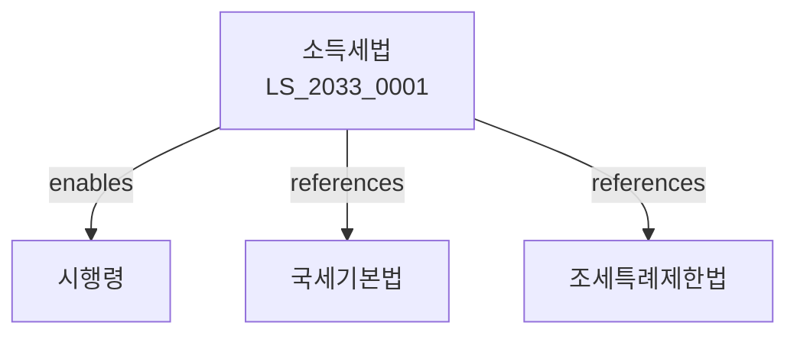

# 소득세법

> [법률 제20138호, 2024. 1. 9., 일부개정]

---

---

## 제1장 총칙
### 제1조 (목적)
이 법은 소득세의 부과와 징수에 관한 사항을 규정함을 목적으로 한다。

### 제2조 (정의)
이 법에서 사용하는 용어의 뜻은 다음과 같다。

1. "소득"이란 일정기간 동안 개인이 취득하는 경제적 이익을 말한다。
2. "거주자"란 대한민국 안에 주소를 두거나 1년 이상 거소를 둔 개인을 말한다。
3. "비거주자"란 거주자 외의 개인을 말한다。
4. "종합소득"란 이자소득ㆍ배당소득ㆍ사업소득ㆍ근로소득ㆍ연금소득 및 기타소득을 합한 것을 말한다。

---

## 제2장 종합소득
### 第5条(이자소득)
이자소득은 다음 각 호의 소득으로 한다。

1. 예금이자
2. 채권이자
3. 신탁수익
### 第6条(배당소득)
배당소득은 법인으로부터 받는 이익배당을 말한다。
### 第7条(사업소득)
사업소득은 사업을 영위하여 얻는 소득을 말한다。
### 第8条(근로소득)
근로소득은 근로를 제공하고 받는 대가를 말한다。

---

## 제3장 퇴직소득
### 第25条(퇴직소득의 범위)
퇴직소득은 퇴직으로 인하여 받는 소득을 말한다。
### 第26条(퇴직소득금액)
퇴직소득금액은 퇴직급여액에서 퇴직소득공제를 뺀 금액으로 한다。
### 第27条(퇴직소득세율)
퇴직소득세율은 6%~45%의 누진세율을 적용한다。
### 第28条(퇴직소득과세표준)
퇴직소득과세표준은 퇴직소득금액에서 표준공제를 뺀 금액으로 한다。

---

## 제4장 양도소득
### 第35条(양도소득의 범위)
양도소득은 자산의 양도로 인하여 발생하는 소득을 말한다。
### 第36条(양도차익)
양도차익은 양도가액에서 취득가액과 필요경비를 뺀 금액으로 한다。
### 第37条(양도소득세율)
양도소득세율은 자산의 종류에 따라 6%~50%를 적용한다。
### 第38条(1세대 1주택 비과세)
1세대 1주택에 대한 양도소득은 비과세한다。

---

## 제5장 소득공제
### 第45条(소득공제의 종류)
소득공제는 다음 각 호와 같다。

1. 인적공제
2. 연금보험료공제
3. 의료비공제
4. 교육비공제
5. 기부금공제
### 第46条(인적공제)
인적공제는 본인ㆍ배우자 및 부양가족에 대하여 한다。
### 第47条(표준공제)
표준공제는 15만원으로 한다。
### 第48条(특별소득공제)
특별소득공제는 장애인ㆍ고령자 등에 대하여 한다。

---

## 제6장 세율
### 第55条(종합소득세율)
종합소득세율은 다음 각호와 같은 누진세율을 적용한다。

1. 1천400만원 이하: 6%
2. 5천만원 이하: 15%
3. 8천800만원 이하: 24%
4. 1억5천만원 이하: 35%
5. 3억원 이하: 38%
6. 5억원 이하: 40%
7. 5억원 초과: 45%
### 第56条(근로소득세액공제)
근로소득세액공제는 근로소득세액의 55%로 한다。
### 第57条(세액공제)
세액공제는 외국납부세액공제 및 배당세액공제로 한다。
### 第58条(세액감면)
세액감면은 조세특례제한법이 정하는 바에 따른다。

---

## 제7장 신고와 납부
### 第65条(과세표준신고)
거주자는 매년 5월 31일까지 종합소득과세표준을 신고하여야 한다。
### 第66条(자진납부)
신고한 세액은 신고기한까지 자진납부하여야 한다。
### 第67条(원천징수)
원천징수의무자는 소득을 지급할 때 세액을 원천징수하여야 한다。
### 第68条(중간예납)
사업소득이 있는 자는 중간예납을 하여야 한다。

---

## 관계 그래프

**상위 법령**
- [[헌법]] 제38조 (납세의무)
- [[국세기본법]]

**관련 법령**
- [[국세기본법]]
- [[조세특례제한법]]
- [[법인세법]]
- [[부가가치세법]]

**하위 법령**
- [[소득세법 시행령]]
