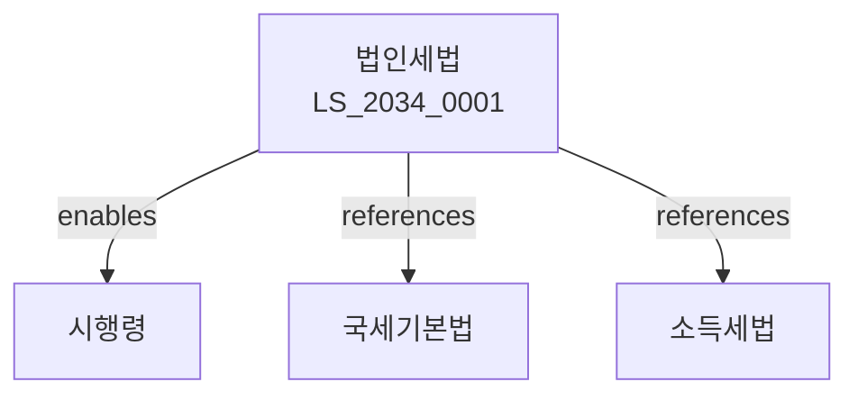

# 법인세법

> [법률 제20139호, 2024. 1. 9., 일부개정]

---

---

## 제1장 총칙
### 제1조 (목적)
이 법은 법인세의 부과와 징수에 관한 사항을 규정함을 목적으로 한다。

### 제2조 (정의)
이 법에서 사용하는 용어의 뜻은 다음과 같다。

1. "내국법인"이란 대한민국 안에 본점 또는 주사무소를 둔 법인을 말한다。
2. "외국법인"이란 내국법인 외의 법인을 말한다。
3. "각 사업연도소득"이란 각 사업연도의 총수익에서 총비용을 공제한 금액을 말한다。
4. "청산소득"이란 법인의 청산으로 인하여 발생하는 소득을 말한다。

---

## 제2장 각 사업연도소득
### 第5条(총수익)
총수익은 익금액으로 한다。
### 第6条(총비용)
총비용은 손금액으로 한다。
### 第7条(익금불산입)
다음 각 호의 금액은 익금에 산입하지 아니한다。

1. 자기주식 처분이익
2. 배당건설이자
### 第8条(손금불산입)
다음 각 호의 금액은 손금에 산입하지 아니한다。

1. 접대비 한도초과액
2. 기부금 한도초과액

---

## 제3장 익금과 손금
### 第15条(익금의 범위)
익금은 자본 또는 자산의 증가를 초래하는 거래로 인하여 발생하는 수익으로 한다。
### 第16条(손금의 범위)
손금은 자본 또는 자산의 감소를 초래하는 거래로 인하여 발생하는 비용으로 한다。
### 第17条(자산의 평가)
자산의 평가는 취득가액을 원칙으로 한다。
### 第18条(감가상각)
감가상각은 정액법 또는 정률법으로 한다。

---

## 제4장 소득공제
### 第25条(이월결손금 공제)
이월결손금은 10년 이내에 각 사업연도소득에서 공제한다。
### 第26条(비영리법인 수익사업소득 공제)
비영리법인의 수익사업소득은 공제한다。
### 第27条(특별외국법인 소득공제)
특별외국법인의 소득은 공제할 수 있다。
### 第28条(연구개발비 공제)
연구개발비는 추가공제한다。

---

## 제5장 세율
### 第35条(법인세율)
법인세율은 다음 각 호와 같다。

1. 2억원 이하: 10%
2. 2억원 초과: 20%
3. 대기업: 22%
### 第36条(지방소득세)
지방소득세는 법인세의 10%로 한다。
### 第37条(농어촌특별세)
농어촌특별세는 법인세의 0.15%로 한다。
### 第38条(할증세율)
유보소득에 대하여는 할증세율을 적용할 수 있다。

---

## 제6장 신고와 납부
### 第45条(과세표준신고)
법인은 사업연도 종료일부터 3월 이내에 과세표준을 신고하여야 한다。
### 第46条(자진납부)
신고한 세액은 신고기한까지 자진납부하여야 한다。
### 第47条(중간예납)
법인은 중간예납을 하여야 한다。
### 第48条(원천징수)
원천징수의무자는 이자ㆍ배당을 지급할 때 세액을 원천징수하여야 한다。

---

## 제7장 결합법인
### 第55条(결합법인의 범위)
결합법인은 지배회사와 종속회사로 구성한다。
### 第56条(결합재무제표)
결합법인은 결합재무제표를 작성하여야 한다。
### 第57条(내부거래 제거)
결합법인 간 내부거래는 제거한다。
### 第58条(결합법인세 신고)
결합법인은 결합법인세를 신고하여야 한다。

---

## 관계 그래프

**상위 법령**
- [[헌법]] 제38조 (납세의무)
- [[국세기본법]]

**관련 법령**
- [[국세기본법]]
- [[소득세법]]
- [[부가가치세법]]
- [[조세특례제한법]]

**하위 법령**
- [[법인세법 시행령]]
