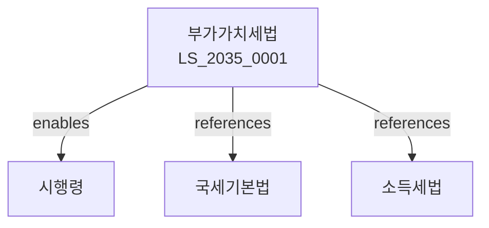

# 부가가치세법

> [법률 제20140호, 2024. 1. 9., 일부개정]

---

---

## 제1장 총칙
### 제1조 (목적)
이 법은 부가가치세의 부과와 징수에 관한 사항을 규정함을 목적으로 한다。

### 제2조 (정의)
이 법에서 사용하는 용어의 뜻은 다음과 같다。

1. "재화"란 유체물 및 무체물을 말한다。
2. "용역"이란 재화 외의 재산적 가치가 있는 행위를 말한다。
3. "공급"이란 재화 또는 용역의 인도 또는 제공을 말한다。
4. "매입세액"이란 재화 또는 용역을 공급받을 때 부담한 부가가치세를 말한다。

---

## 제2장 과세거래
### 第5条(재화의 공급)
재화의 공급은 재화의 인도를 말한다。
### 第6条(용역의 공급)
용역의 공급은 용역의 제공을 말한다。
### 第7条(재화의 수입)
재화의 수입은 외국물품의 수입을 말한다。
### 第8条(간주공급)
다음 각 호의 경우에는 재화의 공급으로 본다。

1. 자가소비
2. 개인적 공급
3. 사업양도

---

## 제3장 면세
### 第15条(면세대상)
다음 각 호의 재화 또는 용역은 부가가치세를 면제한다。

1. 미가공 식료품
2. 의료보건용역
3. 교육용역
4. 금융ㆍ보험용역
5. 주택임대용역
### 第16条(수출영세율)
수출재화에 대하여는 영세율을 적용한다。
### 第17条(외화획득재화)
외화획득재화에 대하여는 영세율을 적용한다。
### 第18条(면세포기)
면세사업자는 면세를 포기하고 과세사업자가 될 수 있다。

---

## 제4장 세율
### 第25条(기본세율)
부가가치세율은 100분의 10으로 한다。
### 第26条(영세율)
영세율은 100분의 0으로 한다。
### 第27条(개별소비세)
개별소비세는 별도로 부과한다。
### 第28条(가산세)
세금계산서 미교부 시 가산세를 부과한다。

---

## 제5장 납부세액
### 第35条(납부세액의 계산)
납부세액은 매출세액에서 매입세액을 공제한 금액으로 한다。
### 第36条(매입세액공제)
세금계산서를 교부받은 경우 매입세액을 공제한다。
### 第37条(매입세액 불공제)
다음 각 호의 매입세액은 공제하지 아니한다。

1. 접대비
2. 업무무관 지출
3. 비영업용 승용자동차
### 第38条(의제매입세액)
면세농산물을 매입한 경우 의제매입세액을 공제한다。

---

## 제6장 신고와 납부
### 第45条(확정신고)
납세의무자는 매 6월을 과세기간으로 하여 확정신고하여야 한다。
### 第46条(예정신고)
예정신고는 매 분기별로 한다。
### 第47条(자진납부)
신고한 세액은 신고기한까지 자진납부하여야 한다。
### 第48条(환급)
매입세액이 매출세액을 초과하는 경우 환급한다。

---

## 제7장 세금계산서
### 第55条(세금계산서의 교부)
사업자는 재화 또는 용역을 공급할 때 세금계산서를 교부하여야 한다。
### 第56条(세금계산서의 기재사항)
세금계산서에는 다음 각 호의 사항을 기재하여야 한다。

1. 공급자 등록번호
2. 공급받는자 등록번호
3. 공급가액
4. 세액
### 第57条(전자세금계산서)
전자세금계산서는 국세청에 전송하여야 한다。
### 第58条(세금계산서의 교부의무)
세금계산서를 교부하지 아니한 자는 가산세를 부과한다。

---

## 관계 그래프

**상위 법령**
- [[헌법]] 제38조 (납세의무)
- [[국세기본법]]

**관련 법령**
- [[국세기본법]]
- [[소득세법]]
- [[법인세법]]
- [[개별소비세법]]

**하위 법령**
- [[부가가치세법 시행령]]
