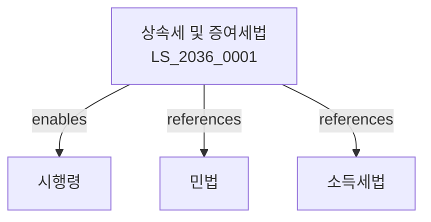

# 상속세 및 증여세법

> [법률 제20141호, 2024. 1. 9., 일부개정]

---

---

## 제1장 총칙
### 제1조 (목적)
이 법은 상속세 및 증여세의 부과와 징수에 관한 사항을 규정함을 목적으로 한다。

### 제2조 (정의)
이 법에서 사용하는 용어의 뜻은 다음과 같다。

1. "상속"이란 사망으로 인하여 재산을 무상으로 취득하는 것을 말한다。
2. "증여"란 무상으로 재산을 취득하는 것을 말한다。
3. "상속인"이란 민법에 따라 상속재산을 승계하는 자를 말한다。
4. "수증자"란 증여에 의하여 재산을 취득하는 자를 말한다。

---

## 제2장 상속세
### 제1절 상속재산
#### 第5条(상속재산의 범위)
상속재산은 상속개시일 현재 피상속인의 재산으로 한다。
#### 第6条(상속재산의 평가)
상속재산의 평가는 상속개시일 현재의 시가로 한다。
#### 第7条(공과금)
상속재산에 관한 공과금은 상속재산가액에서 공제한다。
#### 第8条(채무)
피상속인의 채무는 상속재산가액에서 공제한다。

### 제2절 상속세액
#### 第15条(상속세과세가액)
상속세과세가액은 상속재산가액에서 공과금 및 채무를 공제한 금액으로 한다。
#### 第16条(기초공제)
상속세과세가액에서 2억원을 기초공제한다。
#### 第17条(인적공제)
다음 각 호의 인적공제를 한다。

1. 배우자공제: 5억원
2. 자녀공제: 1인당 5천만원
3. 기타인적공제
#### 第18条(상속세세율)
상속세율은 10%~50%의 누진세율을 적용한다。

---

## 제3장 증여세
### 제1절 증여재산
#### 第25条(증여재산의 범위)
증여재산은 증여일 현재 증여자의 재산으로 한다。
#### 第26条(증여의제)
다음 각 호의 경우에는 증여로 본다。

1. 신탁재산의 이익
2. 보험금의 수취
3. 저가양수
4. 무상이익
#### 第27条(증여재산의 평가)
증여재산의 평가는 증여일 현재의 시가로 한다。
#### 第28条(증여재산의 합산)
10년 이내에 증여받은 재산은 합산한다。

### 제2절 증여세액
#### 第35条(증여세과세가액)
증여세과세가액은 증여재산가액에서 공제액을 뺀 금액으로 한다。
#### 第36条(기초공제)
증여세과세가액에서 1천만원을 기초공제한다。
#### 第37条(배우자공제)
배우자로부터 증여받은 경우 6억원까지 공제한다。
#### 第38条(증여세세율)
증여세율은 10%~50%의 누진세율을 적용한다。

---

## 제4장 신고와 납부
### 第45条(상속세신고)
상속인은 상속개시일부터 6월 이내에 상속세를 신고하여야 한다。
### 第46条(증여세신고)
수증자는 증여일부터 3월 이내에 증여세를 신고하여야 한다。
### 第47条(자진납부)
신고한 세액은 신고기한까지 자진납부하여야 한다。
### 第48条(물납)
세액을 금전으로 납부하기 곤란한 경우 물납할 수 있다。

---

## 제5장 포괄주의
### 第55条(명의신탁재산)
명의신탁재산은 실질소유자의 재산으로 본다。
### 第56条(가업승계)
가업승계에 대하여는 세액을 감면한다。
### 第57条(가업상속공제)
가업상속에 대하여는 공제를 한다。
### 第58条(재해손실공제)
재해로 인한 손실에 대하여는 공제를 한다。

---

## 관계 그래프

**상위 법령**
- [[헌법]] 제38조 (납세의무)
- [[민법]]

**관련 법령**
- [[민법]]
- [[소득세법]]
- [[종합부동산세법]]
- [[지방세법]]

**하위 법령**
- [[상속세 및 증여세법 시행령]]
