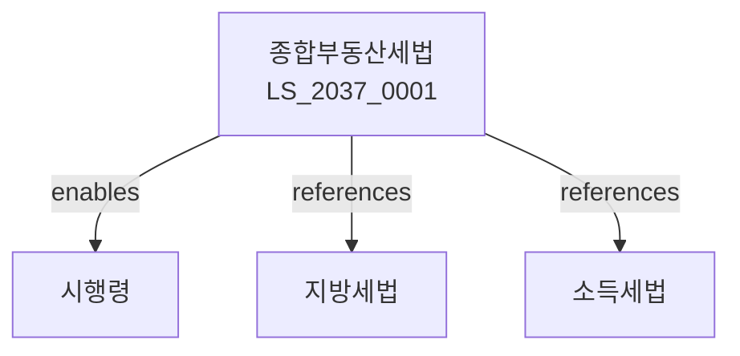

# 종합부동산세법

> [법률 제20142호, 2024. 1. 9., 일부개정]

---

---

## 제1장 총칙
### 제1조 (목적)
이 법은 종합부동산세의 부과와 징수에 관한 사항을 규정함을 목적으로 한다。

### 제2조 (정의)
이 법에서 사용하는 용어의 뜻은 다음과 같다。

1. "주택"이란 주거용으로 사용하는 건물을 말한다。
2. "부속토지"란 건물의 부속토지를 말한다。
3. "공시가격"이란 부동산가격공시에 관한 법률에 따른 가격을 말한다。
4. "과세표준"이란 종합부동산세 부과의 기준이 되는 금액을 말한다。

---

## 제2장 납세의무자
### 第5条(납세의무자)
종합부동산세의 납세의무자는 과세기준일 현재 부동산을 소유한 자로 한다。
### 第6条(공동소유)
공동소유 부동산은 지분에 따라 납세의무를 진다。
### 第7条(법인)
법인 소유 부동산에 대하여도 종합부동산세를 부과한다。
### 第8条(수탁자)
신탁재산의 수탁자는 종합부동산세의 납세의무자로 한다。

---

## 제3장 과세표준
### 第15条(과세표준의 계산)
과세표준은 부동산의 공시가격에서 공제액을 뺀 금액으로 한다。
### 第16条(공제액)
공제액은 다음 각 호와 같다。

1. 주택: 9억원
2. 토지: 별도 기준
### 第17条(부부합산)
부부가 소유하는 주택은 합산하여 과세표준을 계산한다。
### 第18条(가산액)
공시가격 산정에 착오가 있는 경우 가산액을 조정한다。

---

## 제4장 세율
### 第25条(주택세율)
주택에 대한 세율은 다음 각 호와 같다。

1. 6억원 이하: 0.5%
2. 12억원 이하: 1.0%
3. 50억원 이하: 2.0%
4. 50억원 초과: 3.0%
### 第26条(토지세율)
토지에 대한 세율은 다음 각 호와 같다.

1. 기본세율: 0.5%~2.0%
2. 특별세율: 별도 규정
### 第27条(별장 등 특별세율)
별장ㆍ고급주택 등에 대하여는 할증세율을 적용한다。
### 第28条(농어촌특별세)
종합부동산세의 100분의 0.15를 농어촌특별세로 부과한다。

---

## 제5장 공제
### 第35条(공제)
과세표준에서 일정금액을 공제한다。
### 第36条(감면)
다음 각 호의 경우 감면한다。

1. 장애인 소유 주택
2. 고령자 소유 주택
3. 농어촌 특례
### 第37条(비과세)
다음 각 호의 부동산은 비과세한다。

1. 국가 소유 부동산
2. 공공용 부동산
### 第38条(세액공제)
지방소득세 납부세액을 공제한다。

---

## 제6장 신고와 납부
### 第45条(부과징수)
종합부동산세는 관할 세무서장이 부과징수한다。
### 第46条(납부기한)
종합부동산세는 12월 1일부터 12월 31일까지 납부한다。
### 第47条(분납)
세액이 일정금액을 초과하는 경우 분납할 수 있다。
### 第48条(물납)
세액을 금전으로 납부하기 곤란한 경우 물납할 수 있다。

---

## 제7장 보칙
### 第55条(자료제출)
납세의무자는 부동산 소유 현황을 신고하여야 한다。
### 第56条(조사)
세무서장은 필요한 경우 조사할 수 있다。
### 第57条(결정 및 경정)
부과결정에 착오가 있는 경우 경정한다。
### 第58条(가산세)
신고불성실 및 납부지연에 대하여 가산세를 부과한다。

---

## 관계 그래프

**상위 법령**
- [[헌법]] 제38조 (납세의무)
- [[지방세법]]

**관련 법령**
- [[지방세법]]
- [[소득세법]]
- [[상속세 및 증여세법]]
- [부동산가격공시법]

**하위 법령**
- [[종합부동산세법 시행령]]
