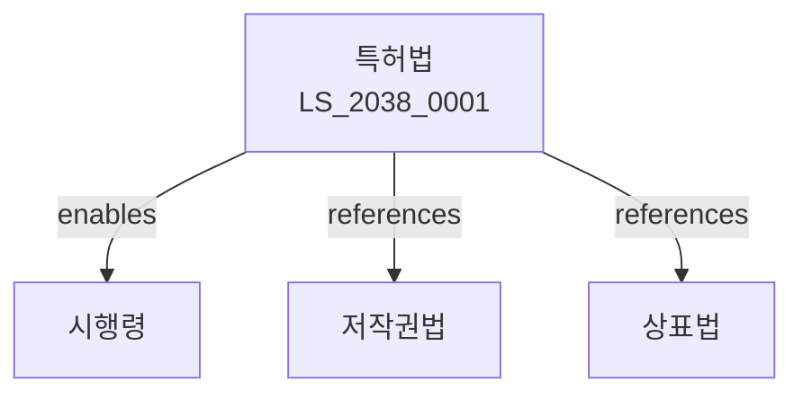

# 특허법

> [법률 제20143호, 2024. 1. 9., 일부개정]

---

---

## 제1장 총칙
### 제1조 (목적)
이 법은 발명을 보호ㆍ장려하고 그 이용을 도모함으로써 기술의 발전을 촉진하여 산업발전에 이바지함을 목적으로 한다。

### 제2조 (정의)
이 법에서 사용하는 용어의 뜻은 다음과 같다。

1. "발명"이란 자연법칙을 이용한 기술적 사상의 창작으로서 고도한 것을 말한다。
2. "특허발명"이란 특허를 받은 발명을 말한다。
3. "실시"란 발명을 생산ㆍ사용ㆍ양도 등을 하는 것을 말한다。
4. "특허권"이란 특허를 받은 자가 가지는 권리를 말한다。

---

## 제2장 특허요건
### 第5条(특허를 받을 수 있는 발명)
산업상 이용할 수 있는 발명은 특허를 받을 수 있다。
### 第6条(신규성)
다음 각 호의 발명은 신규성이 없다。

1. 공지된 발명
2. 공연히 실시된 발명
3. 간행물에 기재된 발명
### 第7条(진보성)
발명이 속하는 기술분야에서 통상의 지식을 가진 자가 용이하게 발명할 수 있는 것은 진보성이 없다。
### 第8条(선원주의)
동일한 발명에 대하여 2 이상의 출원이 있는 때에는 먼저 출원한 자가 특허를 받는다。

---

## 제3장 특허출원
### 第15条(특허출원)
특허를 받으려는 자는 특허출원을 하여야 한다。
### 第16条(출원서)
출원서에는 다음 각 호의 사항을 기재하여야 한다。

1. 발명의 명칭
2. 출원인의 성명
3. 발명자의 성명
### 第17条(명세서)
명세서에는 발명의 상세한 설명과 특허청구범위를 기재하여야 한다。
### 第18条(우선권주장)
파리조약에 따른 우선권을 주장할 수 있다。

---

## 제4장 특허심사
### 第25条(방식심사)
특허청은 출원이 방식에 적합한지 심사한다。
### 第26条(실체심사)
특허청은 특허요건을 실체적으로 심사한다。
### 第27条(거절사유)
특허요건에 미달하는 출원은 거절한다。
### 第28条(거절결정불복)
거절결정에 불복하는 자는 심판을 청구할 수 있다。

---

## 제5장 특허권
### 第35条(특허권의 설정)
특허권은 설정등록으로 발생한다。
### 第36条(특허권의 존속기간)
특허권의 존속기간은 설정등록일부터 20년으로 한다。
### 第37条(특허권의 효력)
특허권자는 업으로서 특허발명을 실시할 권리를 독점한다。
### 第38条(특허권의 제한)
특허권의 효력은 다음 각 호의 경우에 미치지 아니한다。

1. 연구 또는 시험
2. 의료행위
3. 선사용

---

## 제6장 특허침해
### 第45条(침해의 금지)
특허권자는 침해자에 대하여 침해의 금지를 청구할 수 있다。
### 第46条(손해배상)
침해자는 특허권자에게 손해를 배상하여야 한다。
### 第47条(손해액의 추정)
침해자가 얻은 이익액은 손해액으로 추정한다。
### 第48条(침해죄)
특허권을 침해한 자는 7년 이하의 징역 또는 1억원 이하의 벌금에 처한다。

---

## 관계 그래프

**상위 법령**
- [[헌법]] 제22조 (학문ㆍ예술의 자유)
- [[민법]]

**관련 법령**
- [[저작권법]]
- [[상표법]]
- [[디자인보호법]]
- [[부정경쟁방지법]]

**하위 법령**
- [[특허법 시행령]]
