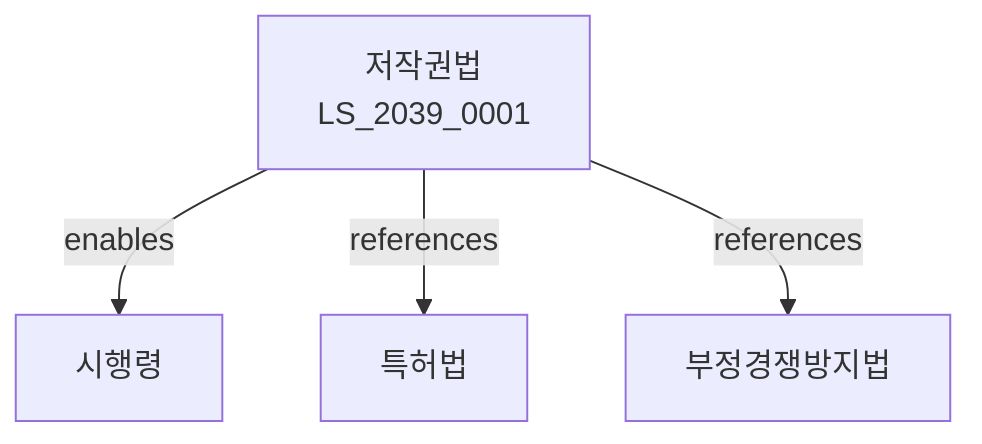

# 저작권법

> [법률 제20144호, 2024. 1. 9., 일부개정]

---

---

## 제1장 총칙
### 제1조 (목적)
이 법은 저작자의 권리와 이에 인접하는 권리를 보호함으로써 저작물의 공정한 이용을 도모함을 목적으로 한다。

### 제2조 (정의)
이 법에서 사용하는 용어의 뜻은 다음과 같다。

1. "저작물"이란 문학ㆍ학술 또는 예술의 범위에서 창작적인 표현을 말한다。
2. "저작자"란 저작물을 창작한 자를 말한다。
3. "저작권"이란 저작자가 가지는 권리를 말한다。
4. "2차적저작물"이란 원저작물을 각색한 저작물을 말한다。

---

## 제2장 저작물
### 第5条(저작물의 예시)
저작물은 다음 각 호와 같다。

1. 어문저작물
2. 음악저작물
3. 연극저작물
4. 미술저작물
5. 건축저작물
6. 사진저작물
7. 영상저작물
8. 도면저작물
### 第6条(2차적저작물)
2차적저작물은 독자적인 저작물로 보호한다。
### 第7条(편집저작물)
편집저작물은 독자적인 저작물로 보호한다。
### 第8条(데이터베이스)
데이터베이스는 편집저작물로 보호한다。

---

## 제3장 저작자
### 第15条(저작자의 추정)
저작물의 원본 또는 복제물에 저작자로서의 성명이 표시된 자는 저작자로 추정한다。
### 第16条(직무저작물)
법인 등의 기획 하에 창작한 저작물은 법인이 저작자가 된다。
### 第17条(공동저작물)
2인 이상이 공동으로 창작한 저작물은 공동저작물로 한다。
### 第18条(저작자의 권리)
저작자는 인격권과 재산권을 가진다。

---

## 제4장 저작인격권
### 第25条(공표권)
저작자는 저작물을 공표할 권리를 가진다。
### 第26条(성명표시권)
저작자는 저작물에 성명을 표시할 권리를 가진다。
### 第27条(동일성유지권)
저작자는 저작물의 내용의 동일성을 유지할 권리를 가진다。
### 第28条(권리의 성질)
저작인격권은 양도할 수 없다。

---

## 제5장 저작재산권
### 第35条(복제권)
저작권자는 저작물을 복제할 권리를 가진다。
### 第36条(공연권)
저작권자는 저작물을 공연할 권리를 가진다。
### 第37条(방송권)
저작권자는 저작물을 방송할 권리를 가진다。
### 第38条(전송권)
저작권자는 저작물을 전송할 권리를 가진다。

---

## 제6장 저작재산권의 보호기간
### 第45条(보호기간의 원칙)
저작재산권은 저작자의 생존 기간 및 사망 후 70년간 존속한다。
### 第46条(공동저작물)
공동저작물은 최종 사망자의 사망 후 70년간 존속한다。
### 第47条(무명저작물)
무명저작물은 공표 후 70년간 존속한다。
### 第48条(영상저작물)
영상저작물은 공표 후 70년간 존속한다。

---

## 제7장 저작권의 제한
### 第55条(공정이용)
저작물은 공정한 관행에 따라 공정한 범위 안에서 이용할 수 있다。
### 第56条(교육목적 이용)
학교 교육목적을 위하여 저작물을 이용할 수 있다。
### 第57条(도서관 이용)
도서관은 저작물을 복제할 수 있다。
### 第58条(시사보도)
시사보도를 위하여 저작물을 이용할 수 있다。

---

## 제8장 벌칙
### 第65条(침해죄)
저작권을 침해한 자는 5년 이하의 징역 또는 5천만원 이하의 벌금에 처한다。
### 第66条(부정복제)
부정복제품을 배포한 자는 1년 이하의 징역 또는 1천만원 이하의 벌금에 처한다。

---

## 관계 그래프

**상위 법령**
- [[헌법]] 제22조 (학문ㆍ예술의 자유)
- [[민법]]

**관련 법령**
- [[특허법]]
- [[상표법]]
- [[부정경쟁방지법]]
- [[콘텐츠산업진흥법]]

**하위 법령**
- [[저작권법 시행령]]
