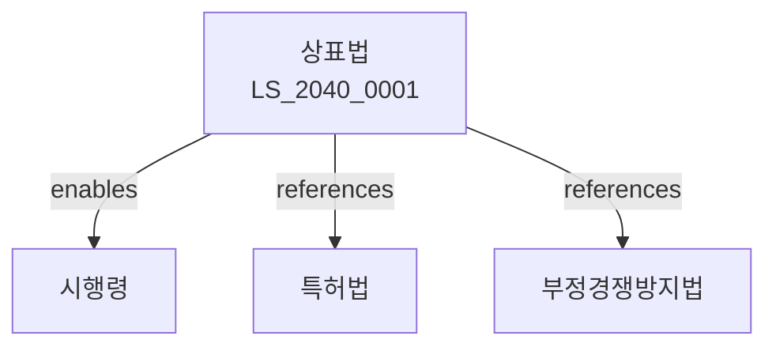

# 상표법

> [법률 제20145호, 2024. 1. 9., 일부개정]

---

---

## 제1장 총칙
### 제1조 (목적)
이 법은 상표를 보호함으로써 상표사용자의 업무상의 신용유지를 도모하여 산업발전에 이바지함을 목적으로 한다。

### 제2조 (정의)
이 법에서 사용하는 용어의 뜻은 다음과 같다。

1. "상표"란 상품을 식별하기 위하여 사용하는 기호를 말한다。
2. "서비스표"란 서비스업을 식별하기 위하여 사용하는 기호를 말한다。
3. "상표권"이란 상표등록을 받은 자가 가지는 권리를 말한다。
4. "지정상품"이란 상표등록을 받을 상품을 말한다。

---

## 제2장 상표등록요건
### 第5条(상표등록을 받을 수 있는 상표)
상품을 식별할 수 있는 상표는 등록할 수 있다。
### 第6条(부등록사유)
다음 각 호의 상표는 등록할 수 없다。

1. 국기ㆍ국장
2. 공공질서 또는 선량한 풍속
3. 타인의 성명ㆍ상호
4. 상품의 보통명칭
### 第7条(선원주의)
동일 또는 유사한 상표에 대하여 먼저 출원한 자가 등록을 받는다。
### 第8条(1류1상표주의)
1개의 류에 1개의 상표를 등록한다。

---

## 제3장 상표등록출원
### 第15条(출원)
상표등록을 받으려는 자는 출원을 하여야 한다。
### 第16条(출원서)
출원서에는 상표 및 지정상품을 기재하여야 한다。
### 第17条(출원공고)
출원은 공고한다。
### 第18条(이의신청)
출원공고에 대하여 이의를 신청할 수 있다。

---

## 제4장 상표권
### 第25条(상표권의 설정)
상표권은 설정등록으로 발생한다。
### 第26条(존속기간)
상표권의 존속기간은 설정등록일부터 10년으로 한다。
### 第27条(갱신등록)
상표권은 갱신등록으로 존속기간을 갱신할 수 있다。
### 第28条(상표권의 효력)
상표권자는 지정상품에 관하여 상표를 사용할 권리를 독점한다。

---

## 제5장 상표권의 이용
### 第35条(전용실시권)
상표권자는 타인에게 전용실시권을 설정할 수 있다。
### 第36条(통상실시권)
상표권자는 타인에게 통상실시권을 허락할 수 있다。
### 第37条(실시권의 등록)
실시권은 등록하여야 효력이 발생한다。
### 第38条(상표권의 이전)
상표권은 이전할 수 있다。

---

## 제6장 상표권의 소멸
### 第45条(소멸사유)
상표권은 다음 각 호의 사유로 소멸한다。

1. 존속기간의 만료
2. 상표권자의 사망
3. 상표권의 포기
### 第46条(취소심판)
상표등록에 대하여 취소심판을 청구할 수 있다。
### 第47条(무효심판)
상표등록에 대하여 무효심판을 청구할 수 있다。
### 第48条(불사용취소)
3년 이상 상표를 사용하지 아니한 경우 취소할 수 있다。

---

## 제7장 상표침해
### 第55条(침해의 금지)
상표권자는 침해자에 대하여 침해의 금지를 청구할 수 있다。
### 第56条(손해배상)
침해자는 상표권자에게 손해를 배상하여야 한다。
### 第57条(침해죄)
상표권을 침해한 자는 7년 이하의 징역 또는 1억원 이하의 벌금에 처한다。
### 第58条(부정상표)
부정상표를 사용한 자는 처벌한다。

---

## 관계 그래프

**상위 법령**
- [[헌법]] 제22조 (학문ㆍ예술의 자유)
- [[민법]]

**관련 법령**
- [[특허법]]
- [[디자인보호법]]
- [[부정경쟁방지법]]
- [[저작권법]]

**하위 법령**
- [[상표법 시행령]]
