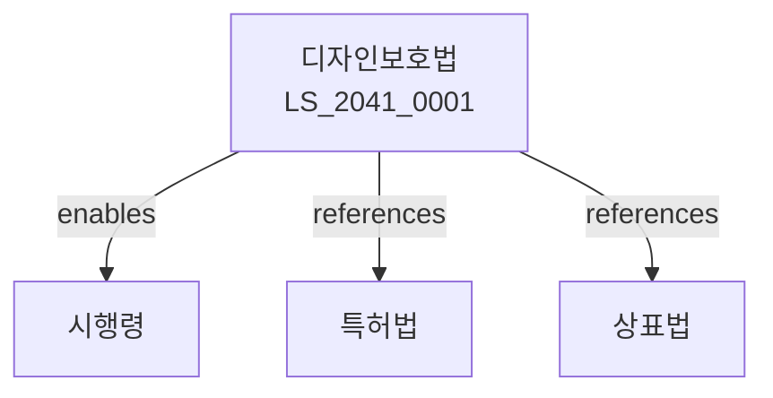

# 디자인보호법

> [법률 제20146호, 2024. 1. 9., 일부개정]

---

---

## 제1장 총칙
### 제1조 (목적)
이 법은 디자인을 보호ㆍ장려하고 그 이용을 도모함으로써 디자인의 창작을 촉진하여 산업발전에 이바지함을 목적으로 한다。

### 제2조 (정의)
이 법에서 사용하는 용어의 뜻은 다음과 같다。

1. "디자인"이란 물품의 형상ㆍ모양ㆍ색채 또는 이들의 결합을 말한다。
2. "디자인권"이란 디자인등록을 받은 자가 가지는 권리를 말한다。
3. "실시"란 디자인을 제조ㆍ사용ㆍ양도 등을 하는 것을 말한다。
4. "물품"이란 디자인이 적용되는 대상을 말한다。

---

## 제2장 디자인등록요건
### 第5条(디자인등록을 받을 수 있는 디자인)
산업상 이용할 수 있는 디자인은 등록할 수 있다。
### 第6条(신규성)
다음 각 호의 디자인은 신규성이 없다。

1. 공지된 디자인
2. 공연히 실시된 디자인
3. 간행물에 기재된 디자인
### 第7条(창작성)
디자인이 속하는 분야에서 통상의 지식을 가진 자가 용이하게 창작할 수 있는 것은 창작성이 없다。
### 第8条(선원주의)
동일한 디자인에 대하여 먼저 출원한 자가 등록을 받는다。

---

## 제3장 디자인등록출원
### 第15条(출원)
디자인등록을 받으려는 자는 출원을 하여야 한다。
### 第16条(출원서)
출원서에는 디자인 및 물품을 기재하여야 한다。
### 第17条(1디자인1출원주의)
1개의 디자인은 1개의 출원으로 한다。
### 第18条(디자인의 분류)
디자인은 물품의 분류에 따라 구분한다。

---

## 제4장 심사
### 第25条(방식심사)
특허청은 출원이 방식에 적합한지 심사한다。
### 第26条(실체심사)
특허청은 등록요건을 실체적으로 심사한다。
### 第27条(무심사등록)
일부 디자인은 무심사로 등록한다。
### 第28条(등록결정)
등록요건을 갖춘 디자인은 등록결정한다。

---

## 제5장 디자인권
### 第35条(디자인권의 설정)
디자인권은 설정등록으로 발생한다。
### 第36条(존속기간)
디자인권의 존속기간은 설정등록일부터 20년으로 한다。
### 第37条(디자인권의 효력)
디자인권자는 업으로서 디자인을 실시할 권리를 독점한다。
### 第38条(디자인권의 제한)
디자인권의 효력은 다음 각 호의 경우에 미치지 아니한다。

1. 연구 또는 시험
2. 선사용

---

## 제6장 유사디자인
### 第45条(유사디자인의 등록)
본디자인과 유사한 디자인은 유사디자인으로 등록할 수 있다。
### 第46条(유사디자인의 존속기간)
유사디자인의 존속기간은 본디자인의 존속기간에 따른다。
### 第47条(유사디자인권)
유사디자인권은 본디자인권과 독립하여 이전할 수 없다。
### 第48条(유사디자인의 심판)
유사디자인의 무효는 본디자인의 무효에 따른다。

---

## 제7장 비밀디자인
### 第55条(비밀디자인의 출원)
비밀디자인으로 출원할 수 있다。
### 第56条(비밀기간)
비밀디자인은 3년간 비밀로 한다。
### 第57条(비밀해제)
비밀디자인은 청구에 의하여 비밀을 해제한다。
### 第58条(비밀디자인의 효력)
비밀디자인은 공개 후 효력이 발생한다。

---

## 제8장 벌칙
### 第65条(침해죄)
디자인권을 침해한 자는 7년 이하의 징역 또는 1억원 이하의 벌금에 처한다。
### 第66条(부정행위)
부정한 방법으로 등록받은 자는 처벌한다。

---

## 관계 그래프

**상위 법령**
- [[헌법]] 제22조 (학문ㆍ예술의 자유)
- [[민법]]

**관련 법령**
- [[특허법]]
- [[상표법]]
- [[저작권법]]
- [[부정경쟁방지법]]

**하위 법령**
- [[디자인보호법 시행령]]
