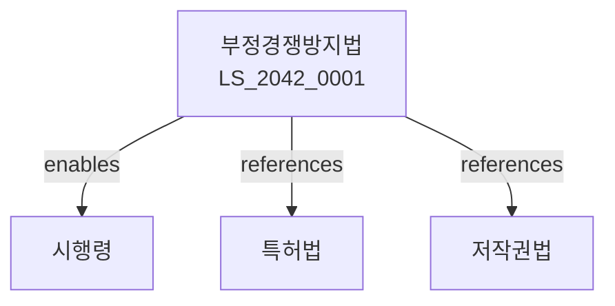

# 부정경쟁방지 및 영업비밀보호에 관한 법률

> [법률 제20147호, 2024. 1. 9., 일부개정]

---

---

## 제1장 총칙
### 제1조 (목적)
이 법은 부정경쟁행위와 영업비밀 침해행위를 방지함으로써 건전한 거래질서를 유지함을 목적으로 한다。

### 제2조 (정의)
이 법에서 사용하는 용어의 뜻은 다음과 같다。

1. "부정경쟁행위"란 타인의 경제적 활동을 부정한 방법으로 방해하는 행위를 말한다。
2. "영업비밀"란 공지되지 아니한 정보로서 독립된 경제적 가치가 있는 것을 말한다。
3. "영업비밀침해행위"란 영업비밀을 부정하게 취득하거나 사용하는 행위를 말한다。
4. "표현물"이란 타인의 상품 등과 혼동을 일으키는 표시를 말한다。

---

## 제2장 부정경쟁행위
### 第5条(부정경쟁행위의 금지)
다음 각 호의 행위는 부정경쟁행위로 금지한다。

1. 주지표시의 혼동행위
2. 국내 주지표시의 모방행위
3. 국외 주지표시의 모방행위
4. 상품형태의 모방행위
5. 타인의 성명 등의 무단사용
### 第6条(주지표시)
주지표시는 타인의 상품 등을 식별하는 표시로서 널리 인식된 것을 말한다。
### 第7条(상품형태)
상품형태는 상품의 형상ㆍ모양ㆍ색채 등을 말한다。
### 第8条(예외)
다음 각 호의 행위는 부정경쟁행위에 해당하지 아니한다。

1. 상품의 기능 확보에 필요한 형태
2. 경쟁상품과의 호환성 확보

---

## 제3장 영업비밀
### 第15条(영업비밀의 요건)
영업비밀은 다음 각 호의 요건을 갖추어야 한다。

1. 비밀성
2. 경제적 가치
3. 비밀관리노력
### 第16条(영업비밀의 침해)
다음 각 호의 행위는 영업비밀 침해행위로 한다。

1. 절취ㆍ기망 등에 의한 취득
2. 무단사용 또는 공개
3. 제3자에 의한 사용
### 第17条(침해의 금지)
영업비밀 보유자는 침해자에 대하여 침해의 금지를 청구할 수 있다。
### 第18条(손해배상)
침해자는 영업비밀 보유자에게 손해를 배상하여야 한다。

---

## 제4장 손해배상
### 第25条(손해액의 추정)
침해자가 얻은 이익액은 손해액으로 추정한다。
### 第26条(손해액의 인정)
영업비밀 보유자는 침해로 인한 손해액을 입증하기 곤란한 때에는 상당한 손해액을 주장할 수 있다。
### 第27条(과실의 추정)
침해자는 과실이 없음을 입증하지 못하면 과실이 있는 것으로 추정한다。
### 第28条(명예회복)
법원은 침해자에 대하여 명예회복에 필요한 조치를 명할 수 있다。

---

## 제5장 기술보호
### 第35条(기술유출의 금지)
누구든지 타인의 기술을 부정하게 유출하여서는 아니 된다。
### 第36条(기술보호조치)
기술 보유자는 기술보호조치를 하여야 한다。
### 第37条(기술침해의 구제)
기술 보유자는 침해자에 대하여 구제를 청구할 수 있다。
### 第38条(기술이전)
기술이전은 계약에 의하여 한다。

---

## 제6장 직무발명
### 第45条(직무발명의 정의)
직무발명은 종업원이 직무상 행한 발명을 말한다。
### 第46条(직무발명의 승계)
사용자는 직무발명을 승계할 수 있다。
### 第47条(보상금)
사용자는 직무발명을 승계한 경우 보상금을 지급하여야 한다。
### 第48条(직무발명의 권리)
직무발명에 관한 권리는 계약으로 정한다。

---

## 제7장 벌칙
### 第55条(침해죄)
영업비밀을 침해한 자는 10년 이하의 징역 또는 10억원 이하의 벌금에 처한다。
### 第56条(해외유출죄)
영업비밀을 해외로 유출한 자는 15년 이하의 징역 또는 15억원 이하의 벌금에 처한다。

---

## 관계 그래프

**상위 법령**
- [[헌법]] 제22조 (학문ㆍ예술의 자유)
- [[민법]]

**관련 법령**
- [[특허법]]
- [[저작권법]]
- [[상표법]]
- [[디자인보호법]]

**하위 법령**
- [[부정경쟁방지법 시행령]]
