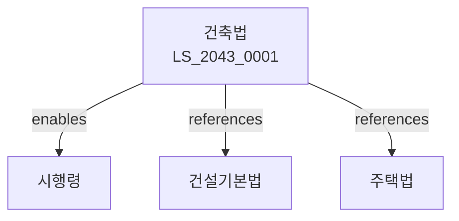

# 건축법

> [법률 제20148호, 2024. 1. 9., 일부개정]

---

---

## 제1장 총칙
### 제1조 (목적)
이 법은 건축물의 대지ㆍ구조ㆍ설비 및 용도 등에 관한 기준을 정함으로써 건축물의 안전ㆍ기능 및 미관을 향상하여 공공복리의 증진에 이바지함을 목적으로 한다。

### 제2조 (정의)
이 법에서 사용하는 용어의 뜻은 다음과 같다。

1. "건축물"이란 토지에 정착하는 공작물로서 지붕 및 기둥 또는 벽이 있는 것을 말한다。
2. "대지"란 건축물이 있는 토지를 말한다。
3. "건축"이란 건축물을 신축ㆍ증축ㆍ개축 또는 이전하는 것을 말한다。
4. "용도변경"이란 건축물의 용도를 변경하는 것을 말한다。

---

## 제2장 건축물의 대지
### 第5条(대지의 안전)
대지는 건축물의 안전에 지장이 없어야 한다。
### 第6条(도로)
대지는 도로에 접하여야 한다。
### 第7条(대지의 면적)
대지는 건축물의 바닥면적에 대하여 일정비율 이상이어야 한다。
### 第8条(대지의 정리)
대지는 배수ㆍ성토 등이 적절히 이루어져야 한다。

---

## 제3장 건축물의 구조
### 第15条(구조내력)
건축물은 자중ㆍ적재하중 등에 견딜 수 있는 구조이어야 한다。
### 第16条(내진설계)
건축물은 지진에 견딜 수 있도록 설계하여야 한다。
### 第17条(방화구조)
건축물은 화재에 견딜 수 있는 구조이어야 한다。
### 第18条(피난설비)
건축물에는 피난설비를 설치하여야 한다。

---

## 제4장 건축물의 설비
### 第25条(급수설비)
건축물에는 급수설비를 설치하여야 한다。
### 第26条(배수설비)
건축물에는 배수설비를 설치하여야 한다。
### 第27条(환기설비)
건축물에는 환기설비를 설치하여야 한다。
### 第28条(소방설비)
건축물에는 소방설비를 설치하여야 한다。

---

## 제5장 건축허가
### 第35条(허가대상)
일정규모 이상의 건축물은 허가를 받아야 한다。
### 第36条(신고대상)
허가대상 외의 건축물은 신고하여야 한다。
### 第37条(허가절차)
건축허가는 관할 행정기관에 신청하여야 한다。
### 第38条(허가기간)
건축허가는 일정기간 내에 착공하여야 한다。

---

## 제6장 용도지역
### 第45条(용도지역)
건축물은 용도지역에 적합하여야 한다。
### 第46条(건폐율)
건축물은 건폐율 제한을 준수하여야 한다。
### 第47条(용적률)
건축물은 용적률 제한을 준수하여야 한다。
### 第48条(높이제한)
건축물은 높이제한을 준수하여야 한다。

---

## 제7장 감독
### 第55条(감독)
특별자치시장ㆍ시장ㆍ군수는 건축물을 감독한다。
### 第56条(시정명령)
위법한 건축물에 대하여는 시정을 명할 수 있다。
### 第57条(이행강제금)
시정명령을 이행하지 아니한 자에게는 이행강제금을 부과한다。
### 第58条(철거명령)
위법 건축물에 대하여는 철거를 명할 수 있다。

---

## 제8장 벌칙
### 第65条(벌칙)
다음 각 호의 어느 하나에 해당하는 자는 3년 이하의 징역 또는 3천만원 이하의 벌금에 처한다。

1. 허가 없이 건축한 자
2. 용도변경을 하지 아니한 자
### 第66条(과태료)
다음 각 호의 어느 하나에 해당하는 자에게는 2천만원 이하의 과태료를 부과한다。

1. 신고 없이 건축한 자
2. 감독을 방해한 자

---

## 관계 그래프

**상위 법령**
- [[헌법]] 제35조 (주거생활 보장)
- [[국토계획법]]

**관련 법령**
- [[건설기본법]]
- [[주택법]]
- [[소방기본법]]
- [[도시개발법]]

**하위 법령**
- [[건축법 시행령]]
