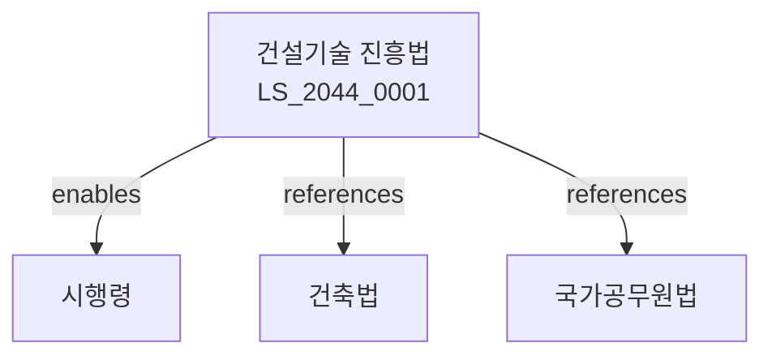

# 건설기술 진흥법

> [법률 제20149호, 2024. 1. 9., 일부개정]

---

---

## 제1장 총칙
### 제1조 (목적)
이 법은 건설기술을 진흥하고 건설사업의 품질을 향상함으로써 건설산업의 건전한 발전에 이바지함을 목적으로 한다。

### 제2조 (정의)
이 법에서 사용하는 용어의 뜻은 다음과 같다。

1. "건설기술"이란 건설사업에 관한 계획ㆍ조사ㆍ설계ㆍ시공 등의 기술을 말한다。
2. "건설기술자"란 건설기술에 관한 기술적 사항을 담당하는 자를 말한다。
3. "건설사업"이란 건축물 등의 건설에 관한 사업을 말한다。
4. "책임감리"란 건설사업의 품질관리를 위한 감리를 말한다。

---

## 제2장 건설기술진흥
### 第5条(기술진흥시책)
국가는 건설기술진흥시책을 수립하여야 한다。
### 第6条(기술개발지원)
국가는 건설기술개발을 지원한다。
### 第7条(기술인력양성)
국가는 건설기술인력을 양성한다。
### 第8条(국제협력)
국가는 건설기술의 국제협력을 도모한다。

---

## 제3장 건설기술자
### 第15条(자격)
건설기술자는 자격을 갖추어야 한다。
### 第16条(보수교육)
건설기술자는 보수교육을 이수하여야 한다。
### 第17条(업무범위)
건설기술자는 자격에 따른 업무를 수행한다。
### 第18条(의무)
건설기술자는 성실하게 업무를 수행하여야 한다。

---

## 제4장 건설기술용역
### 第25条(용역업)
건설기술용역업은 등록하여야 한다。
### 第26条(등록요건)
용역업자는 기술인력 등을 갖추어야 한다。
### 第27条(결격사유)
다음 각 호의 자는 용역업 등록을 할 수 없다。

1. 파산선고를 받은 자
2. 금고 이상의 형을 선고받은 자
### 第28条(업무범위)
용역업자는 등록한 업무를 수행한다。

---

## 제5장 책임감리
### 第35条(책임감리대상)
일정규모 이상의 건설사업은 책임감리를 하여야 한다。
### 第36条(감리원)
감리원은 자격을 갖추어야 한다。
### 第37条(감리업무)
감리원은 시공품질을 확인한다。
### 第38条(감리보고)
감리원은 감리결과를 보고하여야 한다。

---

## 제6장 품질관리
### 第45条(품질관리)
시공자는 건설사업의 품질을 관리하여야 한다。
### 第46条(품질시험)
시공자는 자재 등에 대하여 품질시험을 하여야 한다。
### 第47条(품질보증)
시공자는 품질을 보증하여야 한다。
### 第48条(하자담보)
시공자는 하자담보책임을 진다。

---

## 제7장 감독
### 第55条(감독)
국토교통부장관은 건설기술사업을 감독한다。
### 第56条(보고 및 검사)
국토교통부장관은 필요한 경우 보고를 명하거나 검사할 수 있다。
### 第57条(시정명령)
위법한 사항에 대하여는 시정을 명할 수 있다。
### 第58条(영업정지)
중대한 위반사유가 있는 경우 영업정지를 명할 수 있다。

---

## 제8장 벌칙
### 第65条(벌칙)
다음 각 호의 어느 하나에 해당하는 자는 3년 이하의 징역 또는 3천만원 이하의 벌금에 처한다。

1. 허위로 등록한 자
2. 감리를 태만히 한 자
### 第66条(과태료)
다음 각 호의 어느 하나에 해당하는 자에게는 2천만원 이하의 과태료를 부과한다。

1. 정당한 사유 없이 보고를 하지 아니한 자
2. 검사를 거부한 자

---

## 관계 그래프

**상위 법령**
- [[헌법]] 제119조 (경제자유)
- [[건설산업기본법]]

**관련 법령**
- [[건축법]]
- [[국가공무원법]]
- [[기술자격법]]
- [공인노무사법]

**하위 법령**
- [[건설기술 진흥법 시행령]]
