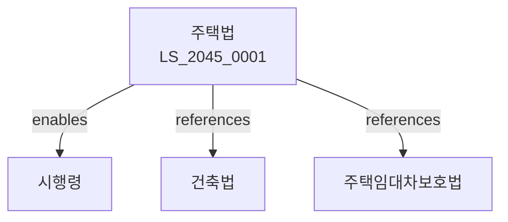

# 주택법

> [법률 제20150호, 2024. 1. 9., 일부개정]

---

---

## 제1장 총칙
### 제1조 (목적)
이 법은 주택의 건설ㆍ공급 및 관리에 관한 사항을 정함으로써 주택의 안정적인 공급과 주거생활의 향상을 도모함을 목적으로 한다。

### 제2조 (정의)
이 법에서 사용하는 용어의 뜻은 다음과 같다。

1. "주택"이란 주거용으로 사용하는 건물을 말한다。
2. "국민주택"이란 국가의 지원을 받아 공급하는 주택을 말한다。
3. "민영주택"이란 민간이 건설하는 주택을 말한다。
4. "주택사업"이란 주택을 건설ㆍ공급하는 사업을 말한다。

---

## 제2장 주택건설
### 第5条(주택건설계획)
정부는 주택건설종합계획을 수립하여야 한다。
### 第6条(주택건설사업)
주택건설사업은 등록하여야 한다。
### 第7条(등록요건)
주택건설사업자는 자본금 등을 갖추어야 한다。
### 第8条(결격사유)
다음 각 호의 자는 주택건설사업 등록을 할 수 없다。

1. 파산선고를 받은 자
2. 금고 이상의 형을 선고받은 자

---

## 제3장 주택공급
### 第15条(공급대상)
주택은 무주택자에게 우선 공급한다。
### 第16条(공급방법)
주택공급은 청약에 의한다。
### 第17条(청약자격)
청약자격은 주택구입적격증명 등에 의한다。
### 第18条(공급가격)
주택공급가격은 건설원가 등을 고려하여 결정한다。

---

## 제4장 주택관리
### 第25条(주택관리)
주택은 적절히 관리하여야 한다。
### 第26条(주택관리업)
주택관리업은 등록하여야 한다。
### 第27条(관리비)
주택관리비는 적정하게 부과하여야 한다。
### 第28条(주택조합)
주택입주자는 주택조합을 구성할 수 있다。

---

## 제5장 주택재개발
### 第35条(재개발사업)
주택재개발사업은 도시의 주거환경을 개선하기 위하여 시행한다。
### 第36条(재개발구역)
주택재개발구역은 시장ㆍ군수가 지정한다。
### 第37条(재개발조합)
주택재개발사업은 재개발조합이 시행할 수 있다。
### 第38条(재개발비용)
주택재개발사업의 비용은 조합원이 부담한다。

---

## 제6장 주택재건축
### 第45条(재건축사업)
주택재건축사업은 노후주택을 철거하고 새로 건설하는 사업을 말한다。
### 第46条(재건축요건)
일정 연수 이상 경과한 주택은 재건축할 수 있다.
### 第47条(재건축조합)
주택재건축사업은 재건축조합이 시행할 수 있다。
### 第48条(재건축비용)
주택재건축사업의 비용은 조합원이 부담한다.

---

## 제7장 감독
### 第55条(감독)
국토교통부장관은 주택사업을 감독한다。
### 第56条(보고 및 검사)
국토교통부장관은 필요한 경우 보고를 명하거나 검사할 수 있다。
### 第57条(시정명령)
위법한 사항에 대하여는 시정을 명할 수 있다。
### 第58条(영업정지)
중대한 위반사유가 있는 경우 영업정지를 명할 수 있다。

---

## 제8장 벌칙
### 第65条(벌칙)
다음 각 호의 어느 하나에 해당하는 자는 3년 이하의 징역 또는 3천만원 이하의 벌금에 처한다。

1. 허위로 등록한 자
2. 주택을 부정공급한 자
### 第66条(과태료)
다음 각 호의 어느 하나에 해당하는 자에게는 2천만원 이하의 과태료를 부과한다。

1. 정당한 사유 없이 보고를 하지 아니한 자
2. 검사를 거부한 자

---

## 관계 그래프

**상위 법령**
- [[헌법]] 제35조 (주거생활 보장)
- [[국토계획법]]

**관련 법령**
- [[건축법]]
- [[주택임대차보호법]]
- [[도시개발법]]
- [[도시 및 주거환경정비법]]

**하위 법령**
- [[주택법 시행령]]
