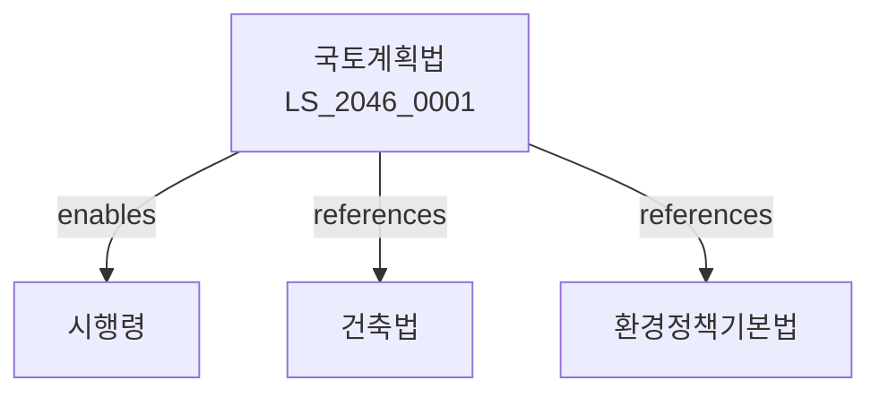

# 국토의 계획 및 이용에 관한 법률

> [법률 제20151호, 2024. 1. 9., 일부개정]

---

---

## 제1장 총칙
### 제1조 (목적)
이 법은 국토의 이용ㆍ개발 및 보전에 관한 계획을 수립하고 이를 종합적으로 관리함으로써 국토의 균형있는 발전에 이바지함을 목적으로 한다。

### 제2조 (정의)
이 법에서 사용하는 용어의 뜻은 다음과 같다。

1. "국토"란 대한민국의 영토를 말한다。
2. "국토계획"이란 국토의 이용ㆍ개발 및 보전에 관한 종합적인 계획을 말한다。
3. "용도지역"이란 국토계획에 따라 지정하는 지역을 말한다。
4. "용도지구"란 용도지역 내에서 세분화된 지구를 말한다。

---

## 제2장 국토계획
### 第5条(국토종합계획)
정부는 국토종합계획을 수립하여야 한다。
### 第6条(광역도시계획)
광역도시권에 대하여는 광역도시계획을 수립한다。
### 第7条(도시기본계획)
도시에 대하여는 도시기본계획을 수립한다。
### 第8条(도시관리계획)
도시에 대하여는 도시관리계획을 수립한다。

---

## 제3장 용도지역
### 第15条(용도지역의 지정)
국토는 다음 각 호의 용도지역으로 구분한다。

1. 도시지역
2. 관리지역
3. 농림지역
4. 자연환경보전지역
### 第16条(도시지역)
도시지역은 주거ㆍ상업ㆍ공업 및 녹지지역으로 구분한다。
### 第17条(관리지역)
관리지역은 보전관리ㆍ생산관리 및 계획관리지역으로 구분한다。
### 第18条(행위제한)
용도지역별로 행위를 제한할 수 있다。

---

## 제4장 개발행위
### 第25条(개발행위허가)
일정규모 이상의 개발행위는 허가를 받아야 한다。
### 第26条(허가요건)
개발행위허가는 계획적 관리에 적합하여야 한다。
### 第27条(허가절차)
개발행위허가는 관할 행정기관에 신청한다。
### 第28条(개발행위료)
개발행위에 대하여는 수수료를 납부하여야 한다。

---

## 제5장 지구단위계획
### 第35条(지구단위계획의 수립)
도시지역 내에서는 지구단위계획을 수립할 수 있다。
### 第36条(계획의 내용)
지구단위계획에는 다음 각 호의 사항을 포함한다。

1. 가로망계획
2. 공원계획
3. 건축물계획
### 第37条(계획의 효력)
지구단위계획은 건축 등의 기준이 된다。
### 第38条(계획의 변경)
지구단위계획은 필요한 경우 변경할 수 있다。

---

## 제6장 개발밀도관리
### 第45条(용적률)
용도지역별 용적률은 법령으로 정한다。
### 第46条(건폐율)
용도지역별 건폐율은 법령으로 정한다。
### 第47条(공개공지)
일정규모 이상의 건축물은 공개공지를 설치하여야 한다。
### 第48条(주차장)
건축물에는 주차장을 설치하여야 한다。

---

## 제7장 감독
### 第55条(감독)
특별자치시장ㆍ시장ㆍ군수는 국토계획사업을 감독한다。
### 第56条(시정명령)
위법한 행위에 대하여는 시정을 명할 수 있다。
### 第57条(이행강제금)
시정명령을 이행하지 아니한 자에게는 이행강제금을 부과한다。
### 第58条(원상회복)
위법한 개발행위는 원상회복을 명할 수 있다。

---

## 제8장 벌칙
### 第65条(벌칙)
다음 각 호의 어느 하나에 해당하는 자는 3년 이하의 징역 또는 3천만원 이하의 벌금에 처한다。

1. 허가 없이 개발행위를 한 자
2. 용도지역 행위제한을 위반한 자
### 第66条(과태료)
다음 각 호의 어느 하나에 해당하는 자에게는 2천만원 이하의 과태료를 부과한다。

1. 정당한 사유 없이 보고를 하지 아니한 자
2. 검사를 거부한 자

---

## 관계 그래프

**상위 법령**
- [[헌법]] 제120조 (국토의 보전)
- [[환경정책기본법]]

**관련 법령**
- [[건축법]]
- [[환경정책기본법]]
- [[주택법]]
- [[도시개발법]]

**하위 법령**
- [[국토계획법 시행령]]
