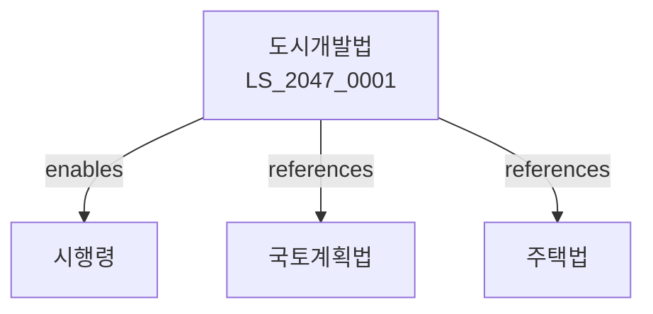

# 도시개발법

> [법률 제20152호, 2024. 1. 9., 일부개정]

---

---

## 제1장 총칙
### 제1조 (목적)
이 법은 도시개발사업에 관한 사항을 정함으로써 도시의 계획적 개발과 쾌적한 도시환경을 조성함을 목적으로 한다。

### 제2조 (정의)
이 법에서 사용하는 용어의 뜻은 다음과 같다。

1. "도시개발사업"이란 도시를 개발하는 사업을 말한다。
2. "도시개발구역"이란 도시개발사업을 시행하는 구역을 말한다。
3. "시행자"란 도시개발사업을 시행하는 자를 말한다。
4. "환지"란 도시개발사업으로 인하여 토지를 교환하는 것을 말한다。

---

## 제2장 도시개발구역
### 第5条(구역의 지정)
국토교통부장관은 도시개발구역을 지정할 수 있다。
### 第6条(지정요건)
도시개발구역은 계획적 개발이 필요한 지역으로 한다。
### 第7条(지정절차)
도시개발구역 지정은 관할 행정기관의 의견을 들어 결정한다。
### 第8条(구역의 변경)
도시개발구역은 필요한 경우 변경할 수 있다。

---

## 제3장 시행자
### 第15条(시행자의 지정)
도시개발사업은 다음 각 호의 자가 시행할 수 있다。

1. 국가 또는 지방자치단체
2. 한국토지주택공사
3. 지방공사
4. 민간사업자
### 第16条(시행자의 요건)
민간사업자는 자본금 등의 요건을 갖추어야 한다.
### 第17条(시행자의 의무)
시행자는 도시개발사업을 성실히 수행하여야 한다.
### 第18条(시행자의 변경)
시행자는 필요한 경우 변경할 수 있다.

---

## 제4장 시행방식
### 第25条(수용방식)
도시개발사업은 토지 등을 수용하여 시행할 수 있다。
### 第26条(환지방식)
도시개발사업은 환지하여 시행할 수 있다。
### 第27条(혼용방식)
도시개발사업은 수용과 환지를 혼용하여 시행할 수 있다。
### 第28条(일반분양)
도시개발사업으로 조성된 토지는 일반분양할 수 있다。

---

## 제5장 환지계획
### 第35条(환지계획의 수립)
시행자는 환지계획을 수립하여야 한다.
### 第36条(환지계획의 내용)
환지계획에는 다음 각 호의 사항을 포함한다.

1. 환지의 위치
2. 환지의 면적
3. 환지의 권리관계
### 第37条(환지계획의 인가)
환지계획은 관할 행정기관의 인가를 받아야 한다.
### 第38条(환지처분)
환지는 환지계획에 따라 처분한다.

---

## 제6장 비용부담
### 第45条(비용부담원칙)
도시개발사업의 비용은 수익자가 부담한다.
### 第46条(국고보조)
국가는 도시개발사업에 대하여 보조할 수 있다.
### 第47条(공동부담)
토지소유자는 공동으로 비용을 부담할 수 있다.
### 第48条(청산금)
환지로 인한 차액은 청산금으로 정산한다.

---

## 제7장 감독
### 第55条(감독)
국토교통부장관은 도시개발사업을 감독한다.
### 第56条(시정명령)
위법한 사항에 대하여는 시정을 명할 수 있다.
### 第57条(사업정지)
중대한 위반사유가 있는 경우 사업정지를 명할 수 있다.
### 第58条(시행자 지정취소)
시행자가 의무를 위반한 경우 지정을 취소할 수 있다.

---

## 제8장 벌칙
### 第65条(벌칙)
다음 각 호의 어느 하나에 해당하는 자는 3년 이하의 징역 또는 3천만원 이하의 벌금에 처한다。

1. 허가 없이 사업을 시행한 자
2. 환지계획을 위반한 자
### 第66条(과태료)
다음 각 호의 어느 하나에 해당하는 자에게는 2천만원 이하의 과태료를 부과한다。

1. 정당한 사유 없이 보고를 하지 아니한 자
2. 검사를 거부한 자

---

## 관계 그래프

**상위 법령**
- [[헌법]] 제120조 (국토의 보전)
- [[국토계획법]]

**관련 법령**
- [[국토계획법]]
- [[주택법]]
- [[건축법]]
- [한국토지주택공사법]

**하위 법령**
- [[도시개발법 시행령]]
