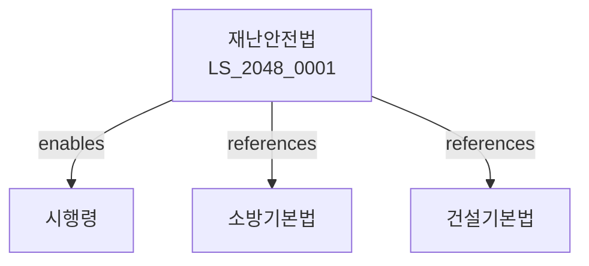

# 재난 및 안전관리 기본법

> [법률 제20153호, 2024. 1. 9., 일부개정]

---

---

## 제1장 총칙
### 제1조 (목적)
이 법은 재난으로부터 국민의 생명과 재산을 보호하고 국가의 안전을 도모하기 위하여 재난관리에 관한 기본적인 사항을 정함을 목적으로 한다.

### 제2조 (정의)
이 법에서 사용하는 용어의 뜻은 다음과 같다.

1. "재난"이란 자연재해ㆍ인적재해 등으로 인하여 발생하는 피해를 말한다.
2. "자연재해"란 태풍ㆍ홍수ㆍ호우 등 자연현상으로 인한 재난을 말한다.
3. "인적재해"란 화재ㆍ붕괴ㆍ폭발 등 사람의 행위로 인한 재난을 말한다.
4. "재난관리"란 재난의 예방ㆍ대비ㆍ대응 및 복구 활동을 말한다.

---

## 제2장 재난관리체계
### 第5条(재난관리책임)
국가와 지방자치단체는 재난관리의 책임을 진다.
### 第6条(중앙재난안전대책본부)
대통령 소속하에 중앙재난안전대책본부를 둔다.
### 第7条(지방재난안전대책본부)
시ㆍ도지사 소속하에 지방재난안전대책본부를 둔다.
### 第8条(재난안전조정관)
행정안전부에 재난안전조정관을 둔다.

---

## 제3장 재난예방
### 第15条(재난예방계획)
국가는 재난예방계획을 수립하여야 한다.
### 第16条(안전점검)
관계 기관은 시설물에 대한 안전점검을 실시하여야 한다.
### 第17条(안전진단)
중요 시설물에 대하여는 정기적으로 안전진단을 실시한다.
### 第18条(위험요인제거)
발견된 위험요인은 지체 없이 제거하여야 한다.

---

## 제4장 재난대비
### 第25条(재난대비계획)
국가는 재난대비계획을 수립하여야 한다.
### 第26条(재난훈련)
관계 기관은 정기적으로 재난훈련을 실시하여야 한다.
### 第27条(재난경보)
재난 발생 시 경보를 발령하여야 한다.
### 第28条(재난정보)
국민에게 재난정보를 신속히 제공하여야 한다.

---

## 제5장 재난대응
### 第35条(재난대응체계)
재난 발생 시 대응체계를 즉시 가동한다.
### 第36条(상황실운영)
재난상황실을 24시간 운영한다.
### 第37条(긴급구조)
인명구조를 위하여 긴급구조활동을 전개한다.
### 第38条(피해복구)
피해 시설물에 대한 응급복구를 실시한다.

---

## 제6장 복구지원
### 第45条(복구계획)
국가는 복구계획을 수립하여야 한다.
### 第46条(복구비용)
복구비용은 국가와 지방자치단체가 부담한다.
### 第47条(재난구호)
재난피해자에 대한 구호를 실시한다.
### 第48条(재해보험)
국가는 재해보험을 지원할 수 있다.

---

## 제7장 안전문화
### 第55条(안전의식함양)
국가는 국민의 안전의식을 함양하여야 한다.
### 第56条(안전교육)
관계 기관은 안전교육을 실시하여야 한다.
### 第57条(안전홍보)
국가는 안전에 관한 홍보를 실시한다.
### 第58条(민관협력)
민관협력을 통하여 안전문화를 조성한다.

---

## 제8장 감독
### 第65条(감독)
행정안전부장관은 재난관리사업을 감독한다.
### 第66条(보고 및 검사)
행정안전부장관은 필요한 경우 보고를 명하거나 검사할 수 있다.
### 第67条(시정명령)
위법한 사항에 대하여는 시정을 명할 수 있다.
### 第68条(과태료)
다음 각 호의 어느 하나에 해당하는 자에게는 과태료를 부과한다.

1. 안전점검을 태만히 한 자
2. 보고를 하지 아니한 자

---

## 제9장 벌칙
### 第75条(벌칙)
다음 각 호의 어느 하나에 해당하는 자는 3년 이하의 징역 또는 3천만원 이하의 벌금에 처한다.

1. 재난경보를 고의로 방해한 자
2. 구조활동을 방해한 자
### 第76条(양벌규정)
법인의 대리인이 위반행위를 한 경우 그 법인도 처벌한다.

---

## 관계 그래프

**상위 법령**
- [[헌법]] 제34조 (재해예방 의무)
- [[행정기본법]]

**관련 법령**
- [[소방기본법]]
- [[건설기본법]]
- [[교통안전법]]
- [[위험물안전관리법]]

**하위 법령**
- [[재난 및 안전관리 기본법 시행령]]
