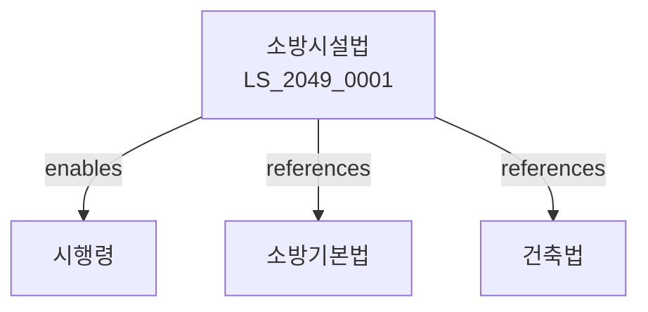

# 소방시설 설치 및 관리에 관한 법률

> [법률 제20152호, 2024. 1. 9., 일부개정]

---

---

## 제1장 총칙
### 제1조 (목적)
이 법은 건축물 등에 설치하는 소방시설의 기준과 관리에 관한 사항을 정함으로써 화재로부터 국민의 생명과 재산을 보호함을 목적으로 한다.

### 제2조 (정의)
이 법에서 사용하는 용어의 뜻은 다음과 같다.

1. "소방시설"이란 화재의 예방ㆍ경보ㆍ피난 및 진압에 필요한 시설을 말한다.
2. "소방용수시설"이란 화재진압에 필요한 수원시설을 말한다.
3. "경보시설"이란 화재발생을 알리는 시설을 말한다.
4. "피난시설"이란 화재 시 피난에 필요한 시설을 말한다.

---

## 제2장 소방시설의 설치기준
### 第5条(설치의무)
건축물의 소유자는 소방시설을 설치하여야 한다.
### 第6条(설치기준)
소방시설의 설치기준은 대통령령으로 정한다.
### 第7条(소방용수)
일정규모 이상의 건축물에는 소방용수를 설치하여야 한다.
### 第8条(스프링클러)
일정규모 이상의 건축물에는 스프링클러를 설치하여야 한다.

---

## 제3장 경보시설
### 第15条(자동화재탐지설비)
일정규모 이상의 건축물에는 자동화재탐지설비를 설치하여야 한다.
### 第16条(비상경보설비)
화재 발생 시 비상경보설비를 작동하여야 한다.
### 第17条(방송설비)
일정규모 이상의 건축물에는 비상방송설비를 설치하여야 한다.
### 第18条(수신반)
자동화재탐지설비에는 수신반을 설치하여야 한다.

---

## 제4장 피난시설
### 第25条(피난계단)
일정규모 이상의 건축물에는 피난계단을 설치하여야 한다.
### 第26条(비상구)
비상구는 피난에 지장이 없도록 설치하여야 한다.
### 第27条(유도등)
피난경로에는 유도등을 설치하여야 한다.
### 第28条(피난기구)
일정규모 이상의 건축물에는 피난기구를 비치하여야 한다.

---

## 제5장 소화시설
### 第35条(소화기)
건축물에는 소화기를 비치하여야 한다.
### 第36条(옥내소화전)
일정규모 이상의 건축물에는 옥내소화전을 설치하여야 한다.
### 第37条(옥외소화전)
일정규모 이상의 대지에는 옥외소화전을 설치하여야 한다.
### 第38条(특수소화설비)
특수용도 건축물에는 특수소화설비를 설치하여야 한다.

---

## 제6장 소방시설의 관리
### 第45条(점검의무)
건축물의 소유자는 소방시설을 정기적으로 점검하여야 한다.
### 第46条(점검기준)
소방시설의 점검기준은 행정안전부령으로 정한다.
### 第47条(점검결과보고)
점검결과를 관할 소방서에 보고하여야 한다.
### 第48条(보수)
결함이 발견된 소방시설은 지체 없이 보수하여야 한다.

---

## 제7장 소방시설업
### 第55条(소방시설업 등록)
소방시설공사업은 등록하여야 한다.
### 第56条(등록요건)
소방시설업자는 기술인력 등을 갖추어야 한다.
### 第57条(결격사유)
다음 각 호의 자는 소방시설업 등록을 할 수 없다.

1. 파산선고를 받은 자
2. 금고 이상의 형을 선고받은 자
### 第58条(영업정지)
위법한 행위에 대하여는 영업정지를 명할 수 있다.

---

## 제8장 감독
### 第65条(감독)
소방서장은 소방시설을 감독한다.
### 第66条(검사)
소방서장은 필요한 경우 검사할 수 있다.
### 第67条(시정명령)
위법한 사항에 대하여는 시정을 명할 수 있다.
### 第68条(과태료)
다음 각 호의 어느 하나에 해당하는 자에게는 과태료를 부과한다.

1. 점검을 태만히 한 자
2. 보고를 하지 아니한 자

---

## 제9장 벌칙
### 第75条(벌칙)
다음 각 호의 어느 하나에 해당하는 자는 3년 이하의 징역 또는 3천만원 이하의 벌금에 처한다.

1. 소방시설을 설치하지 아니한 자
2. 허위로 등록한 자
### 第76条(과태료)
다음 각 호의 어느 하나에 해당하는 자에게는 2천만원 이하의 과태료를 부과한다.

1. 점검을 하지 아니한 자
2. 검사를 거부한 자

---

## 관계 그래프

**상위 법령**
- [[헌법]] 제34조 (재해예방 의무)
- [[소방기본법]]

**관련 법령**
- [[건축법]]
- [[재난 및 안전관리 기본법]]
- [[위험물안전관리법]]
- [[건설기본법]]

**하위 법령**
- [[소방시설법 시행령]]
