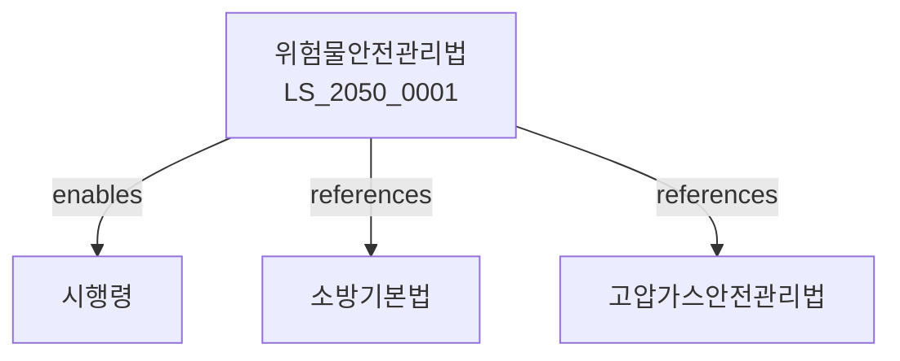

# 위험물 안전관리법

> [법률 제20151호, 2024. 1. 9., 일부개정]

---

---

## 제1장 총칙
### 제1조 (목적)
이 법은 위험물의 제조ㆍ저장ㆍ운반 및 취급에 관한 안전관리에 필요한 사항을 정함으로써 화재ㆍ폭발 등의 사고를 예방함을 목적으로 한다.

### 제2조 (정의)
이 법에서 사용하는 용어의 뜻은 다음과 같다.

1. "위험물"이란 인화성ㆍ가연성 등의 성질을 가진 물질로서 대통령령으로 정하는 것을 말한다.
2. "위험물시설"이란 위험물을 제조ㆍ저장 또는 취급하는 시설을 말한다.
3. "위험물제조소"란 위험물을 제조하는 시설을 말한다.
4. "위험물저장소"란 위험물을 저장하는 시설을 말한다.

---

## 제2장 위험물의 분류
### 第5条(위험물의 분류)
위험물은 다음 각 호와 같이 분류한다.

1. 제1류 위험물: 산화성 고체
2. 제2류 위험물: 가연성 고체
3. 제3류 위험물: 자연발화성 물질
4. 제4류 위험물: 인화성 액체
5. 제5류 위험물: 자연반응성 물질
6. 제6류 위험물: 산화성 액체
### 第6条(지정수량)
위험물의 지정수량은 대통령령으로 정한다.
### 第7条(혼합위험물)
서로 반응하는 위험물은 구분하여 저장하여야 한다.
### 第8条(라벨링)
위험물의 용기에는 라벨을 부착하여야 한다.

---

## 제3장 위험물시설의 설치
### 第15条(설치허가)
위험물제조소 등의 설치는 허가를 받아야 한다.
### 第16条(설치기준)
위험물시설의 설치기준은 행정안전부령으로 정한다.
### 第17条(위치기준)
위험물시설은 학교ㆍ병원 등으로부터 일정거리를 유지하여야 한다.
### 第18条(완공검사)
위험물시설은 완공검사를 받아야 한다.

---

## 제4장 위험물의 저장 및 취급
### 第25条(저장기준)
위험물은 기준에 따라 저장하여야 한다.
### 第26条(취급기준)
위험물의 취급은 안전기준에 따라야 한다.
### 第27条(운반기준)
위험물의 운반은 안전기준에 따라야 한다.
### 第28条(폐기)
위험물의 폐기는 안전하게 처리하여야 한다.

---

## 제5장 위험물시설의 관리
### 第35条(안전관리자)
위험물시설에는 안전관리자를 선임하여야 한다.
### 第36条(안전관리자의 자격)
안전관리자는 자격을 갖추어야 한다.
### 第37条(안전교육)
안전관리자는 정기적으로 안전교육을 이수하여야 한다.
### 第38条(자체점검)
위험물시설은 정기적으로 자체점검을 실시하여야 한다.

---

## 제6장 위험물운반
### 第45条(운반차량)
위험물운반은 적격차량으로 하여야 한다.
### 第46条(운반표지)
위험물운반차량에는 운반표지를 하여야 한다.
### 第47条(운반경로)
위험물운반은 지정경로로 하여야 한다.
### 第48条(운반자)
위험물운반자는 자격을 갖추어야 한다.

---

## 제7장 감독
### 第55条(감독)
소방서장은 위험물시설을 감독한다.
### 第56条(보고 및 검사)
소방서장은 필요한 경우 보고를 명하거나 검사할 수 있다.
### 第57条(시정명령)
위법한 사항에 대하여는 시정을 명할 수 있다.
### 第58条(사용정지)
중대한 위반사유가 있는 경우 사용정지를 명할 수 있다.

---

## 제8장 벌칙
### 第65条(벌칙)
다음 각 호의 어느 하나에 해당하는 자는 5년 이하의 징역 또는 5천만원 이하의 벌금에 처한다.

1. 허가 없이 위험물시설을 설치한 자
2. 위험물을 불법 운반한 자
### 第66条(과태료)
다음 각 호의 어느 하나에 해당하는 자에게는 2천만원 이하의 과태료를 부과한다.

1. 정당한 사유 없이 보고를 하지 아니한 자
2. 검사를 거부한 자

---

## 관계 그래프

**상위 법령**
- [[헌법]] 제34조 (재해예방 의무)
- [[소방기본법]]

**관련 법령**
- [[고압가스안전관리법]]
- [[석유사업법]]
- [[가스사업법]]
- [[소방시설법]]

**하위 법령**
- [[위험물안전관리법 시행령]]
