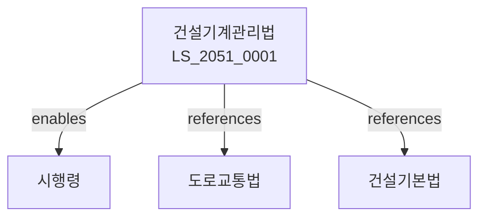

# 건설기계 관리법

> [법률 제20150호, 2024. 1. 9., 일부개정]

---

---

## 제1장 총칙
### 제1조 (목적)
이 법은 건설기계의 제작ㆍ등록ㆍ관리 및 운전에 관한 사항을 정함으로써 건설기계의 안전관리와 건설사업의 건전한 발전에 이바지함을 목적으로 한다.

### 제2조 (정의)
이 법에서 사용하는 용어의 뜻은 다음과 같다.

1. "건설기계"란 건설사업에 사용하는 기계로서 대통령령으로 정하는 것을 말한다.
2. "건설기계등록"이란 건설기계의 소유권을 공부에 등록하는 것을 말한다.
3. "건설기계운전"이란 건설기계를 운전하는 행위를 말한다.
4. "건설기계운전면허"란 건설기계를 운전할 수 있는 자격을 말한다.

---

## 제2장 건설기계의 제작
### 第5条(형식승인)
건설기계의 제작은 형식승인을 받아야 한다.
### 第6条(형식승인기준)
건설기계는 안전기준에 적합하여야 한다.
### 第7条(확인검사)
제작된 건설기계는 확인검사를 받아야 한다.
### 第8条(결함시정)
결함이 발견된 건설기계는 시정조치를 하여야 한다.

---

## 제3장 건설기계의 등록
### 第15条(등록)
건설기계는 등록하여야 한다.
### 第16条(등록절차)
건설기계등록은 관할 행정기관에 신청한다.
### 第17条(등록번호)
등록된 건설기계에는 등록번호를 표시하여야 한다.
### 第18条(이전등록)
건설기계의 소유권 이전 시 이전등록을 하여야 한다.

---

## 제4장 건설기계의 검사
### 第25条(정기검사)
건설기계는 정기적으로 검사를 받아야 한다.
### 第26条(정기검사기준)
정기검사의 기준은 국토교통부령으로 정한다.
### 第27条(임시검사)
필요한 경우 임시검사를 실시할 수 있다.
### 第28条(구조변경)
건설기계의 구조변경은 승인을 받아야 한다.

---

## 제5장 건설기계운전면허
### 第35条(운전면허)
건설기계를 운전하려면 면허를 받아야 한다.
### 第36条(면허의 종류)
건설기계운전면허는 건설기계의 종류에 따라 구분한다.
### 第37条(면허시험)
건설기계운전면허는 시험에 합격하여야 한다.
### 第38条(면허의 결격사유)
다음 각 호의 자는 건설기계운전면허를 받을 수 없다.

1. 신체장애로 인하여 운전이 곤란한 자
2. 마약 등 중독자

---

## 제6장 건설기계관리사업
### 第45条(건설기계관리사업)
건설기계관리사업은 등록하여야 한다.
### 第46条(등록요건)
건설기계관리사업자는 시설ㆍ장비 등을 갖추어야 한다.
### 第47条(업무범위)
건설기계관리사업자는 등록한 업무를 수행한다.
### 第48条(영업정지)
위법한 행위에 대하여는 영업정지를 명할 수 있다.

---

## 제7장 감독
### 第55条(감독)
국토교통부장관은 건설기계를 감독한다.
### 第56条(보고 및 검사)
국토교통부장관은 필요한 경우 보고를 명하거나 검사할 수 있다.
### 第57条(시정명령)
위법한 사항에 대하여는 시정을 명할 수 있다.
### 第58条(등록취소)
중대한 위반사유가 있는 경우 등록을 취소할 수 있다.

---

## 제8장 벌칙
### 第65条(벌칙)
다음 각 호의 어느 하나에 해당하는 자는 3년 이하의 징역 또는 3천만원 이하의 벌금에 처한다.

1. 면허 없이 건설기계를 운전한 자
2. 허위로 등록한 자
### 第66条(과태료)
다음 각 호의 어느 하나에 해당하는 자에게는 2천만원 이하의 과태료를 부과한다.

1. 정기검사를 받지 아니한 자
2. 보고를 하지 아니한 자

---

## 관계 그래프

**상위 법령**
- [[헌법]] 제119조 (경제자유)
- [[건설기본법]]

**관련 법령**
- [[도로교통법]]
- [[산업안전보건법]]
- [[대기환경보전법]]
- [[소음진동규제법]]

**하위 법령**
- [[건설기계관리법 시행령]]
